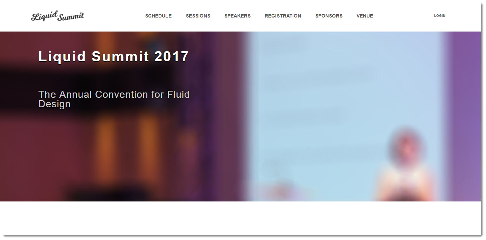
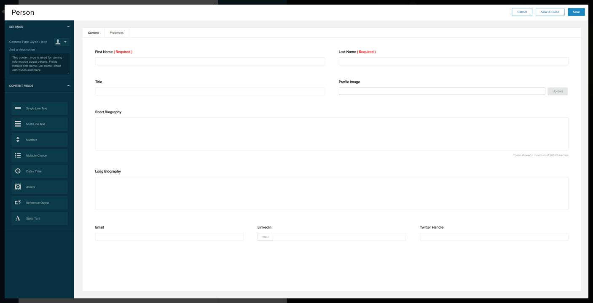
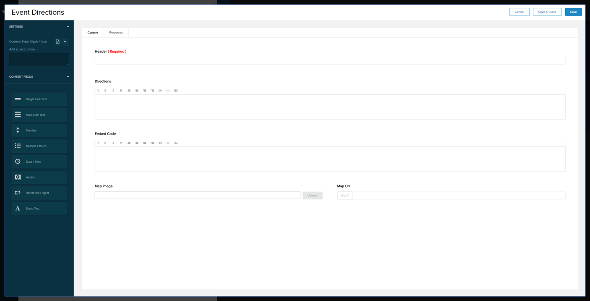
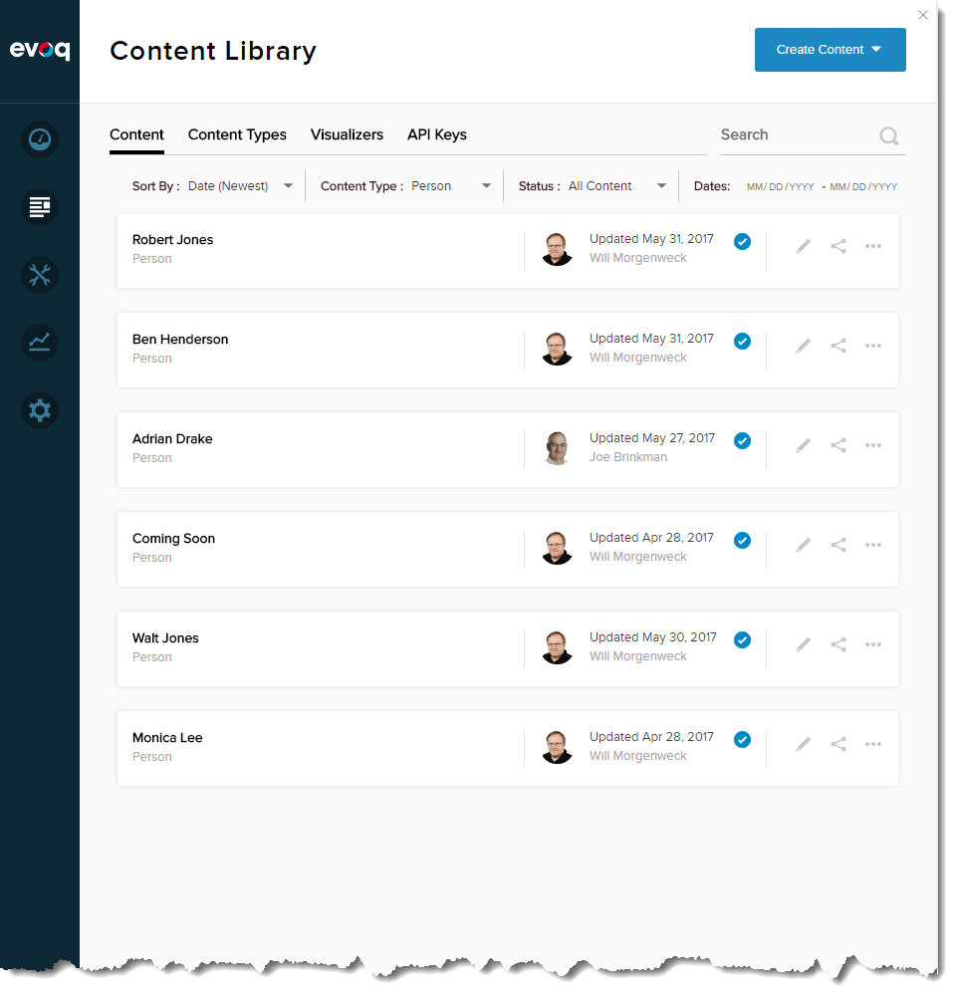
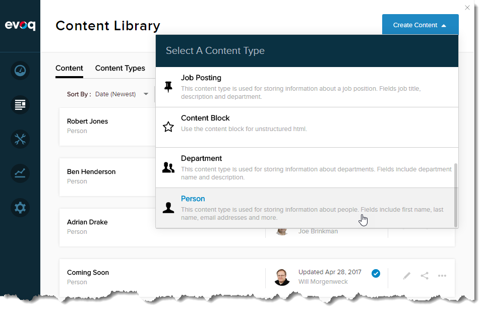
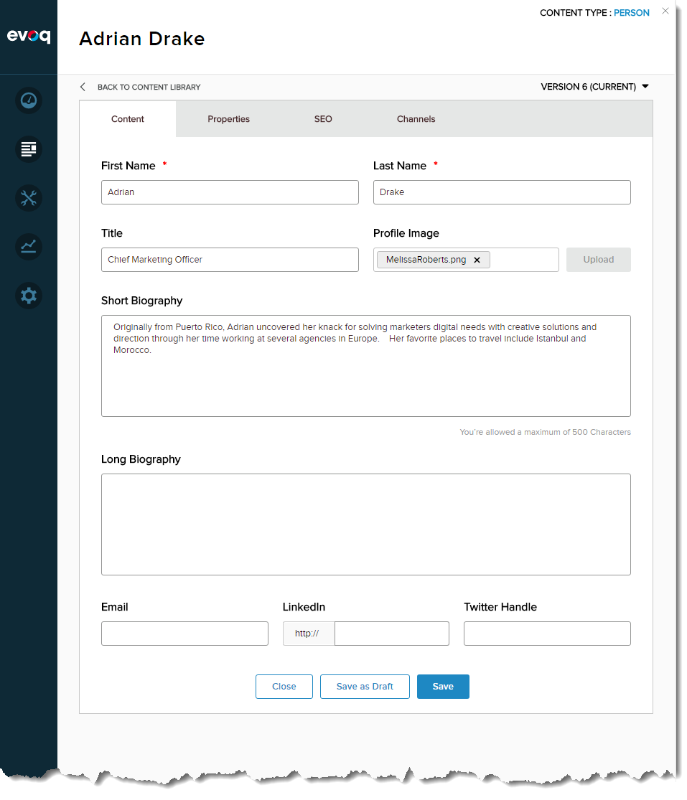
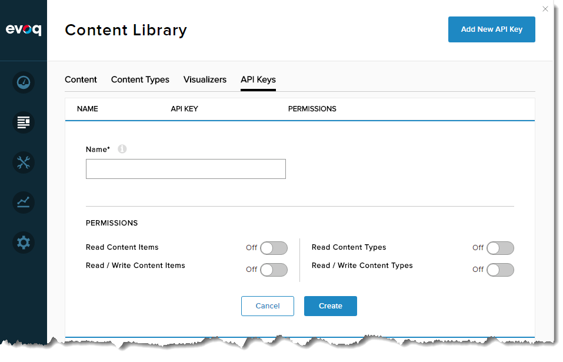

# Section Index
1. [Creating the Liquid Summit Website](1_Setup_Liquid_Content.md)
2. [Creating the AWS Lambda Project](2_Create_AWS_Lambda_Project.md)

   1. [Building the Basic Alexa Framework](2-1_Create_Basic_Framework.md)
   2. [Building the Application Logic for Alexa](2-2_Create_Application_Logic.md)
   3. [Using the Liquid Content API](2-3_Use_Liquid_Content_API.md)
   4. [Publishing to AWS](2-4_Publishing_Lambda.md)
   5. [Testing the Troubleshooting](2-5_Testing_Lambda_Function.md)

3. [Configuring the Alexa Skill](3_Configure_Alexa_Skill.md)

# Creating the Content for the Liquid Summit

Liquid Summit is a fictitious conference website created using Liquid Content. In order to enable Alexa to access content on this site we'll need to build out a few content-types first and start creating some content.

## Creating the Content Types
Liquid Content ships with four (4) content types: 

* Content Block
* Person
* Job Posting
* Department

These content types are useful for learning about the various field types supported by Liquid Content.  Since the Liquid Summit site includes a speakers selection we'll use the Person type to define our speakers.  As part of our Alexa Skill we will allow the user to query for information about conference speakers.

**Person content type definition:**

| Field Name | Field Type | Required |
| --- | --- | --- |
| First Name | Single Line Text | Yes |
| Last Name | Single Line Text | Yes | 
| Title | Single Line Text | No |
| Profile Image | Asset - Image | No |
| Short Biography | Multi Line Text | No |
| Long Biography | Multi Line Text | No |
| Email | Single Line Text | No | 
| LinkedIn | Single Line Text - URL | No |
| Twitter Handle | Single Line Text | No |

Any good conference site will not only need to provide information about the speakers and sessions, but it will also need to tell attendees where the conference is located and make it easy for attendees to get directions.  To store this information we'll create an Event Directions content type:

**Event Directions content type definition:**

| Field Name | Field Type | Required |
| --- | --- | --- |
| Header | Single Line Text | Yes |
| Directions | Multi Line Text - Text Editor | No | 
| Embed Code | Multi Line Text - Text Editor | No |
| Map Image | Asset - Image | No |
| Map Url | Single Line Text - URL | No |

Obviously we would need a few additional content types for our site like: a session type for defining conference sessions, a custom person type for storing information about our sponsors, and maybe a schedule type that assigns sessions to a time-slot and a room. In order to keep our Alexa example simple, we'll just focus on the Person and Event Direction types for now.

## Creating the Content
With these two content types defined we can begin creating our content. 

1. Login using an account with Content Editing permissions (Admin,Content Manager or Content Editor) and open the _Content Library_ page in the Persona Bar.

   

    In this example, I am using the content type filter to show just the Person content items that I have already created.

2. Use the _Create Content_ button to launch the editor for creating a new Person. You may need to scroll down in the window to select the Person content type.

   

3. Fill in the content for your first speaker. Before you save this speaker, go to the _Properties_ tab and add a **speaker** tag. We can use these tags in the API to help find content.

   | Content | Properties |
   | --- | --- |
   |  |  | 

4. Create several speakers for the conference. This will help us excercise some of the querying capability when we build out the Application Code in the next section.

5. Finally, create a single content item using the _Event Directions_ type.  The only fields we are interested in for the demo are the _Header_ and the _Map Image_ fields. 

   This highlights one of the benefits of using structured content: we can define rich content types but only use a subset of the fields depending on where that content type is being displayed. This is perfect for defining list/detail screens where the list page is showing just a couple of fields per content item, and you will link to the detail screen to see all of the information available about that content item.

If we were building a real site, we would go ahead and build out visualizers for each of our content types. Visualizers are the content templates that we use to define how our data will be presented on the various pages of the site. We can create as many visualizers as we need for any given content type since we may want to present data in a couple of different ways depending on the context of the page.

## Create an API Key

The last step to complete our site and get it ready for our Alexa skill is to create an API Key.  The API key is what we will use for securing service calls to Liquid Content. 

1. Open the _Content Library_ and go to the _API Keys_ tab. 
2. Click on the _Add New API Key_ button and you'll get a simple form for generating your key. Enter a name for your key so you'll remember where this key is being used.

   
3. For our demo we just need permission to _Read Content Items_ and to _Read Content Types_. 
4. Click the _Create_ button and the system will generate your key.  You can use the clipboard icon to quickly copy your key for use in the application we will build in the next section.

# Conclusion

At this point, you should have a site with several person content items defined. You also have a new Event Directions type and a single content item of this type. Finally, you created a new API key that we'll use in our application. You are now ready to begin writing your application code.

**Previous:** [Introduction](../Readme.md)

**Next:** [Creating the AWS Lambda Project](2_Create_AWS_Lambda_Project.md)