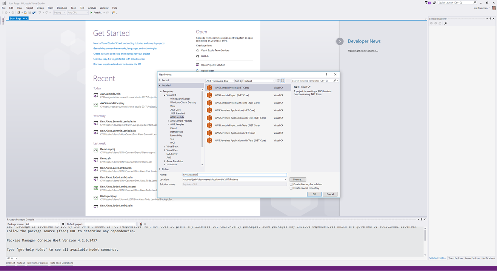

# Section Index
1. [Creating the Liquid Summit Website](1_Setup_Liquid_Content.md)
2. [Creating the AWS Lambda Project](2_Create_AWS_Lambda_Project.md)

   1. [Building the Basic Alexa Framework](2-1_Create_Basic_Framework.md)
   2. [Building the Application Logic for Alexa](2-2_Create_Application_Logic.md)
   3. [Using the Liquid Content API](2-3_Use_Liquid_Content_API.md)
   4. [Publishing to AWS](2-4_Publishing_Lambda.md)
   5. [Using the Liquid Content API](2-5_Testing_Lambda_Function.md)

3. [Configuring the Alexa Skill](3_Configure_Alexa_Skill.md)

# Creating the Application Code for an Alexa Skill

The Amazon Alexa engine does a great job of understanding spoken language and mapping that into an intent defined by your Skill. What Alexa cannot do though, is determine what should happen as a result of that intent being triggered. That is where your application code comes in. Alexa is very flexible and you can host your application code on any publicly accessible server. For my demo skill, I chose to host my code on AWS Lambda. Since Lambda and Alexa are both Amazon services, they are able provide a few little hooks to make it easier for them to talk to each other. Also, since I'll be running code on AWS Lambda, I'll use AWS CloudWatch to handle my logging needs. 

The application logic is the heart of any Alexa Skill. In this section I'll show you how to create a new AWS Lambda function in C# using the AWS Toolkit for Visual Studio.

# Building the Basic Alexa Framework
## Create a New Project

Building the application logic in C# is pretty straight forward.

1. Open Visual Studio and Create a New Project. Select the AWS Lambda project template. This template will help you get started building code that can run on AWS Lambda, but it does not have any knowledge of Alexa (we'll fix that later).

   

2. Select the _Empty Function_ blueprint and click finish

   

3. The default project includes a single function.cs file along with an AWS Lambda publisher settings file.

    ```C#
    // Assembly attribute to enable the Lambda function's JSON input
    // to be converted into a .NET class.
    [assembly: LambdaSerializer(typeof(JsonSerializer))]

    namespace Alexa.Skill
    {
        public class Function
        {
            public string FunctionHandler(string input, ILambdaContext context)
            {
                return input?.ToUpper();
            }
        }
    }
    ```

At this point you have a fully functioning Lambda function which you can publish to AWS. Of course, we'll need much more than this for our Alexa app.

## Working with Alexa
The default Lambda function does not know anything about Alexa. It is up to you to parse the input, execute your logic and return a result in a format that the Alexa engine understands. To simplify this process we'll use a third party Alexa library which will handle some of the heavy lifting for us.

1. Right click on the project name in the _Solution Explorer_ and choose _Manage Nuget Packages_.
2. Browse for the Alexa.NET package and Install the 1.0.0-beta-9 release.
   
   

   Alexa.NET will add in support for a Request and a Response object which saves you a lot of work with parsing the JSON that Alexa expects.

3. Add Using clauses for Alexa.NET

    ```C#
    using Alexa.NET.Request;
    using Alexa.NET.Response;
    ```
4. Modify the main function to change the type of the input parameter and to change the method return type.

    ```c#
    public SkillResponse FunctionHandler(SkillRequest input, ILambdaContext context)
    {
        return new SkillResponse();
    }
    ```

   When Alexa sends a request to your Lambda function it will look something like this [sample IntentRequest](/src/Lambda.Sample.GetSpeaker.json). 
   
We now have a Lambda function which can actually be used with Alexa. It doesn't do anything so it is not really that useful.

## Handling an Alexa Request

In order to begin processing a request from Alexa, we need to understand what type of request Alexa has made. Alexa will send three (3) [standard request types](https://developer.amazon.com/public/solutions/alexa/alexa-skills-kit/docs/handling-requests-sent-by-alexa#types-of-requests-sent-by-alexa) which all Alexa skills must support: 
* LaunchRequest
* IntentRequest
* SessionEndedRequest

If you skill includes the [Audioplayer Interface](https://developer.amazon.com/public/solutions/alexa/alexa-skills-kit/docs/custom-audioplayer-interface-reference), then you'll also need to handle [AudioPlayer](https://developer.amazon.com/public/solutions/alexa/alexa-skills-kit/docs/custom-audioplayer-interface-reference#requests) and [PlaybackController](https://developer.amazon.com/public/solutions/alexa/alexa-skills-kit/docs/custom-playbackcontroller-interface-reference#requests) requests.

The skill we are building is relatively simple so we just need to worry about handling the Launch, Intent and SessionEnd request types. Update the code to handle these three request types.

1. Add methods for the three request types. Each method will use the same method signature to simplify the code.

    ```C#
    private ResponseBody Handler(SkillRequest input)
    {
        return new ResponseBody();
    }
    ```

    In the Code add `HandleLaunchRequest`, `HandleIntentRequest`, and `HandleSessionEndRequest` methods using the method signature shown above.

2. Add a dictionary object to the main class to handle mapping request types to each of the function delegates.

    ```C#
    private readonly IDictionary<string, Func<SkillRequest, SkillResponse>> handlers;
    ```

3. Create a constructor and initialize the handlers dictionary.

    ```C#
    public Function() {
        handlers = new Dictionary<string, Func<SkillRequest, SkillResponse>>() {
            { "LaunchRequest", HandleLaunchRequest },
            { "IntentRequest", HandleIntentRequest },
            { "SessionEndedRequest", HandleSessionEndRequest }
        };
    }
    ```

4. Create a property to hold the request context. The ILambdaContext provides access to a logging function what can be used to log data to AWS CloudWatch.

    ```C#
    public ILambdaContext Context { get; set; }
    ```

5. Update the main `FunctionHandler` method that was created as part of the Lambda template. Save the incoming Lambda context (which is different from the Alexa context contained in the SkillRequest) in the property that was previously created. Output the results of the request handler corresponding to the current request type. Each handler returns a `SkillResponse` so it can be output directly. 

    ```C#
    public SkillResponse FunctionHandler(SkillRequest input, ILambdaContext context)
    {
        Context = context;

        ...

        return handlers[input.Request.Type](input);
    }
    ```

   The dictionary object that we created earlier makes it easy to directly map a given request type to a specific method used to handle the request. This approach keeps the code neat and avoids the use of a switch statement.


At this point we have the basic framework that we can use for creating any Alexa skill. Everything from this point forward will focus on dealing with the actual logic of the specific skill we are building.

# Building the Application Logic for Alexa

Earlier we created generic methods for handling the three (3) basic request types. Now it is time to start filling them in with real logic. Let's start with the easy parts first.

## Handling Launch Requests

When your skill is invoked without specifying an intent, Alexa will send a `LaunchRequest` event to your service.  For skills that just have a single intent you can use this event to perform the action and return an appropriate response.  For skills with multiple intent types, you should return some sort of a prompt that helps guide users on how to use your skill. Let's create a basic prompt for helping the user with Liquid Summit.

```C#
public ResponseBody HandleLaunchRequest(SkillRequest input)
{
    // Log the method type for debugging purposes
    Context.Logger.LogLine("Calling HandleLaunchRequest");

    return new ResponseBody()
    {
        OutputSpeech = new PlainTextOutputSpeech()
        {
            Text = "Welcome to the Liquid Summit. I am here to help you find your way around the conference."
        },
        ShouldEndSession = true
    };
}
```

One of the first things I do in my method is to create an entry in the event log. Since my code is going to run on AWS, and I don't have an easy way to attach a debugger, I am fairly liberal with my logging code. All of my logging output will automatically get stored in AWS CloudWatch. The Context object here is a property that I added to my main class. In my `FunctionHandler` method, I store the context object so I can use it throughout my code for logging.

After I log where I am at, I build a simple `ResponseBody` and return. Since my text is pretty simple, I just use the `PlainTextOutputSpeech` object to create my response. For more complex responses where I care about exactly how my response will be spoken, I can use [SSML](https://www.w3.org/TR/speech-synthesis/) and the `SsmlOutputSpeech` object.

## Handling SessionEnded Requests

Your service will receive a SessionEnded request whenever a session is unexpectedly ended. This can happen for one of three  reasons:

1. The user says "exit".
2. The user does not respond, or says something that doesn't match an intent, while the device is listening for a response.
3. An error occurs.

The current session is also ended when the service sets the `shouldSessionEnd` flag in a response. In this case, the session was explicitly ended and no SessionEnded event will be triggered.

```C#
public ResponseBody HandleSessionEndRequest(SkillRequest input)
{
    // Log the method type for debugging purposes
    Context.Logger.LogLine("Calling HandleSessionEndRequest");

    return new ResponseBody()
    {
        OutputSpeech = new PlainTextOutputSpeech()
        {
            Text = "Result"
        }
    };

}
```  

Even though I am returning a ResponseBody, it does not matter what I include in it. The return value from a SessionEnded event is not used by Alexa.

## Handling Intents

Now we are finally at the heart of building a service for an Alexa Skill. Every skill will have one or more intents defined and the `IntentRequest` event is used to tell your service which intent was requested by the user.

The logic for handling a single intent can be pretty complex so you will want to have a separate method to handle each intent type that you plan to have in your service.

You can determine what intent the user has triggered by looking at the request object in the incoming input object. Since the input object is of type SkillRequest, you'll first need to typecast it to an IntentRequest type so that you can access the Intent property.

```C#
public ResponseBody HandleIntentRequest(SkillRequest input)
{
    // Log the method type for debugging purposes
    Context.Logger.LogLine("Calling HandleIntentRequest");
    var request = input.Request as IntentRequest;
    return handlers[request.Intent.Name](input);
}

```

I have also added some new entries to the handlers dictionary in the constructor to account for the two intents we are defining for our service.

```C#
handlers = new Dictionary<string, Func<SkillRequest, ResponseBody>>() {
    { "LaunchRequest", HandleLaunchRequest },
    { "IntentRequest", HandleIntentRequest },
    { "SessionEndedRequest", HandleSessionEndRequest },

    { "SendDirections", HandleSendDirectionsIntent },
    { "GetSpeaker", HandleGetSpeakerIntent }
};
```

The `GetSpeaker` intent is fairly straightforward. There are effectively four steps that I use for most intents:

1. Define a default set of responses
2. Get some data from an external service
3. If we have data, update my response
4. Return my ResponseBody

```C#
public ResponseBody HandleGetSpeakerIntent(SkillRequest input)
{
    // Log the method type for debugging purposes
    Context.Logger.LogLine("Calling GetSpeaker Intent");

    // Step 1 - Set some defaults
    string title = "Keynote Speaker";
    string speech = "I'm sorry. The selection committee is still working to identify a keynote speaker.";

    // Step 2 - Get some data
    var response = GetKeynoteSpeakerAsync().Result;

    // Step 3 - Update the response
    if (response != null)
    {
        speech = $"We are pleased to announce that {response.firstName} {response.lastName}, ";
        speech += $"{ response.title} will be the keynote speaker at the Liquid Summit conference. ";
        speech += $"{response.shortBiography}";
    }

    //Step 4 - Return 
    return BuildResponse(title, speech, true);
}
```

The `GetKeynoteSpeakerAsync` method call on Step 2 will make a call to Evoq Liquid Content to get some data.  We'll look at the details in the next segment. In step 4 we use a simple helper function to create a standard response object. The method is not very complex, but it really cleans up the code and makes it easier to follow. For a more robust skill, I would probably extract this into a separate class and make it more robust to handle a broader range of responses:

```C#
private ResponseBody BuildResponse(string title, string output, bool shouldEndSession)
{
    return new ResponseBody()
    {
        Card = new SimpleCard()
        {
            Title = $"{title}",
            Content = $"{output}"
        },
        OutputSpeech = new PlainTextOutputSpeech()
        {
            Text = output
        },
        ShouldEndSession = shouldEndSession
    };

}
```

The `HandleSendDirectionsIntent` is a little more complex. When creating the response we not only have to account for the text that will get read to the user, we also need to define how we want the response to look in the Alexa application.  The `OutPutSpeech` property is the portion of the response that Alexa actually says. The `Card` property defines how your response will be displayed.

When sending directions we want to show the user a map so they can easily see how to get to the conference. Below is an example from the SendDirections intent handler to show how we can include an image in our response. 

```C#
return new ResponseBody()
{
    Card = new StandardCard()
    {
        Title = $"{title}",
        Content = $"{directions.details.directions}",
        Image = new CardImage
        {
            SmallImageUrl = directions.details.mapImage.First().url,
            LargeImageUrl = directions.details.mapImage.First().url
        }
    },
    OutputSpeech = new PlainTextOutputSpeech()
    {
        Text = speech
    },
    ShouldEndSession = true
};
```

# Using the Liquid Content API

Evoq Liquid Content includes an easy to use API for accessing your content items and content types. In order to use the API we'll need a couple pieces of data. 
* the API Key that we generated in [Section 1](docs/1_Setup_Liquid_Content.md). 
* the Content Type IDs for the content types that we want to work with. 

Currently, there is no simple way to get the Content Type IDs. We could add a call to Liquid Content to get a list of type ids, but that will add unecessary complexity to the code for IDs which are effectively static values. In the future, Evoq will include the ability to look up these IDs in the UI. For now I have included a simple application which will use your API key to look up Content Types.

 

[Download LC Explorer](/LC.Explorer/LC.Explorer.zip) and extract it to a folder on your machine. Now you can run LC.Explorer.exe to find out the Content Type IDs for each of your content types.

The `GetSpeaker` intent included a call to the `GetKeynoteSpeakerAsync` shown below.

```C#
private async Task<SpeakerDetails> GetKeynoteSpeakerAsync()
{
    string url = string.Format(speakerUrl, ContentTypeIdList[ContentTypes.EventSpeaker], "keynote");

    var json = await GetContentAsync(url);

    var speakerList = JsonConvert.DeserializeObject<SpeakerContentViewModel>(json);
    var obj = JsonConvert.SerializeObject(speakerList);

    Context.Logger.LogLine($"Results: {speakerList.speakers.Count}");

    if (speakerList.speakers == null || speakerList.speakers.Count == 0) return null;


    return speakerList.speakers?.First()?.details;
}
```

The code formats the API url, calls the content API and then converts the response to a C# object. Let's break down a couple of these parts.

The `GetContentAsync` method is a small wrapper around the .Net core HTTPClient. In order to call the Liquid Content APIs we need to pass a bearer token in the Authorization header of the service call. The API Key serves as our bearer token when calling Liquid Content.

```C#
private async Task<string> GetContentAsync(string Url)
{
    var client = new HttpClient
    {
        BaseAddress = new Uri(Url)
    };

    client.DefaultRequestHeaders.Authorization = new System.Net.Http.Headers.AuthenticationHeaderValue("Bearer", ApiKey);

    var response = client.GetAsync("");
    var json = await response.Result.Content.ReadAsStringAsync();

    return json;
}
```

When first developing my service, I just made the call to Liquid Content and logged the JSON object that was returned. I was then able to use the _Paste JSON as Classes_ feature in Visual Studio to create the appropriate classes for deserializing the JSON returned from Liquid Content.


