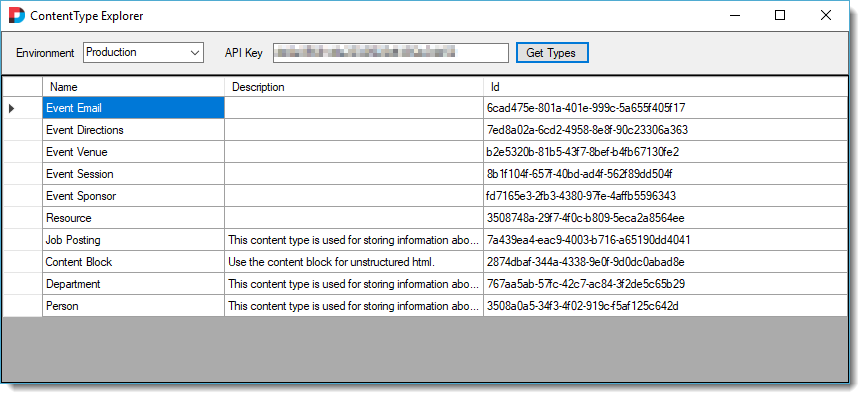
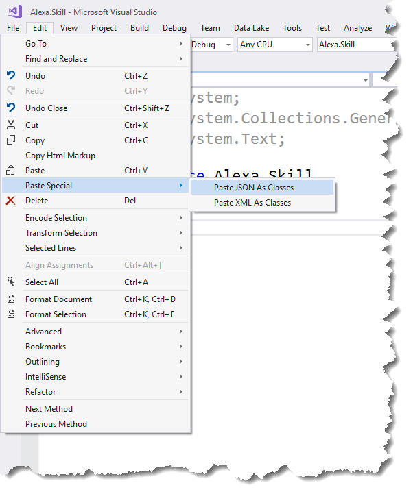

# Section Index
1. [Creating the Liquid Summit Website](1_Setup_Liquid_Content.md)
2. [Creating the AWS Lambda Project](2_Create_AWS_Lambda_Project.md)

   1. [Building the Basic Alexa Framework](2-1_Create_Basic_Framework.md)
   2. [Building the Application Logic for Alexa](2-2_Create_Application_Logic.md)
   3. [Using the Liquid Content API](2-3_Use_Liquid_Content_API.md)
   4. [Publishing to AWS](2-4_Publishing_Lambda.md)
   5. [Testing the Troubleshooting](2-5_Testing_Lambda_Function.md)

3. [Configuring the Alexa Skill](3_Configure_Alexa_Skill.md)

# Using the Liquid Content API

Evoq Liquid Content includes an easy to use API for accessing your content items and content types. In order to use the API we'll need a couple pieces of data. 
* the API Key that we generated in [Section 1](1_Setup_Liquid_Content.md). 
* the Content Type IDs for the content types that we want to work with. 

Currently, there is no simple way to get the Content Type IDs. We could add a call to Liquid Content to get a list of type ids, but that will add unecessary complexity to the code for IDs which are effectively static values. In the future, Evoq will include the ability to look up these IDs in the UI. For now I have included a simple application which will use your API key to look up Content Types.

 

[Download LC Explorer](../LC.Explorer/LC.Explorer.zip) and extract it to a folder on your machine. Now you can run LC.Explorer.exe to find out the Content Type IDs for each of your content types.

## Managing Security Information
At this point you should have the API Key and ContentTypeIDs that you need for the application. You could hardcode these values into the application, but that is not very secure. Anyone with access to the code would have access to the API Key and other internal data that should be kept private. To keep from embedding sensitive data in the code we should instead use environment variables.

1. Add a private property to hold the API Key

    ```C#
    private String ApiKey { get; set; }
    ```

2. Add logic in the FunctionHandler method to read the environment variable and store it in the property.

    ```C#
    ApiKey = Environment.GetEnvironmentVariable("apikey");
    ```

Most DevOps tools have the ability to manage environment variables in your deployment environments. Using this approach allows the IT team to properly manage security keys without risking inadvertent disclosure.

## Calling Liquid Content APIs

The [Liquid Content API](http://www.dnnsoftware.com/docs/api/about-structured-content-apis.html) includes methods for managing content items and content types. This demo is only retrieving content, so we'll be using the [Get ContentItems method](http://www.dnnsoftware.com/docs/api/api-contentitems-get.html). Since the API endpoint is fixed, and the only variables are the query parameters, I'll create a constant for the format string.

```C#
const string contentUrl = "https://dnnapi.com/content/api/ContentItems/?maxItems=1&tags={1}&contentTypeId={0}";
``` 


The `GetSpeaker` intent handler included a call to the `GetKeynoteSpeakerAsync` method shown below.

```C#
private async Task<SpeakerDetails> GetKeynoteSpeakerAsync()
{
    string url = string.Format(contentUrl, ContentTypeIdList[ContentTypes.EventSpeaker], "keynote");

    var json = await GetContentAsync(url);
    var speakerList = JsonConvert.DeserializeObject<SpeakerContentViewModel>(json);

    if (speakerList.speakers == null || speakerList.speakers.Count == 0) return null;

    return speakerList.speakers?.First()?.details;
}
```

The code formats the API url, calls the content API and then converts the response to a C# object. Let's break down a couple of these parts.

The `GetContentAsync` method is a small wrapper around the .Net core HttpClient object. In order to call the Liquid Content APIs we need to pass a bearer token in the Authorization header of the service call. The API Key serves as our bearer token when calling Liquid Content. Liquid Content will return our content items as a JSON string.

```C#
private async Task<string> GetContentAsync(string Url)
{
    var client = new HttpClient
    {
        BaseAddress = new Uri(Url)
    };

    client.DefaultRequestHeaders.Authorization = new System.Net.Http.Headers.AuthenticationHeaderValue("Bearer", ApiKey);

    var response = client.GetAsync("");
    var json = await response.Result.Content.ReadAsStringAsync();

    return json;
}
```
After making the API call, we need to convert the JSON string into a C# object that we can use in our code.  We could use Json.NET to create a [JObject](http://www.newtonsoft.com/json/help/html/T_Newtonsoft_Json_Linq_JObject.htm) but that will require a lot of extra code to traverse the object tree whenever we need to access specific values. Instead I recommend creating custom classes that correspond to the JSON returned by the API. Then it is a simple matter of deserializing the JSON into our custom types.

When first developing my service, I just made the call to Liquid Content and logged the JSON string that was returned. I was then able to use the [Paste JSON as Classes](https://blogs.msdn.microsoft.com/webdev/2012/12/18/paste-json-as-classes-in-asp-net-and-web-tools-2012-2-rc/) feature in Visual Studio to create the appropriate classes for deserializing the JSON returned from Liquid Content. 



In the [sample code](../src/viewmodels/SpeakerContentViewModel.cs), I have simplified the generated classes to remove properties that I don't care about.

The ContentItems API results in our use case, can be represented by three classes: 
1) a simple class to hold a collection of content items 
2) a class that holds the meta-data about a content item 
3) a class that holds the content item details. 

The first two classes will be the same regardless of which content type you are dealing with.  The third class is unique for each content type and contains the fields specific to that content type.

At this point, you understand how all of the code elements fit together. You should be able to create a basic Lambda Function, construct the required Alexa request handlers, and make simple calls to the Liquid Content APIs.  I urge you to download and explore the full working example of the [Liquid Summit code](../src) to get a better understanding of how all the parts fit together.

Once the Lambda function is complete, you will need to upload it to the AWS servers so you can begin testing out your code.  We'll cover that in the next section.

**Previous:** [Building the Application Logic for Alexa](2-2_Create_Application_Logic.md)

**Next:** [Publishing to AWS](2-4_Publishing_Lambda.md)