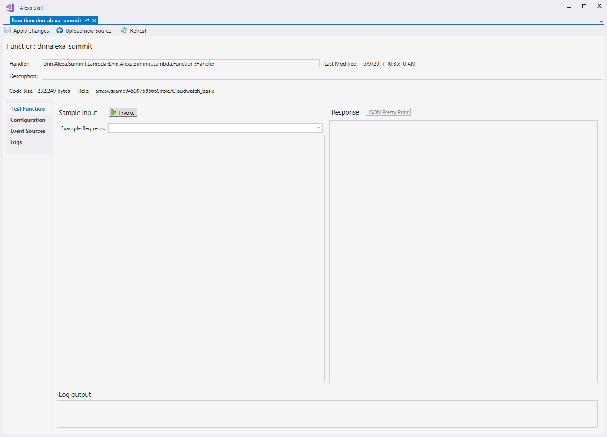
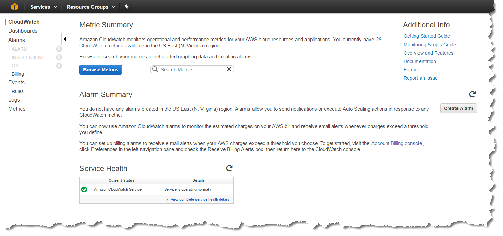
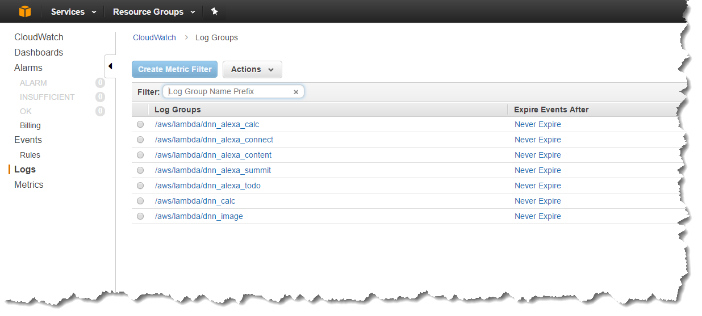
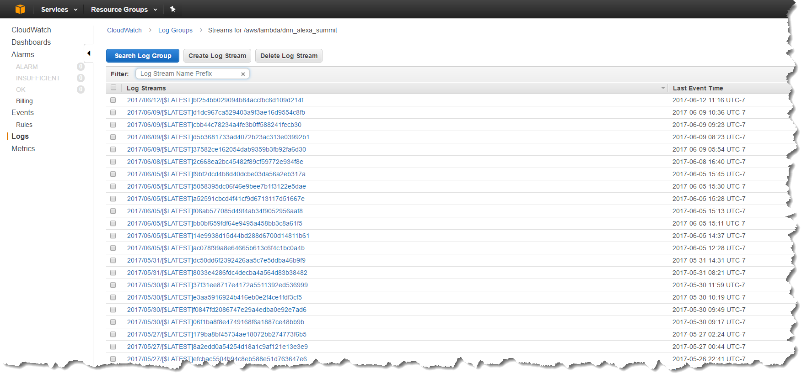
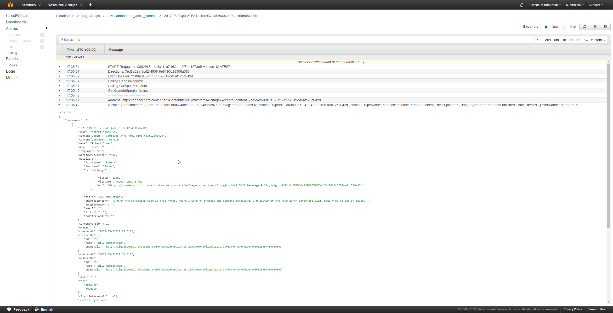

# Section Index
1. [Creating the Liquid Summit Website](1_Setup_Liquid_Content.md)
2. [Creating the AWS Lambda Project](2_Create_AWS_Lambda_Project.md)

   1. [Building the Basic Alexa Framework](2-1_Create_Basic_Framework.md)
   2. [Building the Application Logic for Alexa](2-2_Create_Application_Logic.md)
   3. [Using the Liquid Content API](2-3_Use_Liquid_Content_API.md)
   4. [Publishing to AWS](2-4_Publishing_Lambda.md)
   5. [Testing and Troubleshooting](2-5_Testing_Lambda_Function.md)

3. [Configuring the Alexa Skill](3_Configure_Alexa_Skill.md)

# Testing and Troubleshooting Lambda Functions

Now that the code is written and deployed to AWS, it is time to test that code to ensure it is operating as you expect. If your code fails during testing or execution, you'll want to be able to capture information about how your code is operating so you can correct the issue.  Let's take a look at how to satisfy these concerns for AWS Lambda Functions.

## Testing

1. When you complete publishing to AWS Lambda, the toolkit opens the function properties screen.

    

   You can use this screen for changing the configuration properties of your function or for testing your function.

2. You can also open the function properties screen from the AWS Explorer by right clicking on your Lambda Function and selecting _View Function_

3. To test your function, select an Example Request from the dropdown menu. In this case I will select the **Alexa Start Session** example from the list and press the _Invoke_ button.

    

   **Note:** You can click the _JSON Pretty Print_ button to reformat the results so they are more readable.

If your code is operating correctly you should see the message defined in the `HandleLaunchRequest` method. If your code fails for whatever reason, then you will see an error message in the response.

In this example we used a predefined Example Request. You could use the Example Requests as a template for hand-crafting requests for each of your intents.  The better way to handle this is to allow Alexa to generate a request for you.  In the sample project I have included a couple of json files for the two custom intents I have defined. In the next section on configuring our Alexa Skill I'll show you how you can use Alexa to generate these samples automatically.

## Logging

AWS Lambda does not have remote debugging support. As a result, you will need to rely on logs to provide insight in how your code is performing.

Throughout the sample code for the Liquid Summit project, you will find Context.Logger statements that are used to print debug messages to CloudWatch.  You can see these messages in the Log Output text box, however it can be hard to see complete messages in that small box.

Rather than trying to view messages in the small Log Output text box, you can open the logs tab and see a full list of all logs that are currently stored in CloudWatch.

Click on one of the Download buttons to open the log in a local text editor. While all of the details are present in the log files, it is not a very easy way to view them.

For the best experience, login to the AWS Developer Console and go to the [CloudWatch page](https://console.aws.amazon.com/cloudwatch/home?region=us-east-1#)

Click on the logs navigation link and you should see a list of log groups. There is one group for each of your Lambda functions.

Drill into your application to see the list of log streams.

Once you are looking at an individual stream, you can expand any of the individual log records that you are interested in.  The log viewer has much better formatting than the default text editor (notepad) that is opened in Visual Studio when reviewing logs. This means you can include rich JSON objects in your log files and have no problem viewing them.

While the debugging capabilities in AWS Lambda are not as extensive as most Visual Studio developers are accustomed to, they are sufficient for the size applications that are typically deployed. Even a robust Alexa Skill is unlikely to have a very extensive codebase.

You are now ready to move on to the final layer in developing your Alexa Skill.  In the next section we'll look at how to 

**Previous:** [Publishing to AWS](2-4_Publishing_Lambda.md)

**Next:** [Configuring the Alexa Skill](3_Configure_Alexa_Skill.md)