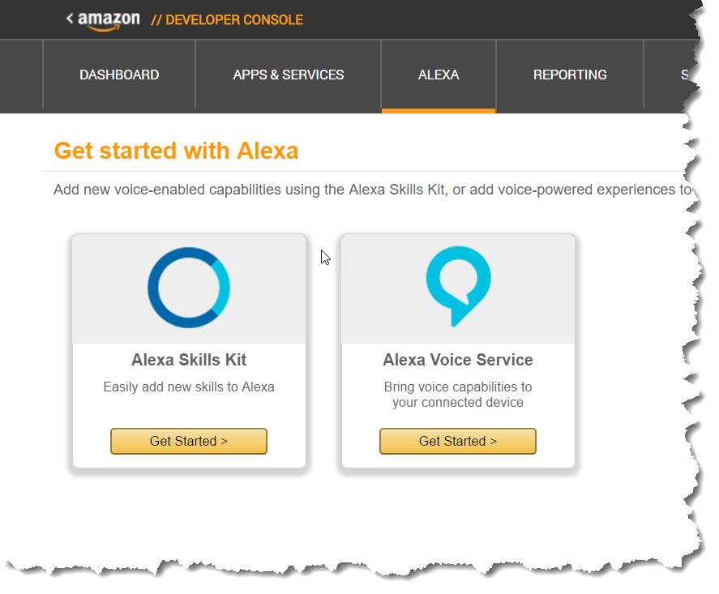
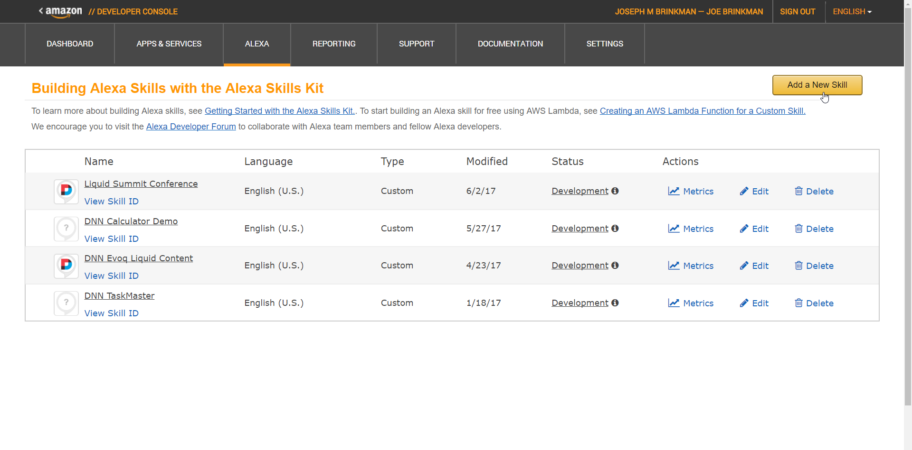
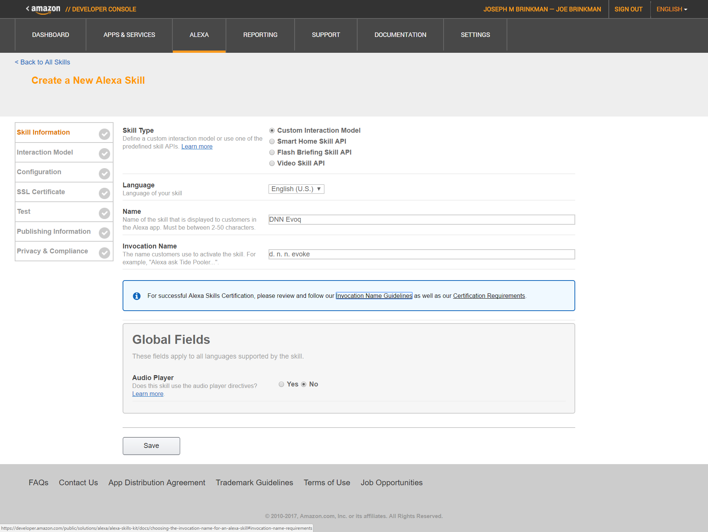
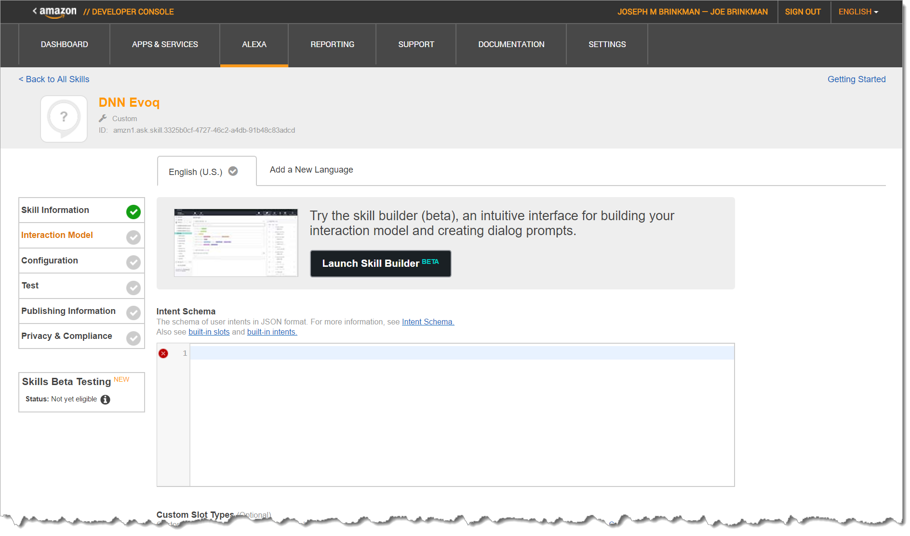
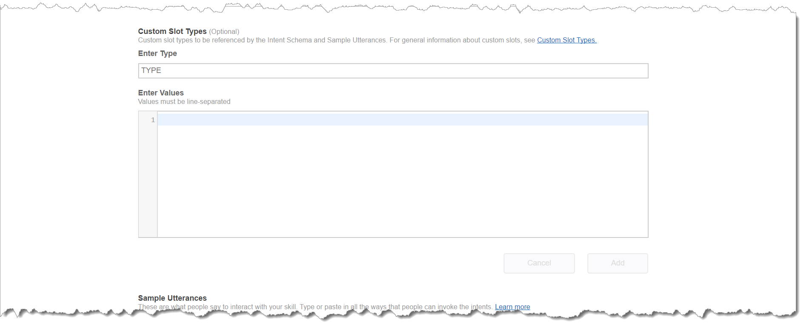
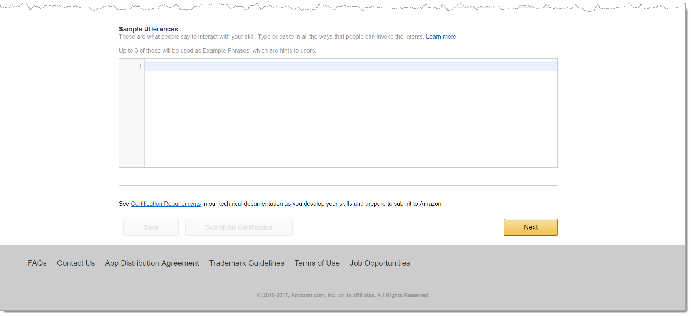
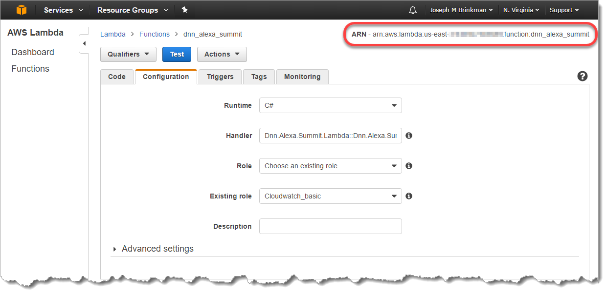
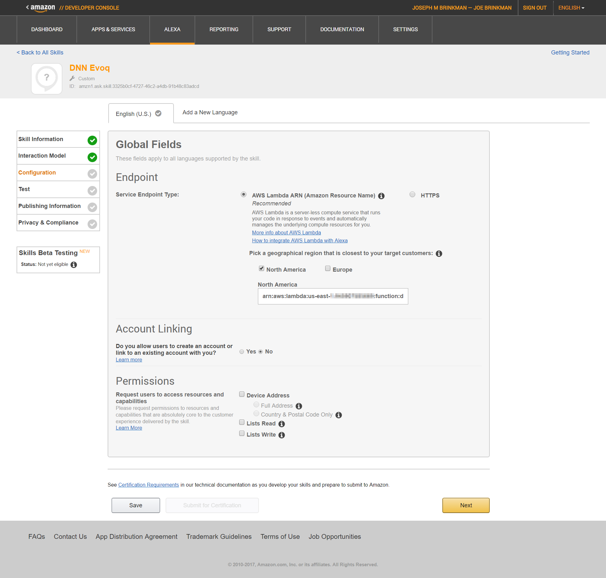
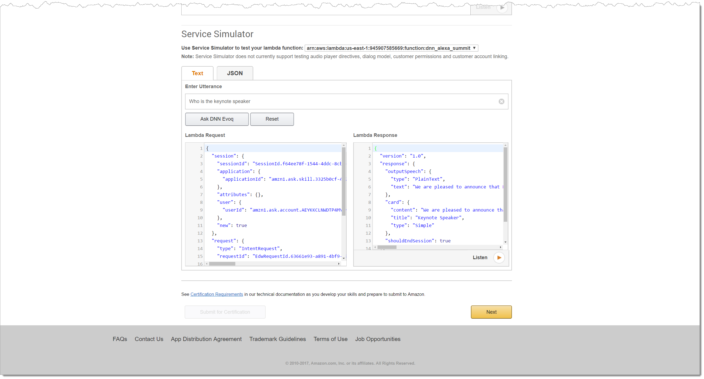

# Section Index
1. [Creating the Liquid Summit Website](1_Setup_Liquid_Content.md)
2. [Creating the AWS Lambda Project](2_Create_AWS_Lambda_Project.md)

   1. [Building the Basic Alexa Framework](2-1_Create_Basic_Framework.md)
   2. [Building the Application Logic for Alexa](2-2_Create_Application_Logic.md)
   3. [Using the Liquid Content API](2-3_Use_Liquid_Content_API.md)
   4. [Publishing to AWS](2-4_Publishing_Lambda.md)
   5. [Testing and Troubleshooting](2-5_Testing_Lambda_Function.md)

3. [Configuring the Alexa Skill](3_Configure_Alexa_Skill.md)

# Configuring the Alexa Skill

The final step in building our Alexa skill is to actually configure our app in the Alexa console. Alexa needs to understand the intents we have codified into our application logic and the location of our application code.

## Creating a New Skill

1. Login to the [Amazon Developer Console](https://developer.amazon.com/edw/home.html#/) and go to the Alexa page. Click the _Get Started_ button for the Alexa Skills Kit to open your list of Alexa Skills

    

3. From the Skill list, you can manage your existing Alexa skills, including viewing usage metrics. To create a new skill, Click the _Add a New Skill_ button to start the skill wizard.

    

4. The Liquid Summit skill will use a custom interaction model. I'll leave the language as English (U.S.), and enter a name for my skill.  Finally, I need to set an invocation name. Make sure to review the [invocation naming requirements](https://developer.amazon.com/public/solutions/alexa/alexa-skills-kit/docs/choosing-the-invocation-name-for-an-alexa-skill#invocation-name-requirements) to ensure your skill can be properly invoked by a user. With all of the fields filled in, press the _Save_ button to save your skill. Then click _Next_ to move to the next step in the wizard.

    

5. The heart of any Alexa skill is the interaction model. The interaction model defines what actions a user can invoke and what utterances Alexa will understand. There are basically three sections that you need to fill out to define your interaction model. 

    1. The first section is the Intent schema.  This defines the different intents (i.e. actions) for your skill. Copy the [IntentSchema.json](../src/IntentSchema.json) document from the sample project and paste it into the Intent Schema box. 

        

    2. The second section is the custom slot types.  If your intents used custom slots, then you would enter those values here.  For our example, you can leave this section blank since we don't use any slots for our intents.

        

    3. The third section is the sample utterances. These utterances are used by Alexa to infer what types of statements will trigger a defined intent, and what slot values should be captured. You should include at least three examples for every intent, but the more examples you can provide, the more accurate Alexa will be. For this example, copy the utterances from [Utterances.txt](../src/Utterances.txt) and past them into the text box.

        

6. Click _Next_ to save and build your interaction model. This can take a few seconds depending on the complexity of your model. This will take you to the Configuration screen

7. In order to connect your skill to the application code, you need the Amazon Resource Name (ARN) of the Lambda function we deployed earlier. The ARN is available in the AWS console on the details page of the Lambda function.

    

8. On the Alexa Skill configuration page, select the _AWS Lambda ARN_ option for the _Service Endpoint Type_.  From there, you can choose where your skill will be hosted (i.e. North America or Europe). Finally, enter the ARN that you retrieved in step 7 and click _Next_.

    

    The _Account Linking_ and _Permissions_ are not needed in our example. Account Linking is used when you want to associate an Amazon user with a specific user in your application. This would allow you to do things like personalize a skill to an individual user based on that users profile in your system. Permissions are used for getting access to user data like their location or their shopping and task lists.

## Testing your skill

At this point your skill is in a development state and is ready to be tested. While it is not accessible to the general public you are able to add it to your skills list for your own Echo devices or from the Alexa Developer Console. You can also access your skill from [Reverb](http://reverb.ai), an application available on the Mac, Apple and Google Play stores.

Initial testing can be easily done from the Testing tab for your skill. Enter a sample utterance and click the _Ask_ button. You will see the request that Alexa sends to your Lambda function and the response you get back.

You can save the json requests in a file, and use them for doing further development and testing of your Lambda functions.

## Finishing Up

Once you are satisfied with how you skill works, you will want to complete the wizard by filling out the _Publishing Info_ and the _Privacy & Compliance_ forms. These forms are straight forward and are used to provide information that is necessary for publishing your skill. If you want to do beta testing with other users you will also need to fill out those two pages.

Your Alexa skill is now complete. While the process may seem long, it is actually quite simple if you look at the individual sections. Simple skills can be built and published in a single afternoon. During this process, you also saw how easy it is to access content in Liquid Content through the public API.  I believe that the simplicity of the Liquid Content API will make it easy for you to develop your own integrations, whether it is with Alexa, or some other application. 