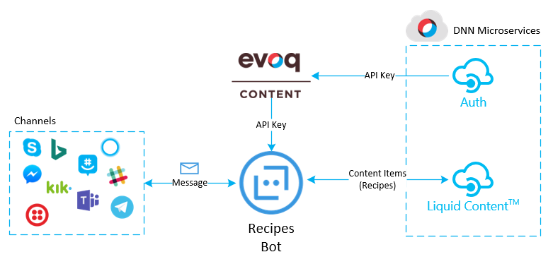

# Recipes bot
Implementing a Recipes bot service with Liquid Content

In this tutorial, you will build a recipes chat bot connecting your favorites message channels with Evoq Liquid ContentTM. 
The bot will be able to return a list of recipes for dinner after providing the list of ingredients you have. 

The bot will be built by using the Azure Bot Service, the intelligent, serverless bot service that scales on demand. With 
this service, you will be able to publish your bot through multiple channels without managing or patching any server. The service 
is free, and you will only pay for the resources you consume. 

# Getting Started

## Prerequisites

To follow the tutorial, you will need:

- An active Azure subscription. You will need to login as owner of the subscription to host the bot service. You can sign up for a free subscription [here](https://azure.microsoft.com/free/).
- An Evoq Content or Engage site with Evoq Liquid Content enabled

Also, to debug your C# bot locally using breakpoints in Visual Studio you will need:

- Download and install the [Bot Framework Emulator](https://docs.microsoft.com/es-es/bot-framework/debug-bots-emulator).
- Install the [Azure Functions Core Tools](https://www.npmjs.com/package/azure-functions-core-tools).
- Install the [DotNet CLI](https://github.com/dotnet/cli).
- Download and install [Visual Studio 2017](https://www.visualstudio.com/downloads/) (Community Edition or above). (VS Code not supported for C# bots yet)
- Download and install the [Command Task Runner Visual Studio Extension](https://visualstudiogallery.msdn.microsoft.com/e6bf6a3d-7411-4494-8a1e-28c1a8c4ce99).
- Download the source code for your bot (from Azure), as described in **Set up continuous integration** section below. Complete previous steps first.

For more information about how to setup the debugging environment, visit [Debug with the emulator](https://docs.microsoft.com/es-es/bot-framework/debug-bots-emulator) and [Debug an Azure Bot Service C# bot](https://docs.microsoft.com/es-es/bot-framework/azure/azure-bot-service-debug-bot#a-iddebug-csharpa-debug-a-c-bot) on the bot framework documentation.

# Content index
1. [Setting up the recipes](docs/1_setup_recipes.md)
2. [Creating the basic bot](docs/2_creating_basic_bot.md)
3. [Setup continuous integration](docs/3_setup_ci.md)
4. [Debugging the bot on your local environment](docs/4_debugging_locally.md)
5. [Customizing the basic bot](docs/5_customizing_bot.md)
6. [Test your recipes bot](docs/6_testing_bot.md)
7. [Adding a webchat in your site](docs/7_adding_webchat.md)
8. [Known issues](docs/8_known_issues.md)
