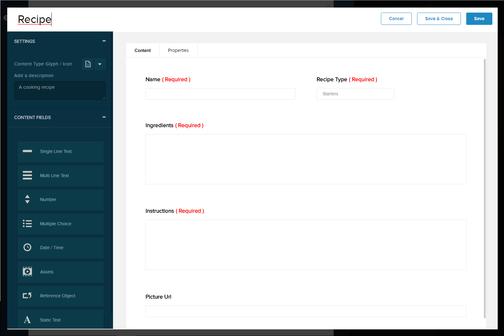
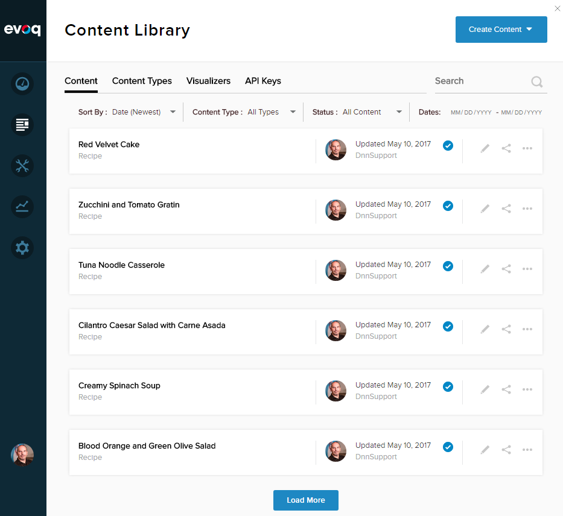
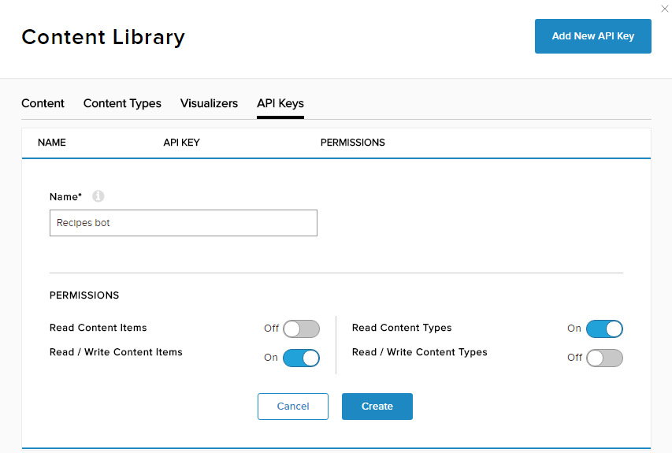

# Content index
1. [Setting up the recipes](1_setup_recipes.md)
2. [Creating the basic bot](2_creating_basic_bot.md)
3. [Setup continuous integration](3_setup_ci.md)
4. [Debugging the bot on your local environment](4_debugging_locally.md)
5. [Customizing the basic bot](5_customizing_bot.md)
6. [Test your recipes bot](6_testing_bot.md)
7. [Adding a webchat in your site](7_adding_webchat.md)
8. [Known issues](8_known_issues.md)

# Setting Up the recipes

First, you need to setup the recipes model on Liquid Content by creating the Recipe content type and the recipes.

## Step 1. Create the Recipes content type

1. On the **Content Library &gt; Content types** page, click on **Create Content Type** button
2. Create the following fields per the picture below:
  1. Name: Single Line Text (Required)
  2. Recipe Type: Multiple Choice (Required), and add the following choices: Starters, Breakfast, Salads, Soups, Main Courses, Sides, Desserts, Beverages
  3. Ingredients: Multi Line Text (Required)
  4. Instructions: Multi Line Text (Required)
  5. Picture Url: Line Text (Optional)
3. Click on **Save &amp; Close** button

## Step 2. Create some recipes

Now that the Recipes content type has been created, we need to create some recipes to our content repository. You can add your own recipes, but for making this task easier, just go to [http://pinchmysalt.com/recipe-list/](http://pinchmysalt.com/recipe-list/) or other of your favorites recipes sites and copy and paste some of your favorite recipes.

For each recipe, ensure you fill the following fields:

- Content Details:
  - Recipe Name
  - Recipe Type
  - Ingredients
  - Instructions
  - Picture Url (this is optional, but causes a cool effect 😊)
- Properties:
  - Content Item Name (use the same Recipe Name)
  - Description (recipe&#39;s short description)

## Step 3. Generate an API Key to access the recipes

1. On the **Content Library &gt; API Keys** page, click on the **Add New API Key** button
2. Type &quot;Recipe bot&quot; on the Name field
3. Enable **Read / Write Content Items**
4. Enable **Read Content Types**
5. Click on the **Create** button
6. The API Key will be generated. You will need this later to setup the bot service

