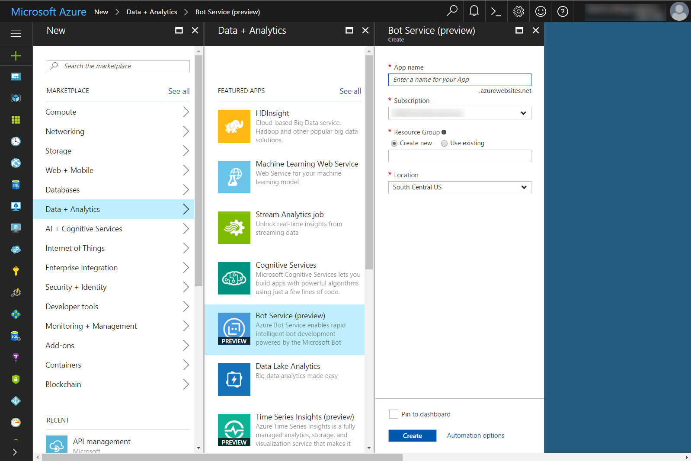
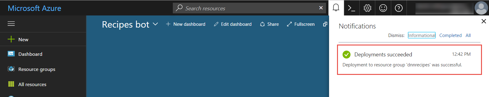
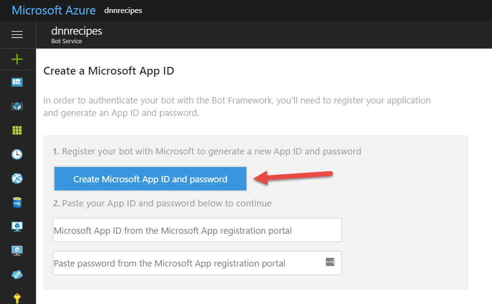
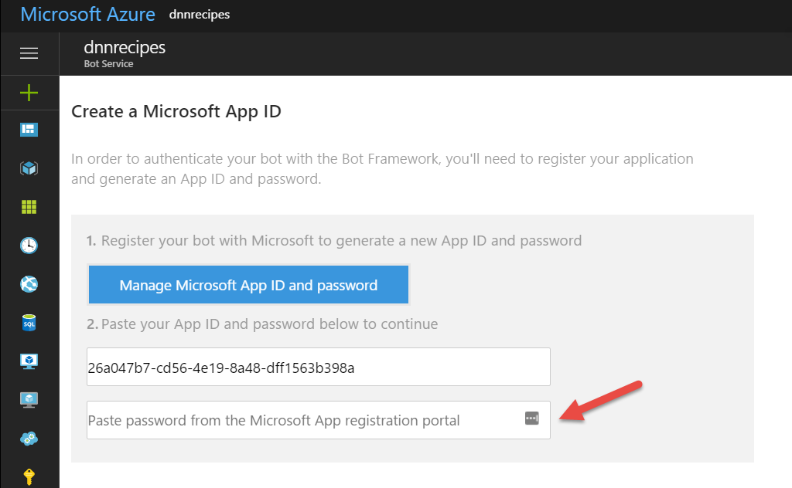
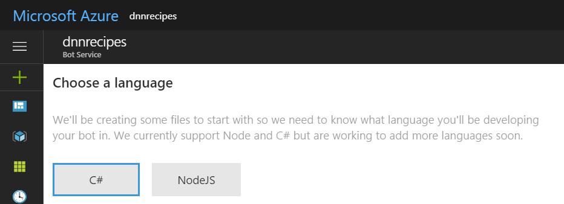
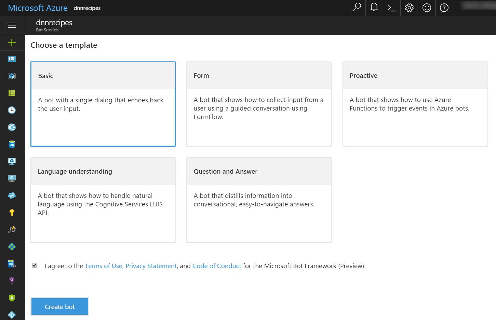
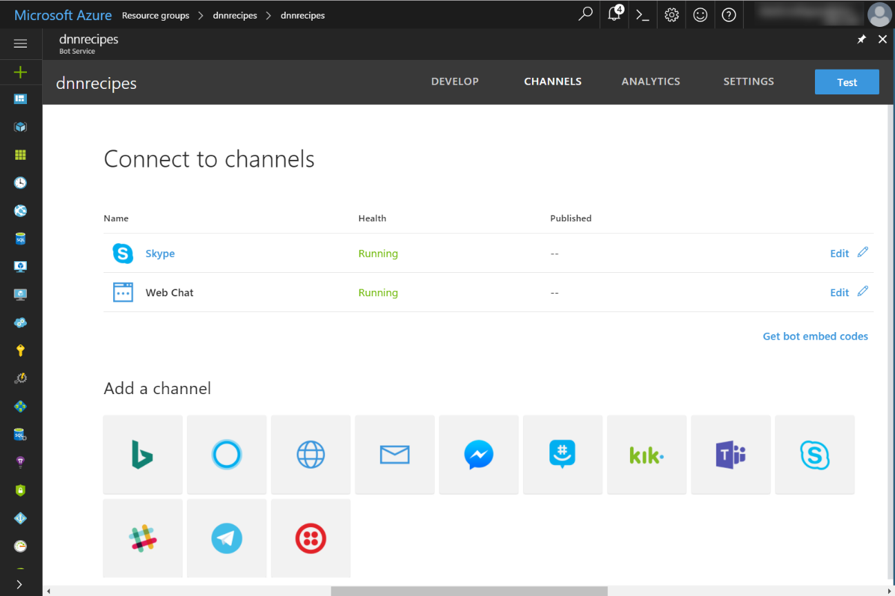
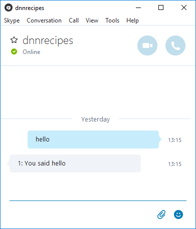

# Content index
1. [Setting up the recipes](1_setup_recipes.md)
2. [Creating the basic bot](2_creating_basic_bot.md)
3. [Setup continuous integration](3_setup_ci.md)
4. [Debugging the bot on your local environment](4_debugging_locally.md)
5. [Customizing the basic bot](5_customizing_bot.md)
6. [Test your recipes bot](6_testing_bot.md)
7. [Adding a webchat in your site](7_adding_webchat.md)
8. [Known issues](8_known_issues.md)

# Creating the basic bot

To create the bot using Azure Bot Service:

1. Sign in to [Azure](https://portal.azure.com/) portal
2. Select **New** in the menu blade
3. In the **New** blade, navigate to the Data + Analytics category, and select Bot Service.
4. In the Bot Service blade, provide the requested information and click **Create**. When the deployment completes, Azure adds a notification to the **Notifications** group.

 

 - Set **App name** to your bot&#39;s name. The name is used as the subdomain of your deployment (for example, mydnnrecipesbot.azurewebsites.net). The name may contain alphanumeric characters and a dash (-).
- Select the subscription to use.
- Select the resource group and location. See the Azure documentation for information about [Resource Group](https://azure.microsoft.com/en-us/documentation/articles/resource-group-overview/), and [Location](https://azure.microsoft.com/en-us/regions/).

5. Check whether the bot has been deployed.
  - To determine whether the bot has been deployed, click **Notifications** (see the bell icon at the top right). The notification will change from **Deployments started** to **Deployments succeeded**.
  - Click on the notification to go to the bot resource

  - Alternatively, you can click All Resources in the menu blade, and then select the bot from the list of resources

6. Create an app ID and password by clicking **Create Microsoft App ID and password**.

  - When you click Create, you&#39;re taken to another page where you click **Generate an app password to continue** to get your password. Copy and securely store the password.
  - Click **Finish and go back to Bot Framework**.
  - When you come back, the app ID field is populated for you. Paste the password that you copied into the password field.

  - You should only click **Manage Microsoft App ID and password** if you want to get a secondary password for your bot. Note that you can manage passwords anytime in the Bot Framework portal. Click **My bots** , select the bot, and in the Details section, click **Edit**. Under Configuration, click **Manage Microsoft App ID and password**.

7. Select **C#** as the programming language to use to develop your bot.

8. Select the **Basic** template to use as the starting point for writing the Recipes bot

9. Click **Create bot** to create the bot. After the Bot Service generates your bot, the Azure editor will contain your bot&#39;s source files. At this point, the bot is functional. Try it out in the chat control.

(Note that there may be a slight delay before the splash screen displays indicating that the Bot Service is generating your bot; don&#39;t click **Create bot** again.)

By default, the bot is published on Skype and the web chat is also enabled. For this tutorial, we will use just one of these channels, but feel free to follow the instructions provided on the **Channels** tab to add more channels like Facebook Messenger, Telegram, Microsoft Teams, Slack, etc.

Just to test the default Skype connected channel, click on the **Skype** label to add the Recipe bot you your Skype contacts. You should be able to chat with the bot in the same way you did on the web test pane.

You can find related information about the [Azure Bot service](https://docs.botframework.com/en-us/azure-bot-service/) as part of the Azure Bot Framework SDK documentation.

