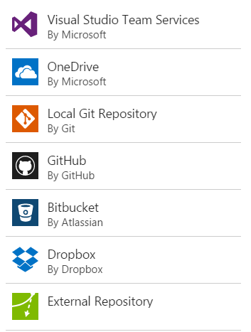
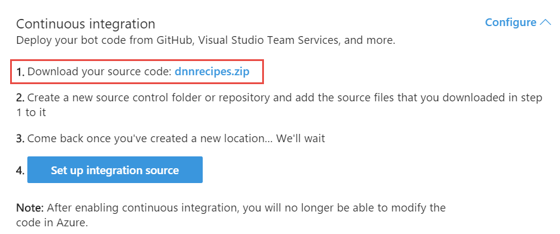
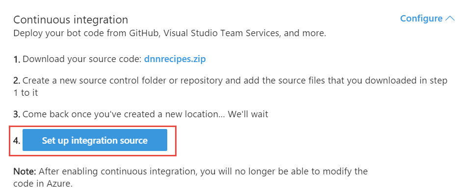

# Content index
1. [Setting up the recipes](1_setup_recipes.md)
2. [Creating the basic bot](2_creating_basic_bot.md)
3. [Setup continuous integration](3_setup_ci.md)
4. [Debugging the bot on your local environment](4_debugging_locally.md)
5. [Customizing the basic bot](5_customizing_bot.md)
6. [Test your recipes bot](6_testing_bot.md)
7. [Adding a webchat in your site](7_adding_webchat.md)
8. [Known issues](8_known_issues.md)

# Setup continuous integration

By default, Azure Bot Service enables you to develop your bot directly in the browser using the Azure editor, without any need for a local editor or source control. However, Azure editor does not allow you to manage files within your application (e.g., add files, rename files, or delete files). If you want to the ability to manage files within your application, you can set up continuous integration and use the integrated development environment (IDE) and source control system of your choice (e.g., Visual Studio Team, GitHub, Bitbucket). With continuous integration configured, any code changes that you commit to source control will automatically be deployed to Azure. Additionally, you will be able to debug your bot locally if you configure continuous integration.

Note: If you enable continuous integration for your bot, you will no longer be able to edit code in the Azure editor. If you want to edit your code in Azure editor once again, you must [disable continuous integration](https://docs.microsoft.com/es-es/bot-framework/azure/azure-bot-service-continuous-integration#disable-continuous-integration).

For more information, visit [Azure Bot Service continuous integration](https://docs.microsoft.com/es-es/bot-framework/azure/azure-bot-service-continuous-integration).

## Enable continuous integration

You can enable continuous integration for your application by completing three simple steps. Go to **Settings** and scroll down to the **Continuous integration** section. Click on the **Set up integration source** to connect with your repository.

### Create an empty repository within a source control system

First, create an empty repository within one of the source control systems that Azure supports.

### Download the source code for your bot

Next, download the source code for your bot from the Azure portal to your local working directory.

1. Within your Azure bot, click the **Settings** tab and expand the **Continuous integration** section.
2. Click the link to download the zip file that contains the source code for your bot.

3. Extract the contents of the downloaded zip file to the local folder where you are planning to sync your deployment source.

### Choose the deployment source and connect your repository

Finally, choose the deployment source for your bot and connect your repository.

1. Within your Azure bot, click the **Settings** tab and expand the **Continuous integration** section.
2. Click **Set up integration source**.

3. Click **Setup** , select the deployment source that corresponds to the source control system where you previously created the empty repository, and complete the steps to connect it. Once setup, you will see the integration details.

