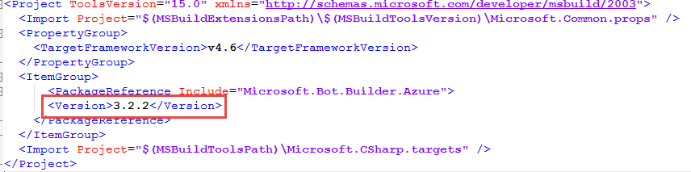
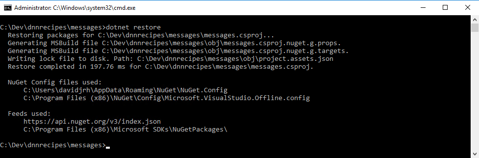
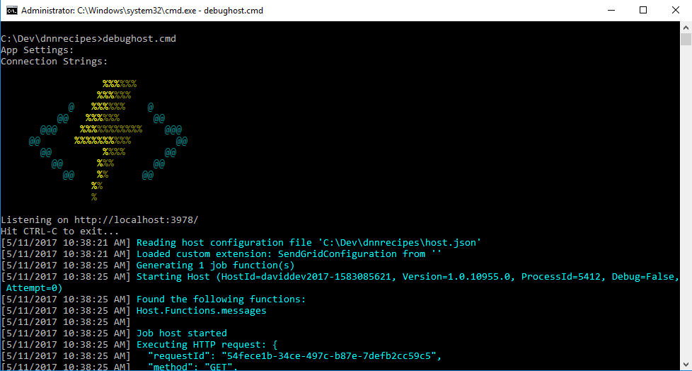
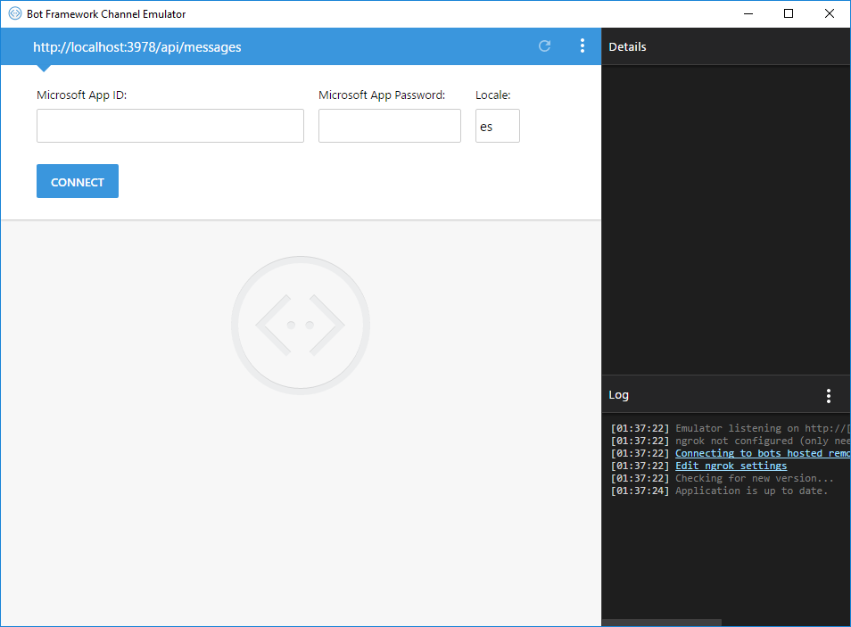
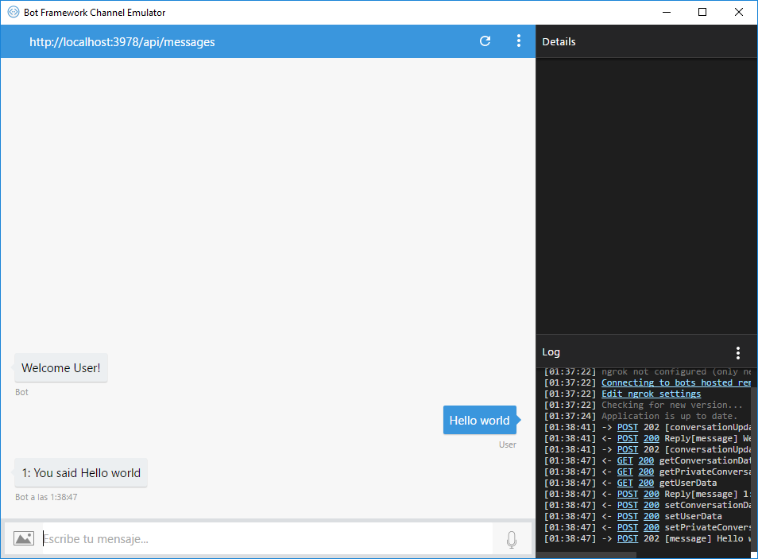
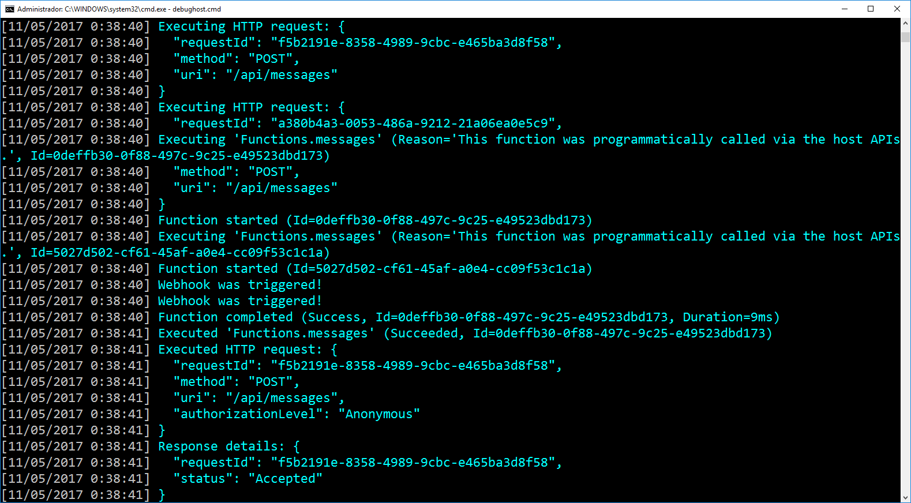
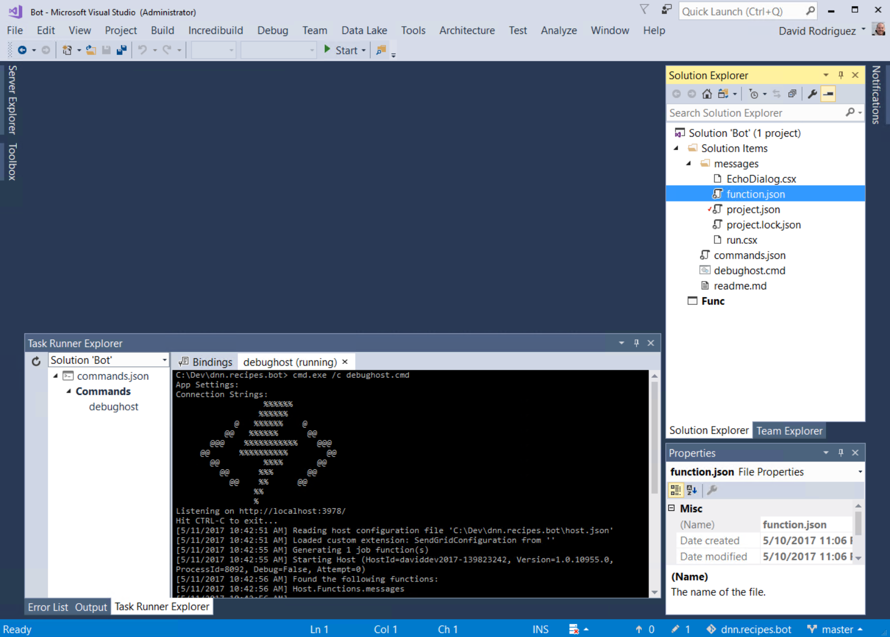
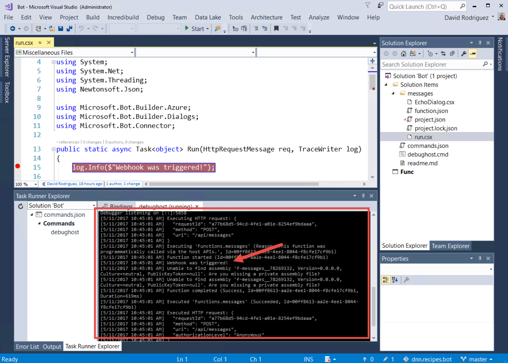
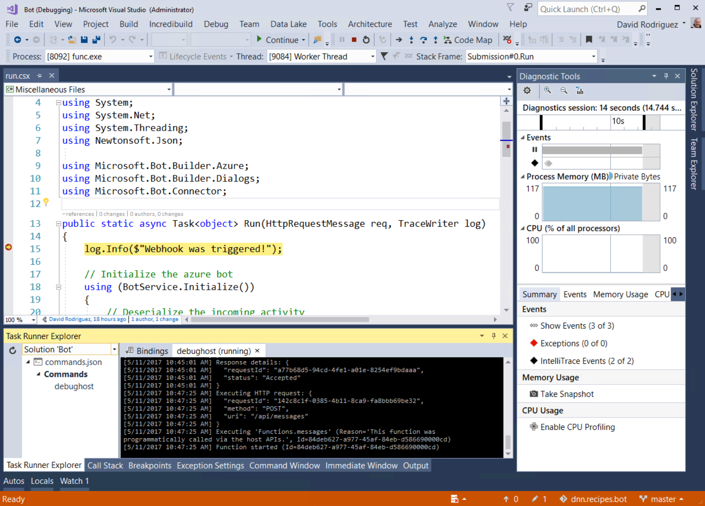

# Content index
1. [Setting up the recipes](1_setup_recipes.md)
2. [Creating the basic bot](2_creating_basic_bot.md)
3. [Setup continuous integration](3_setup_ci.md)
4. [Debugging the bot on your local environment](4_debugging_locally.md)
5. [Customizing the basic bot](5_customizing_bot.md)
6. [Test your recipes bot](6_testing_bot.md)
7. [Adding a webchat in your site](7_adding_webchat.md)
8. [Known issues](8_known_issues.md)

# Debugging the bot on your local environment

Before starting to modify the bot, we would like to setup our local development environment to debug the bot changes, so when we are ready to commit a change, we just push the changes to the repository and the continuous integration will change the Azure Bot service automatically.

Note: the steps outlined here comes from the [Debug a C# bot](https://docs.microsoft.com/es-es/bot-framework/azure/azure-bot-service-debug-bot#a-iddebug-csharpa-debug-a-c-bot) documentation, but with some modification and needed fixes found after the Build 2017 conference.

## Prerequisites

Before you can debug your C# bot, you must complete these tasks.
 
- Download the source code for your bot (from Azure), as described in **Set up continuous integration** section above.
- Download and install the [Bot Framework Emulator](https://docs.microsoft.com/es-es/bot-framework/debug-bots-emulator).
- Install the [DotNet CLI](https://github.com/dotnet/cli).
- Install the [Azure Functions Core Tools](https://www.npmjs.com/package/azure-functions-core-tools). There is a known issue, and after installing the tools, you must modify the file located at **&quot;%USERPROFILE%\AppData\Roaming\npm\node\_modules\azure-functions-cli\bin\Func.exe.config&quot;** and change the System.Net.Http binding redirect as follows. More information on [https://github.com/dotnet/corefx/issues/16805](https://github.com/dotnet/corefx/issues/16805)

      <dependentAssembly>
        <assemblyIdentity name="System.Net.Http" culture="neutral" publicKeyToken="b03f5f7f11d50a3a" />
        <!--Explicitly redirecting back to 4.0.0. See https://github.com/dotnet/corefx/issues/16805 for details-->
        <bindingRedirect oldVersion="0.0.0.0-4.1.1.0" newVersion="4.0.0.0" />
      </dependentAssembly>

Also, to be able to debug your code by using breakpoints in Visual Studio 2017, you must also complete these tasks.

- Download and install [Visual Studio 2017](https://www.visualstudio.com/downloads/) (Community Edition or above). (VS Code not supported for C# bots yet)
- Download and install the [Command Task Runner Visual Studio Extension](https://visualstudiogallery.msdn.microsoft.com/e6bf6a3d-7411-4494-8a1e-28c1a8c4ce99).

## Debug a C# bot using the Bot Framework Emulator

The simplest way to debug your bot locally is to start the bot and then connect to it from Bot Framework Emulator. First, open a command prompt and navigate to the folder where the **project.json** file is located in your repository. Then, run the command **dotnet restore** to restore the various packages that are referenced in your bot.

1. Visual Studio 2017 RC changes how Visual Studio handles dependencies. While Visual Studio 2015 uses **project.json** to handle dependencies, Visual Studio 2017 uses a . **csproj** model when loading in Visual Studio. If you are using Visual Studio 2017, [download this .csproj file](https://aka.ms/bf-debug-project) to the **/messages** folder in your repository.
2. Also, before executing the dotnet restore, ensure the file messages.csproj you just unzipped, matches the same &quot;Microsoft.Bot.Builder.Azure&quot; version specified on the project.json file. When writing this article, was the 3.2.2.

3. Now run the **dotnet restore** command on the /messages folder

4. Next, run debughost.cmd to load and start your bot

At this point, the bot is running locally. From the console window, copy the endpoint that debughost is listening on (in this example, **http://localhost:3978** ). Then, start the Bot Framework Emulator and paste the endpoint into the address bar of the emulator. For this example, you must also append **/api/messages** to the endpoint. Since you do not need security for local debugging, you can leave the **Microsoft App ID** and **Microsoft App Password** fields blank. Click **Connect** to establish a connection to your bot using the specified endpoint.

After you have connected the emulator to your bot, send a message to your bot by typing some text into the textbox that is located at the bottom of the emulator window (i.e., where **Type your message**... appears in the lower-left corner). By using the **Log** and **Inspector** panels on the right side of the emulator window, you can view the requests and responses as messages are exchanged between the emulator and the bot.

Additionally, you can view log details the console window.

## Debug a C# bot using breakpoints in Visual Studio

To debug your bot using breakpoints in Visual Studio 2017, stop the **DebugHost.cmd** script, and load the solution for your project (included as part of the repository) in Visual Studio. Then, click **Task Runner Explorer** at the bottom of the Visual Studio window.

You will see the bot loading in the debug host environment in the **Task Runner Explorer** window. Your bot is now running locally. Copy the bot&#39;s endpoint from the **Task Runner Explorer** window, start the Bot Framework Emulator, and paste the endpoint into the address bar of the emulator. For this example, you must also append **/api/messages** to the endpoint. Since you do not need security for local debugging, you can leave the **Microsoft App Id** and **Microsoft App Password** fields blank. Click **Connect** to establish a connection to your bot using the specified endpoint.

After you have connected the emulator to your bot, send a message to your bot by typing some text into the textbox that is located at the bottom of the emulator window (i.e., where **Type your message**... appears in the lower-left corner). As messages are exchanged between the emulator and the bot, you will see the responses as well as logged output within **Task Runner Explorer** in Visual Studio.

You can also set breakpoints for your bot. The breakpoints are hit only after clicking **Start** in the Visual Studio environment, which will attach to the Azure Function host ( **func** command from Azure Functions CLI). Chat with your bot again using the emulator and you should hit the breakpoints that you set in Visual Studio.

Tip: If you cannot successfully set a breakpoint, a syntax error likely exists in your code. To troubleshoot, look for compile errors in the **Task Runner Explorer** window after you try to send messages to your bot.

