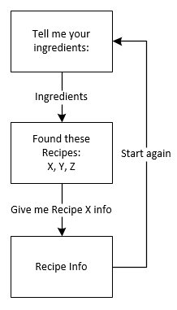
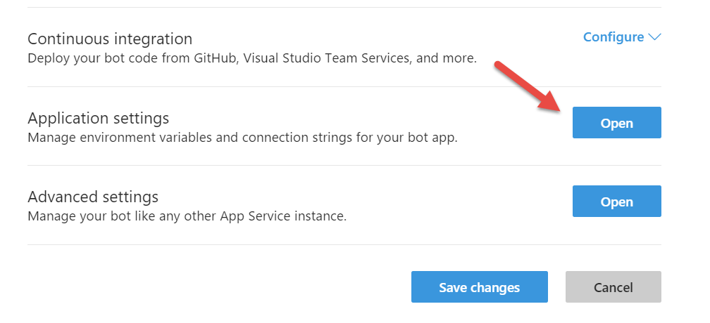
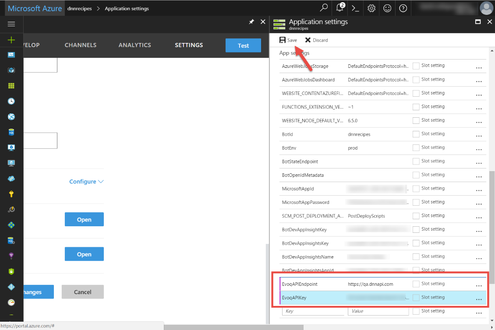
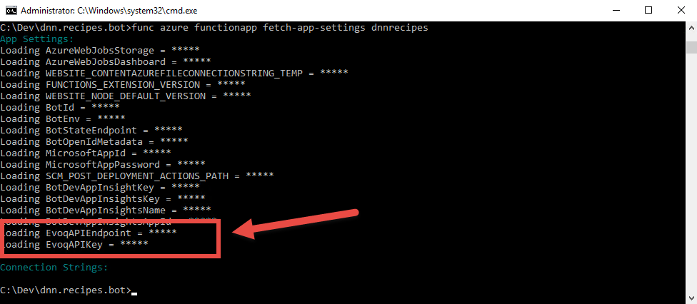
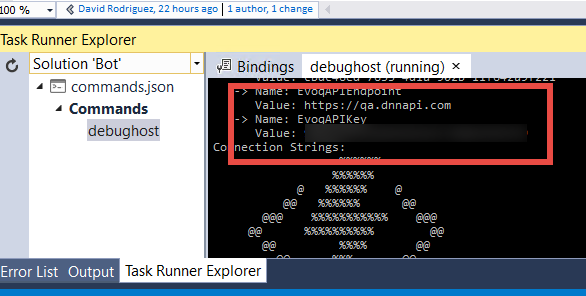
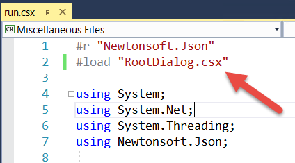
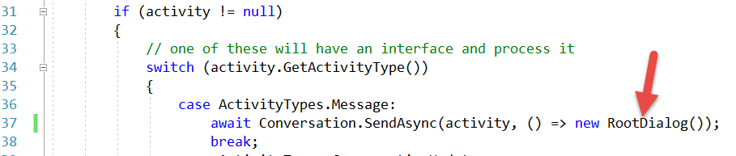

# Content index
1. [Setting up the recipes](1_setup_recipes.md)
2. [Creating the basic bot](2_creating_basic_bot.md)
3. [Setup continuous integration](3_setup_ci.md)
4. [Debugging the bot on your local environment](4_debugging_locally.md)
5. [Customizing the basic bot](5_customizing_bot.md)
6. [Test your recipes bot](6_testing_bot.md)
7. [Adding a webchat in your site](7_adding_webchat.md)
8. [Known issues](8_known_issues.md)

# Customizing the basic bot

We are going to build a very simple bot to start with. The bot will ask you for entering the ingredients you currently have, and the service will return the available recipes containing those ingredients. You can then select a recipe and obtain the cooking instructions. The following diagram shows this simple flow:

 

## Modifying the source code

Note that all the code is implemented in [ScriptCS](http://scriptcs.net/), that makes it easy to write and execute C# with a simple text editor. In the next steps, we are going to modify the basic bot source code to implement the recipes bot dialogs.

### Setup the API Key settings

To avoid hardcoding the API Key and the API Endpoint URL on the code, we will set those parameters as application settings

1. On the Azure Portal, open the bot service resource and click on the **Settings** tab
2. Scroll down to the **Application Settings** and click on the **Open** button

 

1. Create a new setting named **EvoqAPIEndpoint** with the value [https://dnnapi.com](https://dnnapi.com)
2. Create a new setting named **EvoqAPIKey** with the value you obtained on previous steps
3. Click on **Save**

 

To use these settings on your local environment, follow these steps:

1. Open a command prompt on the root of the source code folder
2. Set the current subscription to the one hosting your bot service with the command **func azure subscription set &lt;subscriptionid&gt;**

 

3. Type the command **func azure functionapp fetch-app-settings [YOUR\_BOT\_SERVICE\_NAME]**

 

Note that now, when running the bot from both Visual Studio or just starting from the command prompt, the settings are shown at the beginning:

 

In order to connect from the Bot Emulator to your local bot, you will also need to specify the credentials stored on the app settings **MicrosoftAppId** and **MicrosoftAppPassword:**

 

### Adding the RootDialog.csx

To implement the recipes dialogs, let&#39;s do the following changes:

1. Remove the **/messages/EchoDialog.csx** from the solution explorer and delete the file from the file system

NOTE: removing files from the solution explorer doesn&#39;t delete them from the file system. Also, when adding a new file to the solution explorer, ensure that is on the right place by using **Add &gt; Existing item…** dialog instead of **Add &gt; New item… dialog**

1. Add a new text file under the **/messages** folder, called **RootDialog.csx**
2. Modify the **/messages/run.csx** file to delete the reference to the **EchoDialog.csx** and reference now the RootDialog.csx

 

3. Replace the **EchoDialog()** class instantiation for **RootDialog()** class on the **run.csx** file:

 

4. Open the **RootDialog.csx** and copy and paste the following code:

```
#load ".\Shared\HeroCardExtensions.csx"
#load ".\Shared\Recipes.csx"
#load "RecipeForm.csx"

using System;
using System.Configuration;
using System.Net;
using System.Linq;
using System.Threading.Tasks;
using Microsoft.Bot.Builder.Dialogs;
using Microsoft.Bot.Builder.FormFlow;
using Microsoft.Bot.Connector;


// For more information about this template visit http://aka.ms/azurebots-csharp-basic
[Serializable]
public class RootDialog : IDialog<object>
{
    private const string RootDialog_Welcome_Ingredients = "Type ingredients";
    private const string RootDialog_Welcome_Ingredients_Picture = "Upload pic of ingredients";
    private const string RootDialog_Welcome_Support = "Call DNN Support";
    private const string RootDialog_Welcome_Error = "That is not a valid option. Please try again.";
    private const string RootDialog_Support_Message = "Support will contact you shortly. Have a nice day :)";

    private List<Recipe> Recipes { get; set; }
    private RecipeType RecipeType { get; set; }

    private static string APIEndpoint => ConfigurationManager.AppSettings["EvoqAPIEndpoint"];
    private static string APIKey => ConfigurationManager.AppSettings["EvoqAPIKey"];
    
    public Task StartAsync(IDialogContext context)
    {
        try
        {
            context.Wait(MessageReceivedAsync);
        }
        catch (OperationCanceledException error)
        {
            return Task.FromCanceled(error.CancellationToken);
        }
        catch (Exception error)
        {
            return Task.FromException(error);
        }

        return Task.CompletedTask;
    }

    public virtual async Task MessageReceivedAsync(IDialogContext context, IAwaitable<IMessageActivity> argument)
    {
        var message = await argument;
        await this.WelcomeMessageAsync(context);
    }

    private async Task WelcomeMessageAsync(IDialogContext context)
    {
        var reply = context.MakeMessage();

        var options = new[]
        {
                RootDialog_Welcome_Ingredients,
                RootDialog_Welcome_Ingredients_Picture,
                RootDialog_Welcome_Support
            };

        HeroCardExtensions.AddHeroCard(ref reply,
            "Recipes Bot",
            "Your agent that allows you to cook Liquid Content recipes",
            options, 
            new[] { "https://raw.githubusercontent.com/davidjrh/dnn.recipes.bot/master/dnnrecipes.jpg" });

        await context.PostAsync(reply);

        context.Wait(this.OnOptionSelected);
    }

    private async Task OnOptionSelected(IDialogContext context, IAwaitable<IMessageActivity> result)
    {
        var message = await result;

        if (message.Text == RootDialog_Welcome_Ingredients)
        {
            context.Call(RecipeForm.BuildFormDialog(FormOptions.PromptInStart), FormComplete);
        }
        else if (message.Text == RootDialog_Welcome_Ingredients_Picture)
        {
            await context.PostAsync("This will be on the second tutorial using **Cognitive Services**. Come back soon!");
            context.Wait(MessageReceivedAsync);
        }
        else if (message.Text == RootDialog_Welcome_Support)
        {
            await context.PostAsync("Support will contact you shortly. Have a nice day :)");
            context.Wait(MessageReceivedAsync);
        }
        else
        {
            await this.StartOverAsync(context, RootDialog_Welcome_Error);
        }
    }
    private async Task FormComplete(IDialogContext context, IAwaitable<RecipeForm> result)
    {
        try
        {
            var form = await result;
            if (form != null)
            {
                await context.PostAsync("Ok. Give me a second while I look for something tasty...");
                if (this.RecipeType == null)
                {
                    this.RecipeType = await GetRecipeTypeAsync();
                }
                this.Recipes = await GetRecipesAsync(form.Ingredients, this.RecipeType);
                if (this.Recipes != null && this.Recipes.Count > 0)
                {
                    await this.ShowRecipesAsync(context);
                }
                else
                {
                    await context.PostAsync("Sorry, seems there are no recipes in my library for those ingredients! Do you want me to order a pizza?");
                    context.Wait(MessageReceivedAsync);
                }                
            }
            else
            {
                await context.PostAsync("Form returned empty response! Type anything to restart it.");
                context.Wait(MessageReceivedAsync);
            }
        }
        catch (OperationCanceledException)
        {
            await context.PostAsync("You canceled the form! Type anything to restart it.");
            context.Wait(MessageReceivedAsync);
        }

        
    }

    protected async Task ShowRecipesAsync(IDialogContext context)
    {
        await context.PostAsync($"Found {this.Recipes.Count} recipes:");
        var carouselCards = this.Recipes.Select(it => new HeroCard
        {
            Title = it.Name,
            Text = it.Description,
            Images = new List<CardImage> {
                new CardImage(string.IsNullOrEmpty(it.Details.ImageUrl) ? 
                    "https://raw.githubusercontent.com/davidjrh/mytrash/master/no-image-icon.png" : 
                    it.Details.ImageUrl, it.Name)
            },
            Buttons = new List<CardAction>
                        {
                            new CardAction(ActionTypes.ImBack, "Select", value: it.Name)
                        }
        });

        var reply = context.MakeMessage();
        reply.AttachmentLayout = AttachmentLayoutTypes.Carousel;
        reply.Attachments = new List<Attachment>();
        foreach (var card in carouselCards)
        {
            reply.Attachments.Add(card.ToAttachment());
        }
        await context.PostAsync(reply);
        context.Wait(this.OnRecipeSelected);
    }

    private async Task OnRecipeSelected(IDialogContext context, IAwaitable<IMessageActivity> result)
    {
        var message = await result;

        var recipe = this.Recipes.FirstOrDefault(x => x.Name == message.Text);
        if (recipe != null)
        {
            await context.PostAsync($"**{recipe.Name.ToUpperInvariant()}**");
            await context.PostAsync(recipe.Description);
            await context.PostAsync($"**Ingredients**: {recipe.Details.Ingredients}");
            await context.PostAsync($"**Instructions**: {recipe.Details.Instructions}");
        }
        else
        {
            await this.StartOverAsync(context, "That recipe is not an option");
        }
    }


    static public async Task<List<Recipe>> GetRecipesAsync(string ingredients, RecipeType recipeType)
    {
        if (recipeType == null) return null;
        var parsedIngredients = ParseIngredients(ingredients);
        var request = (HttpWebRequest)WebRequest.Create(
        $"{APIEndpoint}/content/api/contentitems?contenttypeid={recipeType.Id}&searchtext={WebUtility.UrlEncode(parsedIngredients)}");
        request.Method = "GET";
        request.ContentType = "application/json";
        request.Headers = new WebHeaderCollection();
        request.Headers.Add("Authorization", $"Bearer {APIKey}");
        using (var response = await request.GetResponseAsync() as HttpWebResponse)
        {
            if (response.StatusCode != HttpStatusCode.OK)
                throw new Exception($"Server error (HTTP {response.StatusCode}: {response.StatusDescription}).");
            using (Stream stream = response.GetResponseStream())
            using (StreamReader streamReader = new StreamReader(stream))
            {
                var strsb = await streamReader.ReadToEndAsync();
                var items = Newtonsoft.Json.JsonConvert.DeserializeObject<RecipesCollection>(strsb);
                if (items != null && items.Recipes != null)
                    return items.Recipes;
                return null;
            }
        }
    }

    static public async Task<RecipeType> GetRecipeTypeAsync()
    {
        var request = (HttpWebRequest)WebRequest.Create(
        $"{APIEndpoint}/content/api/contenttypes?searchtext=recipe");
        request.Method = "GET";
        request.ContentType = "application/json";
        request.Headers = new WebHeaderCollection();
        request.Headers.Add("Authorization", $"Bearer {APIKey}");
        using (var response = await request.GetResponseAsync() as HttpWebResponse)
        {
            if (response.StatusCode != HttpStatusCode.OK)
                throw new Exception($"Server error (HTTP {response.StatusCode}: {response.StatusDescription}).");
            using (Stream stream = response.GetResponseStream())
            using (StreamReader streamReader = new StreamReader(stream))
            {
                var strsb = await streamReader.ReadToEndAsync();
                var items = Newtonsoft.Json.JsonConvert.DeserializeObject<RecipeTypesCollection>(strsb);
                if (items != null && items.RecipeTypes != null)
                    return items.RecipeTypes.FirstOrDefault();
                return null;
            }
        }
    }


    private static string ParseIngredients(string ingredients)
    {
        var ignoreList = new string[] { "and", "or" };
        var list = ingredients.Trim().Replace(".", ",").Replace(" ", ",").Split(',');
        return String.Join("+", list.Where(x => !string.IsNullOrEmpty(x) && !ignoreList.Contains(x)));
    }


    private async Task StartOverAsync(IDialogContext context, string text)
    {
        var message = context.MakeMessage();
        message.Text = text;
        await this.StartOverAsync(context, message);
    }

    private async Task StartOverAsync(IDialogContext context, IMessageActivity message)
    {
        await context.PostAsync(message);
        //this.order = new Models.Order();
        await this.WelcomeMessageAsync(context);
    }

}

```

### Adding the HeroCardExtensions.csx

1. Create the folder **/messages/Shared**.
2. To Ensure that when the files under that directory change your functions will pick up the changes and be recompiled, add the &quot;Shared&quot; directory to the **watchDirectories** list in the **host.json**
```
{
    "watchDirectories": ["Shared"]
}
```

1. Create a new text file **/messages/Shared** / **HeroCardExtensions.csx** and add it to the solution explorer.
2. Open the **HeroCardExtensions.csx** and copy and paste the following code:

```

using System.Collections.Generic;
using System.Linq;
using Microsoft.Bot.Connector;

public static class HeroCardExtensions
{
    public static void AddHeroCard<T>(ref IMessageActivity message, string title, string subtitle, IEnumerable<T> options, IEnumerable<string> images = default(IEnumerable<string>))
    {
        var heroCard = GenerateHeroCard(title, subtitle, options, images);

        if (message.Attachments == null)
        {
            message.Attachments = new List<Attachment>();
        }

        message.Attachments.Add(heroCard.ToAttachment());
    }

    public static void AddHeroCard(ref IMessageActivity message, string title, string subtitle, IList<KeyValuePair<string, string>> options, IEnumerable<string> images = default(IEnumerable<string>))
    {
        var heroCard = GenerateHeroCard(title, subtitle, options, images);

        if (message.Attachments == null)
        {
            message.Attachments = new List<Attachment>();
        }

        message.Attachments.Add(heroCard.ToAttachment());
    }

    private static HeroCard GenerateHeroCard(string title, string subtitle, IEnumerable<KeyValuePair<string, string>> options, IEnumerable<string> images)
    {
        var actions = new List<CardAction>();

        foreach (var option in options)
        {
            actions.Add(new CardAction
            {
                Title = option.Key.ToString(),
                Type = ActionTypes.ImBack,
                Value = option.Value.ToString()
            });
        }

        var cardImages = new List<CardImage>();

        if (images != default(IEnumerable<string>))
        {
            foreach (var image in images)
            {
                cardImages.Add(new CardImage
                {
                    Url = image,
                });
            }
        }

        return new HeroCard(title, subtitle, images: cardImages, buttons: actions);
    }

    private static HeroCard GenerateHeroCard<T>(string title, string subtitle, IEnumerable<T> options, IEnumerable<string> images)
    {
        return GenerateHeroCard(title, subtitle, options.Select(option => new KeyValuePair<string, string>(option.ToString(), option.ToString())), images);
    }
}

```

### Adding the Recipes.csx

1. Create a new text file **/messages/Shared** / **Recipes.csx** and add it to the solution explorer.
2. Open the **Recipes.csx** and copy and paste the following code:

```

using Newtonsoft.Json;

[Serializable]
public class RecipesCollection
{
    [JsonProperty(PropertyName = "documents")]
    public List<Recipe> Recipes { get; set; }
}

[Serializable]
public class RecipeTypesCollection
{
    [JsonProperty(PropertyName = "documents")]
    public List<RecipeType> RecipeTypes { get; set; }
}

[Serializable]
public class RecipeType
{
    [JsonProperty(PropertyName = "id")]
    public string Id { get; set; }

    [JsonProperty(PropertyName = "name")]
    public string Name { get; set; }
}


    [Serializable]
public class Recipe 
{
    [JsonProperty(PropertyName = "id")]
    public string Id { get; set; }

    [JsonProperty(PropertyName = "name")]
    public string Name { get; set; }

    [JsonProperty(PropertyName = "description")]
    public string Description { get; set; }

    [JsonProperty(PropertyName = "details")]
    public RecipeDetails Details { get; set; }

    [JsonProperty(PropertyName = "updatedAt")]
    public DateTime UpdatedAt { get; set; }

    [JsonProperty(PropertyName = "updatedBy")]
    public RecipeAuthor Author { get; set; }
}

[Serializable]
public class RecipeDetails
{
    [JsonProperty(PropertyName = "name")]
    public string Name { get; set; }

    [JsonProperty(PropertyName = "ingredients")]
    public string Ingredients { get; set; }

    [JsonProperty(PropertyName = "instructions")]
    public string Instructions { get; set; }

    //[JsonProperty(PropertyName = "recipeType")]
    //public string RecipeType { get; set; }

    [JsonProperty(PropertyName = "pictureUrl")]
    public string ImageUrl { get; set; }
}

[Serializable]
public class RecipeAuthor
{
    [JsonProperty(PropertyName = "name")]
    public string Name { get; set; }

    [JsonProperty(PropertyName = "thumbnail")]
    public string ProfilePictureUrl { get; set; }

}

```

### Adding the RecipeForm.csx

1. Create a new text file **/messages/RecipeForm.csx** and add it to the solution explorer.
2. Open the **RecipeForm.csx** and copy and paste the following code:

```
using System;
using Microsoft.Bot.Builder.FormFlow;

public enum RecipeTypeEnum { Starters = 1, Breakfast, Salads, Soups, MainCourses, Sides, Desserts, All };

// For more information about this template visit http://aka.ms/azurebots-csharp-form
[Serializable]
public class RecipeForm
{
    [Prompt("Which {&} do you have?")]
    public string Ingredients { get; set; }

    [Prompt("Please select the type of recype you want to cook {||}")]
    public RecipeTypeEnum RecypeType { get; set; }

    public static IForm<RecipeForm> BuildForm()
    {
        // Builds an IForm<T> based on BasicForm
        return new FormBuilder<RecipeForm>().Build();
    }

    public static IFormDialog<RecipeForm> BuildFormDialog(FormOptions options = FormOptions.PromptInStart)
    {
        // Generated a new FormDialog<T> based on IForm<BasicForm>
        return FormDialog.FromForm(BuildForm, options);
    }
}

```