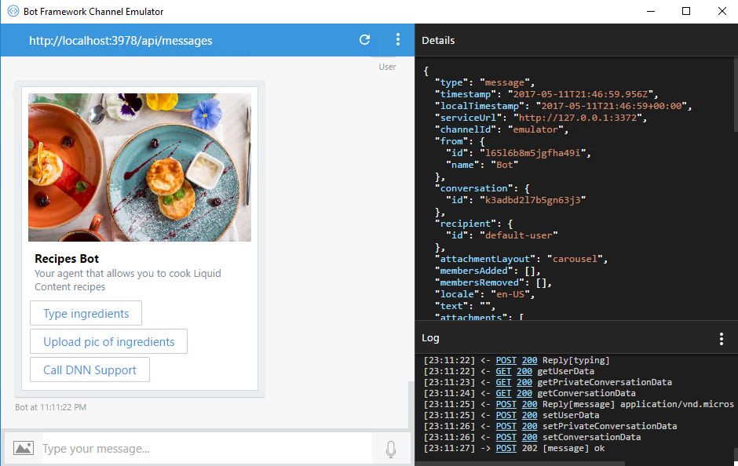
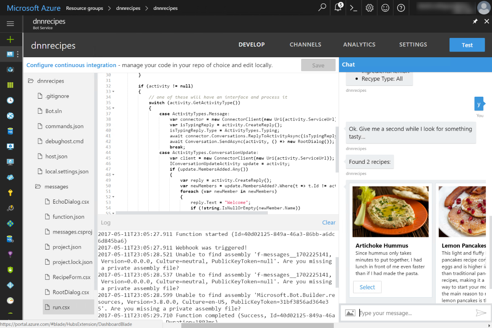
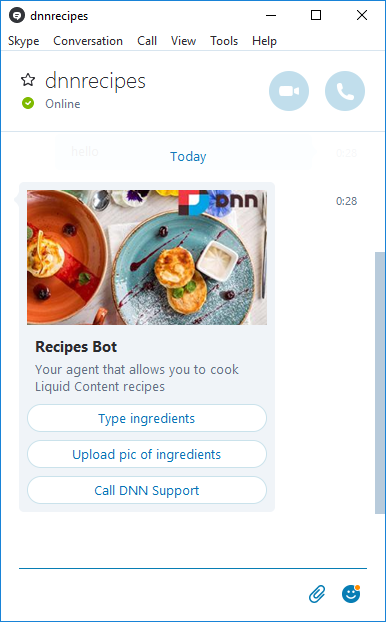

# Content index
1. [Setting up the recipes](1_setup_recipes.md)
2. [Creating the basic bot](2_creating_basic_bot.md)
3. [Setup continuous integration](3_setup_ci.md)
4. [Debugging the bot on your local environment](4_debugging_locally.md)
5. [Customizing the basic bot](5_customizing_bot.md)
6. [Test your recipes bot](6_testing_bot.md)
7. [Adding a webchat in your site](7_adding_webchat.md)
8. [Known issues](8_known_issues.md)

# Test your Recipes bot

## Test your bot locally

Now that you have all the code, start the command prompt **debughost.cmd** and target your Bot Emulator to your local endpoint, or if you prefer to debug, open Visual Studio and run the Task Runner Explorer as shown in the &quot;Debug in your local environment&quot; section.

 

**IMPORTANT: Once you are done, don&#39;t forget to commit the changes in your repository to allow the source control integration to publish your bot automatically on Azure.**

 

## Test from other channels

Now is time to play with other channels. You can find more information at [https://docs.microsoft.com/en-us/bot-framework/portal-configure-channels](https://docs.microsoft.com/en-us/bot-framework/portal-configure-channels)

 

