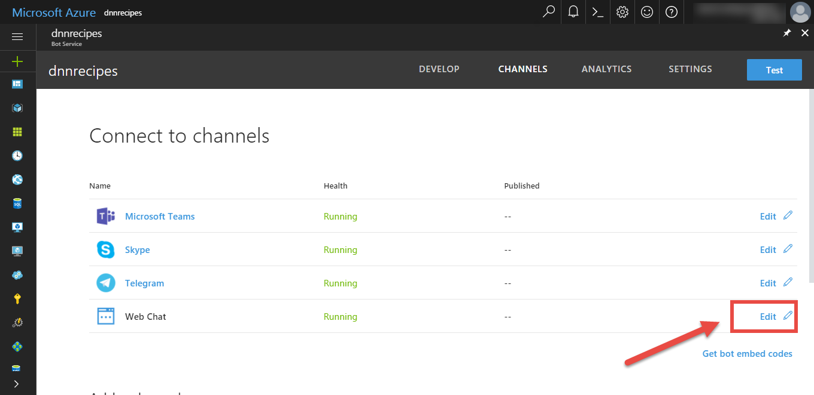
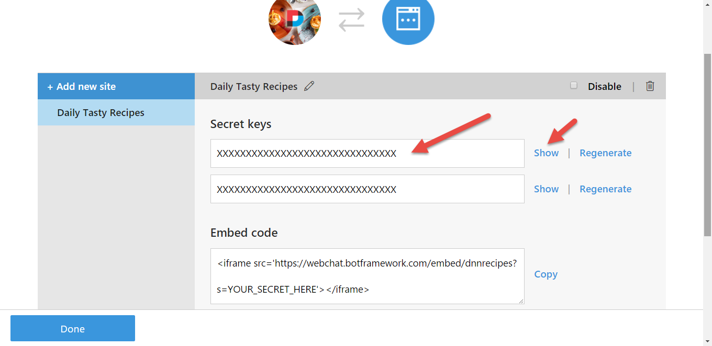
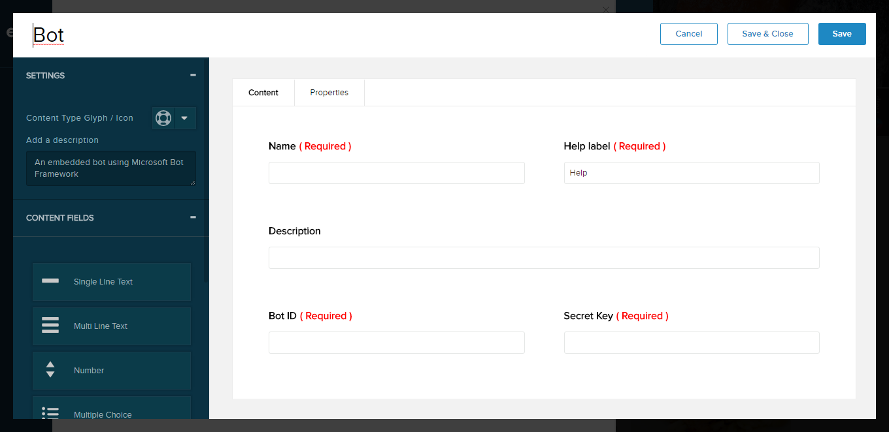
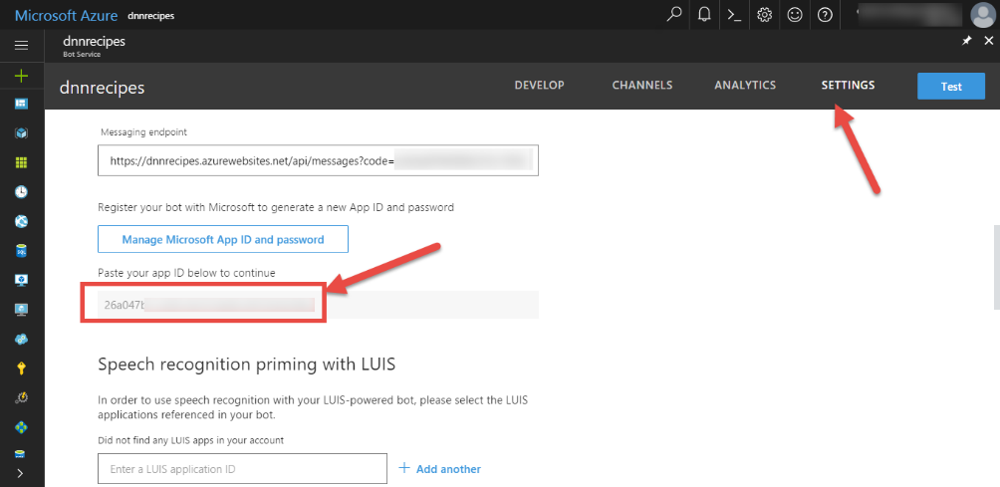
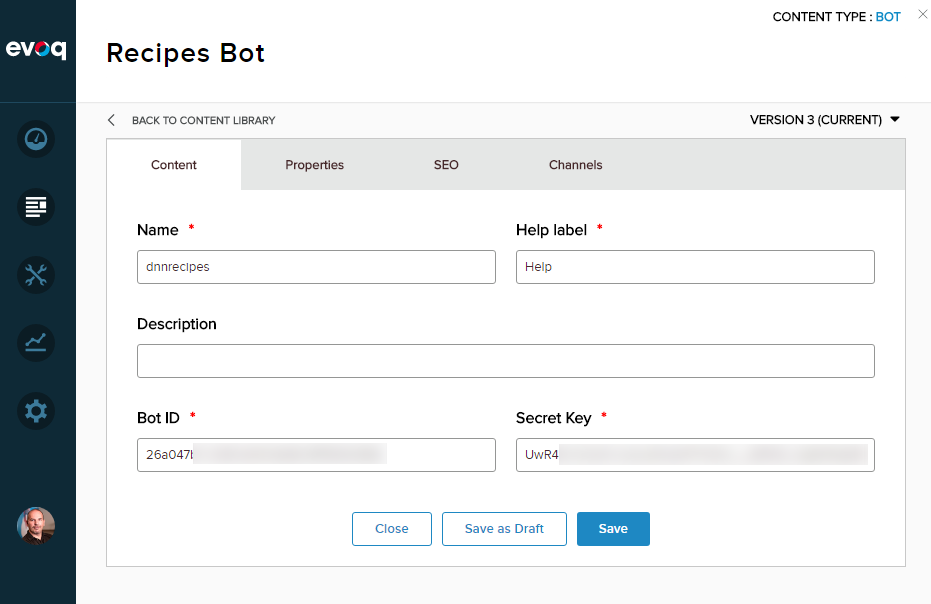
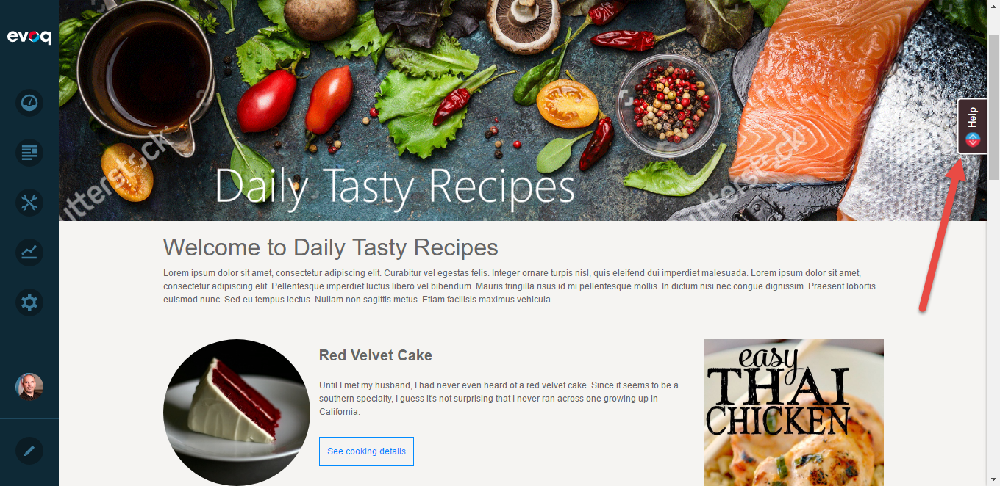
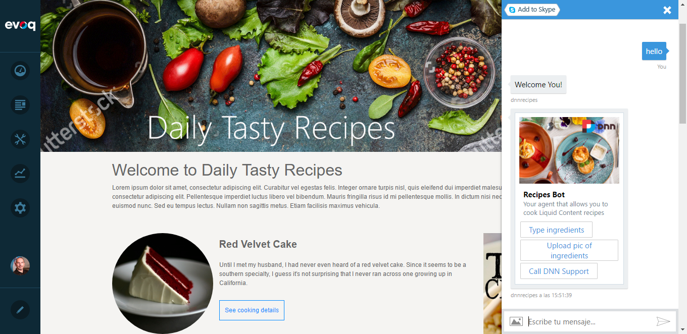

# Content index
1. [Setting up the recipes](1_setup_recipes.md)
2. [Creating the basic bot](2_creating_basic_bot.md)
3. [Setup continuous integration](3_setup_ci.md)
4. [Debugging the bot on your local environment](4_debugging_locally.md)
5. [Customizing the basic bot](5_customizing_bot.md)
6. [Test your recipes bot](6_testing_bot.md)
7. [Adding a webchat in your site](7_adding_webchat.md)
8. [Known issues](8_known_issues.md)

# Adding a webchat in your site

One of the default channels shared by the Azure Bot service is a webchat. Follow these steps to easily integrate the webchat just by using a new Bot Visualizer.

## Enable your bot webchat

1. On the Azure Portal, open your bot&#39;s **Channels** tab and click on the **Web Chat** edit button to edit the properties

 

2. Click on the **Add new site** button to generate a secret key for your web chat

 

3. Copy the secret key in a secure place, you will be using it when setting up the bot
4. Click on **Done** to save the changes

## Create a webchat bot content type

1. Back in your website, create a new content type with the following fields:

 

- Name: Single Line Text (Required)
- Help label: Single Line Text (Required)
- Description: Single Line Text
- Bot ID: Single Line Text (Required)
- Script Key: Single Line Text (Required)

2. Click on **Save and close**

## Create a bot content item

1. Create a new content item of type **Bot**
2. Type the name of your bot as appears on the Azure Portal
3. Copy and paste on the Bot ID available on the Settings tab of your bot

 

4. Copy and paste the webchat secret key you generated before

 

5. Click on **Save** to save the bot

## Create a bot visualizer

1. Create a new visualizer called **Embedded bot helper** f content type **Bot**
2. On the **Script** tab, paste the following

```
var dnnBot = dnnBot || {
    showTab: function () {
        $('.bot-tab').removeClass('bot-tab-hide');
    },
    hideTab: function () {
        $('.bot-tab').addClass('bot-tab-hide');
    },
    showChat: function () {
        $('.bot-chat').addClass('bot-chat-show');
    },
    hideChat: function () {
        $('.bot-chat').removeClass('bot-chat-show');
    }
};

jQuery(function () {
    $('.bot-tab').click(function () {
        dnnBot.hideTab();
        setTimeout('dnnBot.showChat()', 200);
    });

    $('.bot-close').click(function () {
        dnnBot.hideChat();
        setTimeout('dnnBot.showTab()', 300);
    });

});

``` 

3. On the **Styles** tab, paste the following

```
.bot-tab {
    border-radius: 5px 5px 0 0;
    height: 40px;
    padding: 0;
    background-color: #402A2E;
    color: #fff;
    position: fixed;
    z-index: 9999;
    cursor: pointer;
    left: auto;
    right: 0;
    -moz-transform: rotate(-90.0deg);
    -ms-transform: rotate(-90.0deg);
    -o-transform: rotate(-90.0deg);
    -webkit-transform: rotate(-90.0deg);
    transform: rotate(-90.0deg);
    margin-right: -19px;
    border: 2px solid #fff;
    box-shadow: 0 0 5px 0 rgba(0, 0, 0, 0.5);
    -moz-transition: margin-right .2s ease-in;
    -o-transition: margin-right .2s ease-in;
    -webkit-transition: margin-right .2s ease-in;
    transition: margin-right .2s ease-in;
    top: 150px;
}

.bot-tab-hide {
    margin-right: -75px;
}

.bot-tab-icon {
    background: transparent url(https://raw.githubusercontent.com/davidjrh/dnn.bot/master/Dnn.Bot/images/bot-icon.png) no-repeat center;
    float: left;
    height: 100%;
    width: 35px;
}

.bot-tab-title {
    float: right;
    font-size: 13px;
    font-weight: bold;
    line-height: 18px;
    padding: 10px 10px 10px 0;
}

.bot-chat {
    position: fixed;
    right: 0;
    left: auto;
    top: 0;
    bottom: 0;
    z-index: 9999;
    box-shadow: 0 0 5px 0 rgba(0, 0, 0, 0.5);
    margin-right: -350px;
    -moz-transition: margin-right .3s ease-in;
    -o-transition: margin-right .3s ease-in;
    -webkit-transition: margin-right .3s ease-in;
    transition: margin-right .3s ease-in;
    background-color: white;
}

    .bot-chat > iframe {
        height: 100%;
        width: 350px;
    }

.bot-chat-show {
    margin-right: 0;
}

.bot-close {
    position: absolute;
    top: 5px;
    right: 5px;
    width: 35px;
    height: 30px;
    z-index: 99999;
    background: transparent url(https://raw.githubusercontent.com/davidjrh/dnn.bot/master/Dnn.Bot/images/close.png) no-repeat center;
    cursor: pointer;
}

```

4. On the **Template** tab, paste the following

```
<div id="HelpBot">
    <div class="bot-tab">
        <div class="bot-tab-icon"></div>
        <div class="bot-tab-title">{{helpLabel}}</div>
    </div>
    <div class="bot-chat">
        <div class="bot-close"></div>
        <div style="padding-top: 7px; padding-left: 5px; position: absolute;"><a href="https://join.skype.com/bot/{{botID}}"></a></div>
        <iframe src="https://webchat.botframework.com/embed/{{name}}?s={{secretKey}}"></iframe>
    </div>
</div>

```

## Add the visualizer to a page

1. Edit a page in your site to add a visualizer
2. From the list of visualizers, select the **Embedded Bot Helper**
3. From the bots list, select the bot you have created
4. Click OK and save the changes

After refreshing the page, a Button on the right side should appear to open the webchat.

 

 
