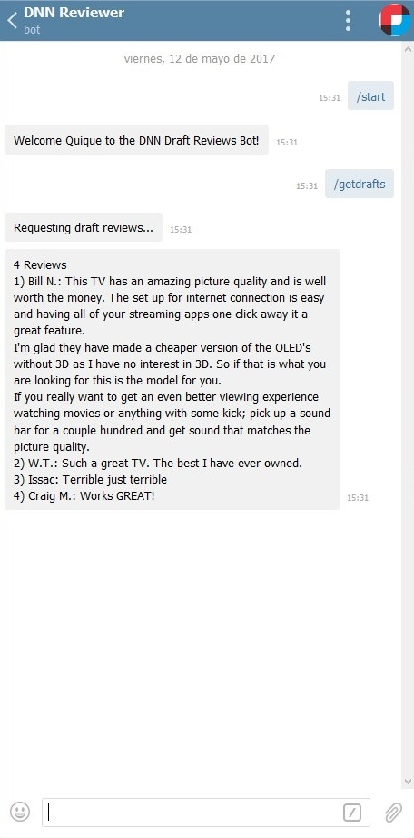
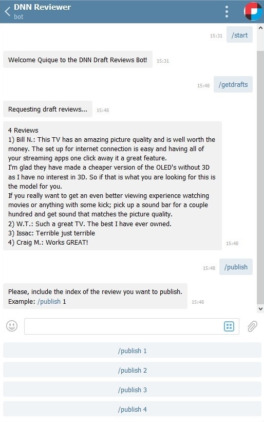
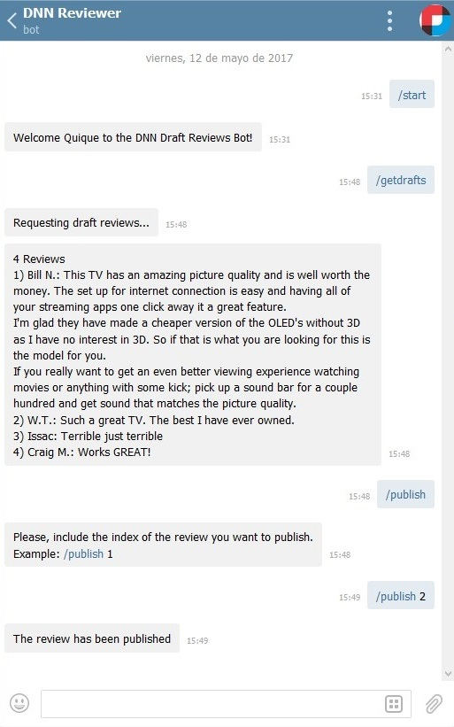

# DNN Reviewer #

A Telegram Bot to publish draft customers reviews.

## Introduction ##
[Liquid Content from DNN Software](http://www.dnnsoftware.com/cms-features/about-liquid-content) provides a great API to integrate with other applications and systems. This tutorial will teach you how to implement a Telegram bot that can interact with your Liquid Content.

### Use Case ###

Let’s imagine the next use case.

ACME Electronics co. has an [DNN Evoq](http://www.dnnsoftware.com/products) website where their products are displayed. On that site, customers can write reviews about the products.

John Doe, the Content Manager, reads the reviews that are created with draft status and publishes them in order to make them visible on the site.

The problem is that John is traveling and continuously in meetings, so it would be good if he had an easy way to make his revisions. ACME Electronics provides him with a telegram bot with which John is able to interact from his smart phone in order to read and publish the customer reviews.

DNN Reviewer is built as a Telegram bot that allows users to publish drafted reviews created by the site customers.

## Prerequisites ##
### Content Type ###
A new content type is needed to be created on the site. The Content Type used by the bot is named Review and has two properties:
*Name: Required property, single line text
*Comment: Multi Line Text

### API Key ###
A Content Library **API Key** is needed by the bot to communicate with the Content API. So we also have to create a new API Key on the Evoq site.

### Installing Node.js ###
DNN Reviewer is a Node.js application, so you need to download and install Node.js to launch it. You can do it [here](https://nodejs.org/en/download/)

## Creating the Bot on Telegram ##
First of all, you need to create the bot on Telegram, you can do this following the simple steps explained [here](https://core.telegram.org/bots)
The bot creation generate an **authorization token**.

For this example, we can create a bot named DNN Reviewed, set the user pic of the bot and the /getdrafts and /publish commands.

## Bot code ##
The bot is a Node.js application. To be implemented, we will use [Telegraf](https://github.com/telegraf/telegraf), a Telegram bot framework for Node.js.

### Implementing the bot ###

Let’s start by a Node.js application. Our bot is implemented by these four files in our src/ folder:
* app.js: The main file of our application. It contains the bot logic using Telegraf.
* config.js: Simple file where we are going to include our Telegram bot token and our API Key.
* reviewManager.js: We will include some business logic to manage our review objects here.
* reviewService.js: On this file, we will include the logic to make the requests to the Liquid Content API.

#### config.js ####

The API Key of the site and the Telegram token of the bot have to be included on src/config.js file from the bot code:

```
const config = {
    telegramBotToken: '333333333:AAAAAAAAAAAAAAAAAAAAAAAAAAAAAAAAAAA',
    apiKey: '01234ab01234ab01234ab01234ab0123'
};

export default config;
```

#### reviewManager.js ####

We have to include an array variable to store the reviews object that we are going to receive from the Liquid Content API and some functions to manage it.

For example, we can include a get and a set functions and another function that convert the stored review info to a string that we can use to show they.

#### reviewService.js ####

We need our bot to do two different request. One request to get the pending reviews from the Liquid Content API and another request to update one request to the published status.
Both of the requests will be sent to the same endpoint:

```
const apiEndPointUrl = 'https://dnnapi.com/content/api/ContentItems/';
```

In all of the requests to the Liquid Content API we have to include on the **header** our API Key concatenated with **“Bearer “** before it.

To **get the draft reviews** from the API, we need to send a **GET** request with the parameters we desire on the query string. 

For that example, we want the last five reviews, so we have to order by **createdAt** field and get the elements from 0 to 5 at max. Also, we have to indicate the **Content Type Id** of our *Review* Content Type and get only **not published** contents.

```
getDraftReviews() {
    return new Promise((resolve, reject) => {
        const options = {
            method: 'GET',
            url: apiEndPointUrl,
            qs: {
                startIndex: 0,
                maxItems: 5,
                fieldOrder: 'createdAt',
                orderAsc: false,
                contentTypeId: '11111111-1111-1111-1111-111111111111',
                published: false
            },
            headers: {
                'Content-type': 'application/json',
                'Authorization': 'Bearer ' + config.apiKey
            }
        };
        request(options, function(error, response, body){
            if (error) {
                reject(error);
            }
            else {
                resolve(JSON.parse(response.body));
            }
        });
    });
}
```

To **update a review** to published status and make it visible on our site we have to make a **PUT** request.

On the request we have to include the **Liquid Content Id** of the review we want to update. Also we have to include the **content object** on the **body** of the request and the updates we want to make as parameters on the query string. For this case we want to set the publish attribute to true value.

```
publishReview(review) {
    return new Promise((resolve, reject) => {
        const options = {
            method: 'PUT',
            url: apiEndPointUrl + review.id,
            body: JSON.stringify(review),
            qs: {
                publish: true
            },
            headers: {
                'Content-type': 'application/json',
                'Authorization': 'Bearer ' + config.apiKey
            }
        };
        request(options, function(error, response, body){
            if (error) {
                reject(error);
            }
            else {
                resolve(JSON.parse(response.body));
            }
        });
    });
}
```

#### app.js ####

We have to create an instance of a Telegraf bot, configure it with our desired commands and launch it.

To create the bot instance we add this lines, notice that we have to pass the **Telegram Bot Token** to the Telegraf constructor: 

```
const app = new Telegraf(config.telegramBotToken);
app.use(Telegraf.memorySession());
```

It can be useful on publish command to use the telegram-command-parts package too:

```
app.use(commandParts());
```

Next, we have to define the commands that our bot will interpret. For this example we will include three commands:
* start: The bot send a welcome message.
* getdraft: The bot load the last not published reviews and send a message with them.
* publish: The bot will set the desired review to published.

The **start** command is pretty simple, It's just a reply from the bot with a welcome message:

```
app.command('start',
    ctx => ctx.reply('Welcome ' + ctx.from.first_name + ' to the DNN Draft Reviews Bot!')
);
```

For the **getdrafts** command we have to use our *reviewService* to make a request and obtain the latest draft reviews, then, we store the received data on our *reviewManager* and use it to obtain a string with the reviews to send in a message:

```
app.command('getdrafts', (ctx) => {
    const draftReviews = reviewService.getDraftReviews()
    .then(
        result => {
            reviewManager.setReviews(result);
            ctx.reply(reviewManager.printReviews());
        },
        error => console.log(error)
    );

    ctx.reply('Requesting draft reviews...');
});
```

For the **publish** command we have to get the argument of the command call, it has to be the index of the review to publish on our loaded reviews set. Then, we have to get the indexed review object using our *reviewManager* and use our *reviewService* to make a request to update the review.

```
app.command('publish', (ctx) => {
    const { args } = ctx.state.command;

    const reviewToPublish = reviewManager.getReview(args);

    return reviewService.publishReview(reviewToPublish)
    .then(
        response => ctx.reply('The review has been published'),
        reason => ctx.reply('An error has ocurred')
    );
});
```

This command can be improved. For example, we can add validations to ensure there is reviews loaded:

```
const reviews = reviewManager.getReviews();
if (!reviews.length) {
    return ctx.reply('No reviews loaded, maybe you want to /getdrafts and then publish one of the results');
}
```

Or if the user has not specified the review index, ask him for it and include direct options as new keyboard buttons:

```
if (!args) {
    const reviews = reviewManager.getReviews();
    let buttons = [];
    reviews.forEach(
      (review, i) => buttons.push('/publish ' + (i + 1))
    );

    return ctx.reply('Please, include the index of the review you want to publish.\nExample: /publish 1',
        Markup.keyboard(buttons)
            .oneTime()
            .resize()
            .extra());
}
```

Or validate that there is a review loaded on the index:

```
const reviewToPublish = reviewManager.getReview(args);
if (!reviewToPublish) {
    return ctx.reply('The review is not loaded, maybe you want to /getdrafts and then publish one of the results');
}
```

Finally, we have to run the bot:

```
app.startPolling();
```

## Launching the bot ##

To **launch** the bot application simply run the application on a **command promp**:

```
npm start
```


## Using the bot ##

Using the bot is as simple as chat with it on Telegram.

### /getdrafts ###

This command make the bot load the last five reviews not published and reply a message assigning they an index from 1 to 5, as we can see below:



### /publish ###

This command update the indicate review to published. The command has to be followed by the **index** of the review (The index value is what the **/getdraft** command assigned to the review). If the index is not included with the command, then the bot ask the user for it and provides buttons with the possible options.





Now, the review of the user W.T. is updated to **published**, and visible on the Evoq site.
