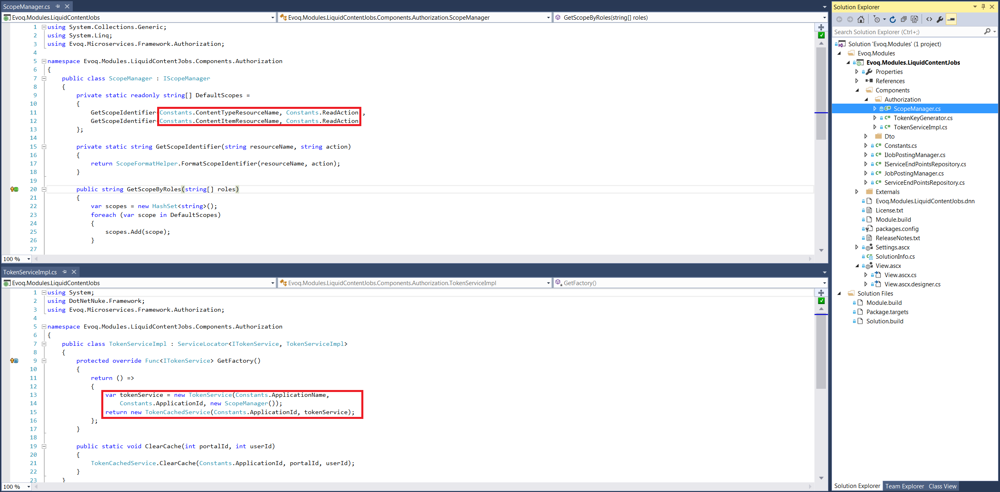
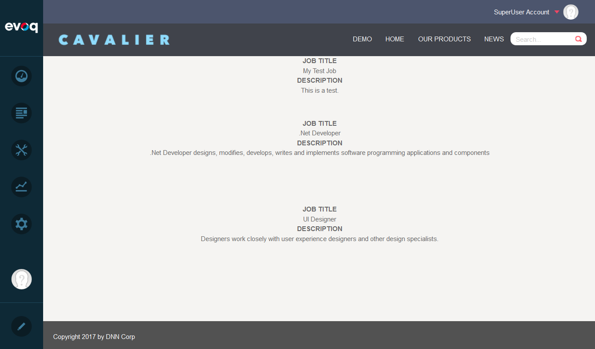

# Evoq Modules - Liquid Content Job List

This is a sample DNN module to access Liquid Content using Web Forms.

[SHOW image of final module]

## Token
Liquid Content requires a bearer token for a client to access the APIs. In this module, the token is generated on the server side.

## View
The view.ascx has very little markup

The data for the view is populated server site
[Schow screenshot of code]

## Settings

The moduel has a page size setting, but it's not used anywhere. It will be used in the next module.
