# Evoq Modules - Liquid Content Job List

This is a sample DNN module to access Liquid Content using Angular JS. A bearer token with read permission for Liquid Content is generated on the server side and passed to the front-end.


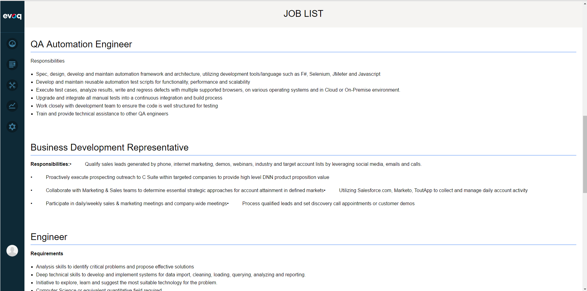

## View

Angular directives add to View.ascx. Also div with unique id added to the View. It will serve as a container for Angular application 

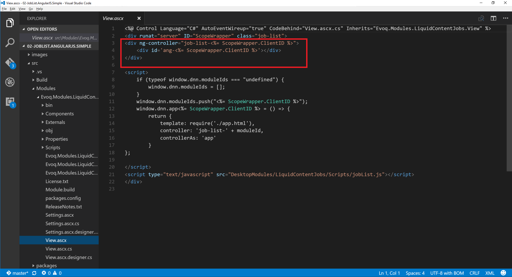

To keep array of Module IDs dnn.moduleIds global variable is used. Angular application will need the ids to know in what container to bootstrap.
Also there is a dnn.app variable that bundle angular app to unique controller 

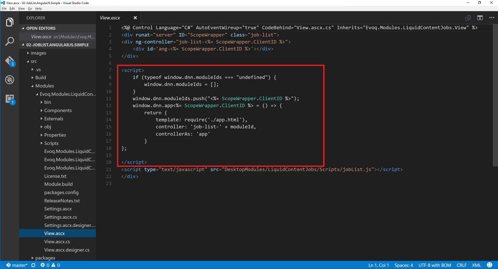

Script tag to the pass with the angular bundle is included to the View.

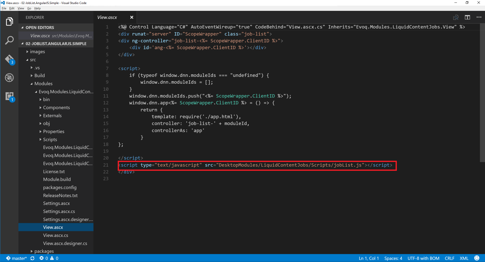

## NPM and Webpack

Include all devDependecies into package.json file.

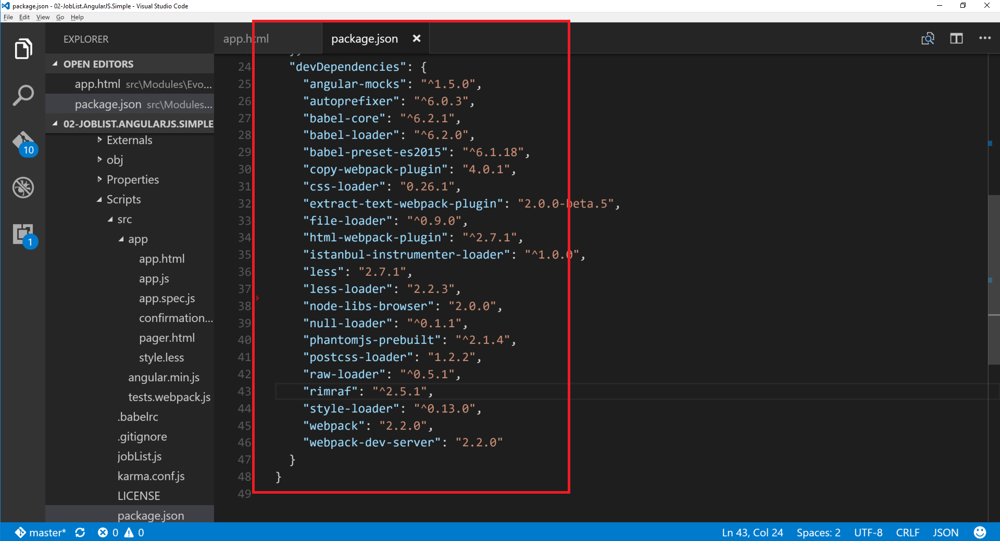

Install all node modules 
```
npm install
```

Configure webpack to load bundle in the path that is used in View.ascx

## Template
For this module only one template used. It's included in app.html file.

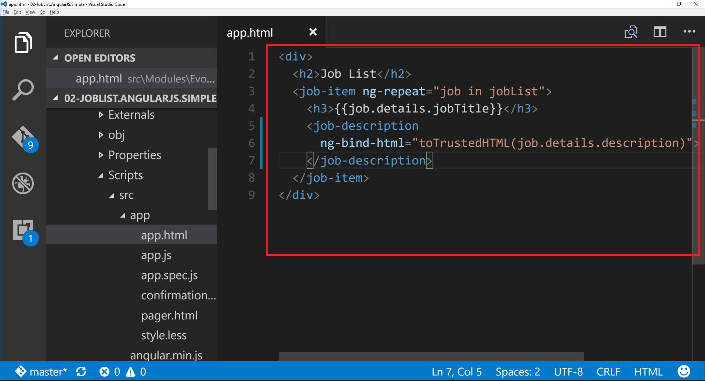

ng-repeat directive iterates through each job in JobList and repeates the job-item element for each iteration

## app.js

Get moduleId first. It will be used to name angular module and angular controler to make it nuique for each evoq module

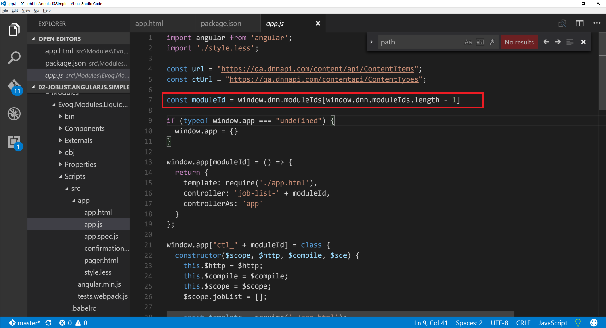

Create an empty object as a global variable. In this variable we will store angular modules and controllers for each Evoq module

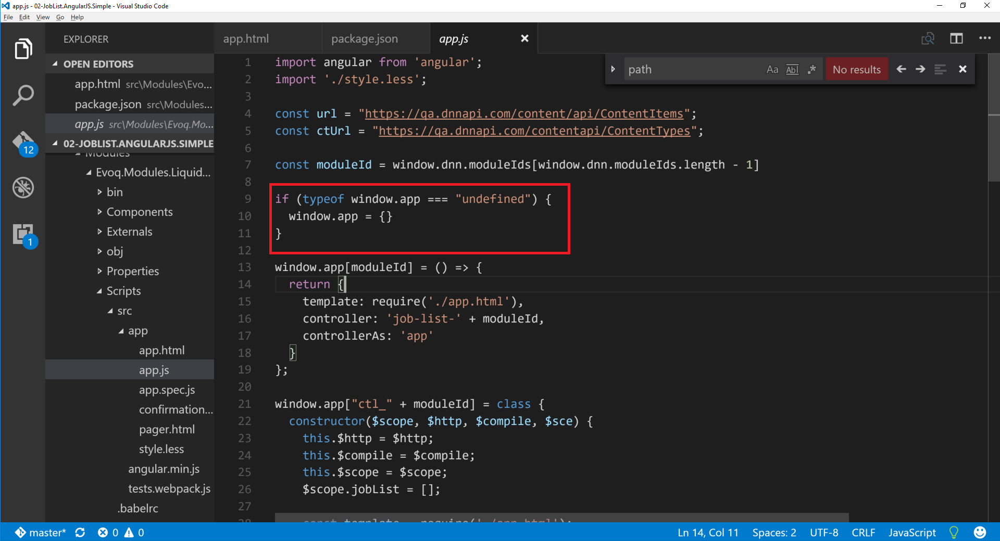

Create an angular module using moduleId. One angular module per Evoq module. Bind template and controller to it.

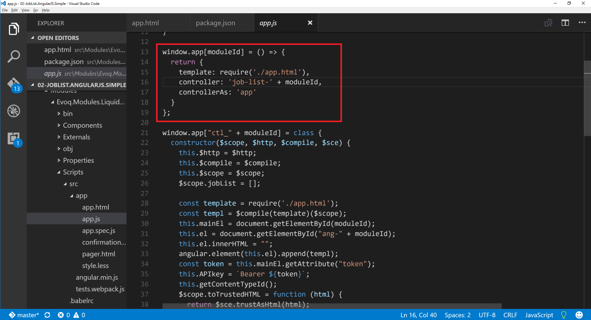

Create an angular controller using moduleId. The Controller is a JS class. Provide $scope, $htpp, $compile and $sce services to the constructor of the class.

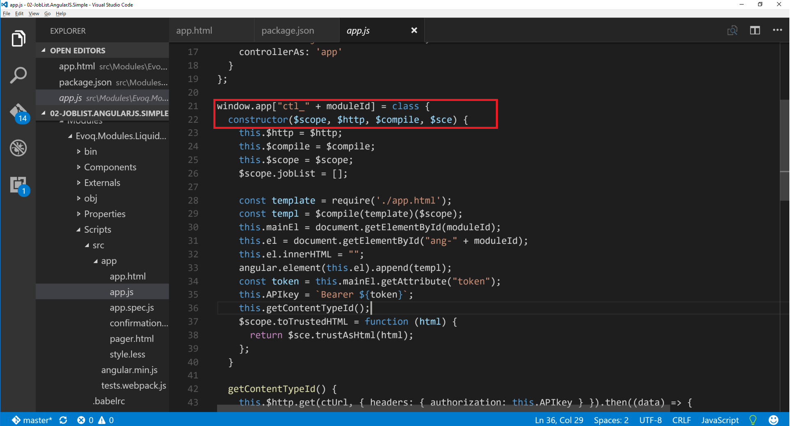

Ingect all the services into the controller.

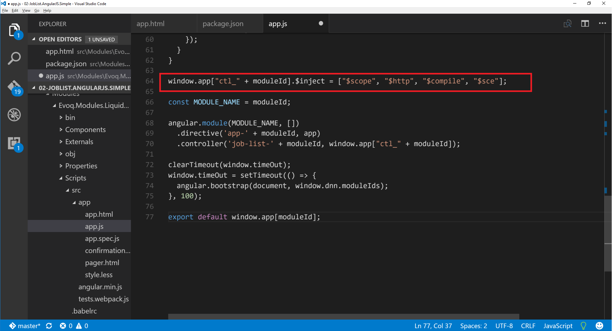

Inside of the constructor of the controller Append template app.html to the Evoq module DOM. Compile the template using $compile service.


Liquid Content requires a bearer token for a client to access the APIs. Get the token from DOM element of the Evoq Module.

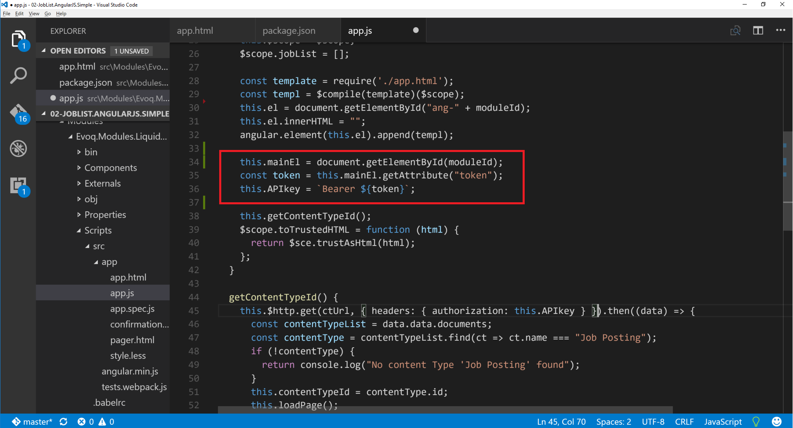

Get the Id of the "Job Posting" Content type. We need this id to get content items only of the "Job Posting" content type.
Asynchronously call loadPage() function after getting the content type id.

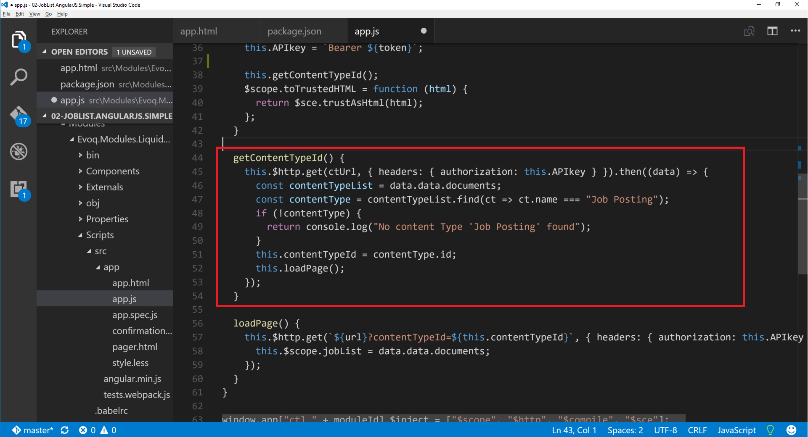

Load content items using content type id. Store the result into the $scope.

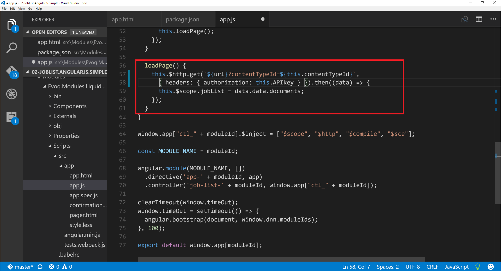

Register  the angular module with the controller.

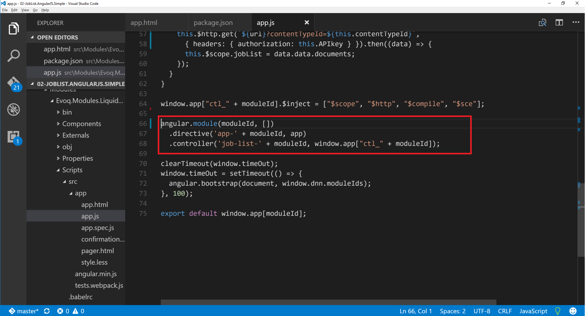

To be able to load multiple angular modules on the same page, bootstrap all the modules. Bootstrap should happen only once for all modules. There is a delay with timeout that alows the next module to clear the timeout. This way only when the last module is loaded bootstrap will execute.

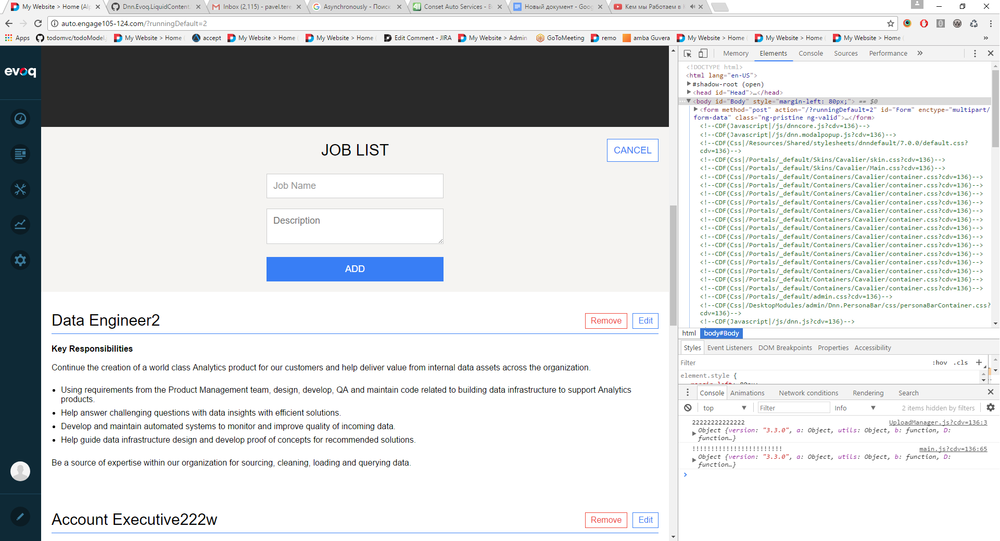