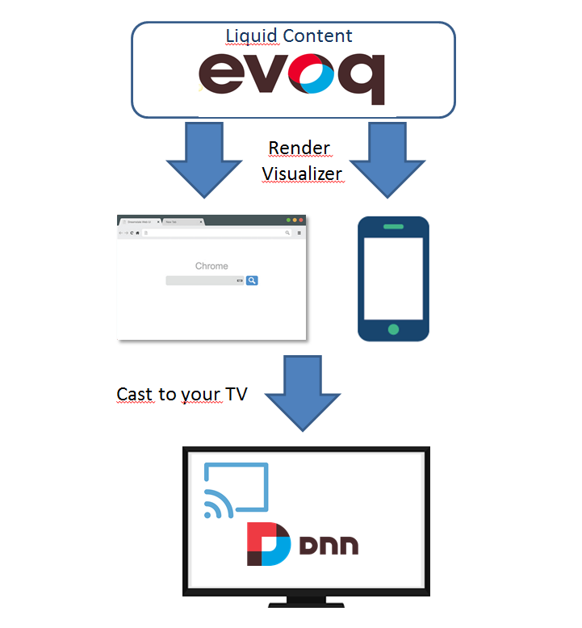

# Liquid Content - Chrome Cast Visualizer

# Introduction

This project is all about leverage Liquid Content Visualizers beyond the simple html Web Site.

The today Visualizer is suitable for other devices as:
- Mobile Application (https://ionicframework.com/docs/)
- TV using Google Chrome Cast (https://www.google.com/intl/es_es/chromecast/?utm_source=chromecast.com)

In this project we will show you how to achieve this integration.

# Architecture

The project is composed in 3 parts:
- Visualizer Chrome Cast Receiver (see custom receivers https://developers.google.com/cast/docs/custom_receiver)
- Visualizer Mobile App: mobile application able to render visualizer in mobile and cast to Google Chrome Cast
- Visualizer Chrome Cast Dnn Module: simple Dnn module able to recognize visualizer on a page and cast to Google Chrome Cast

