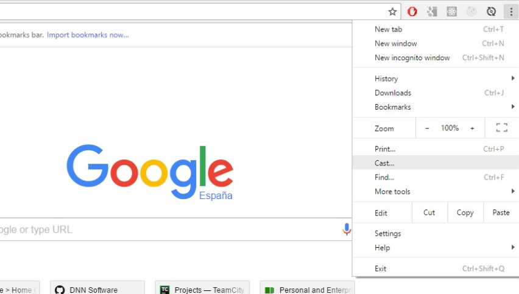
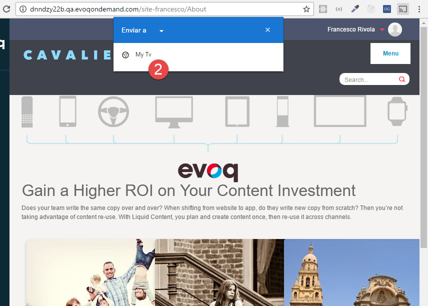
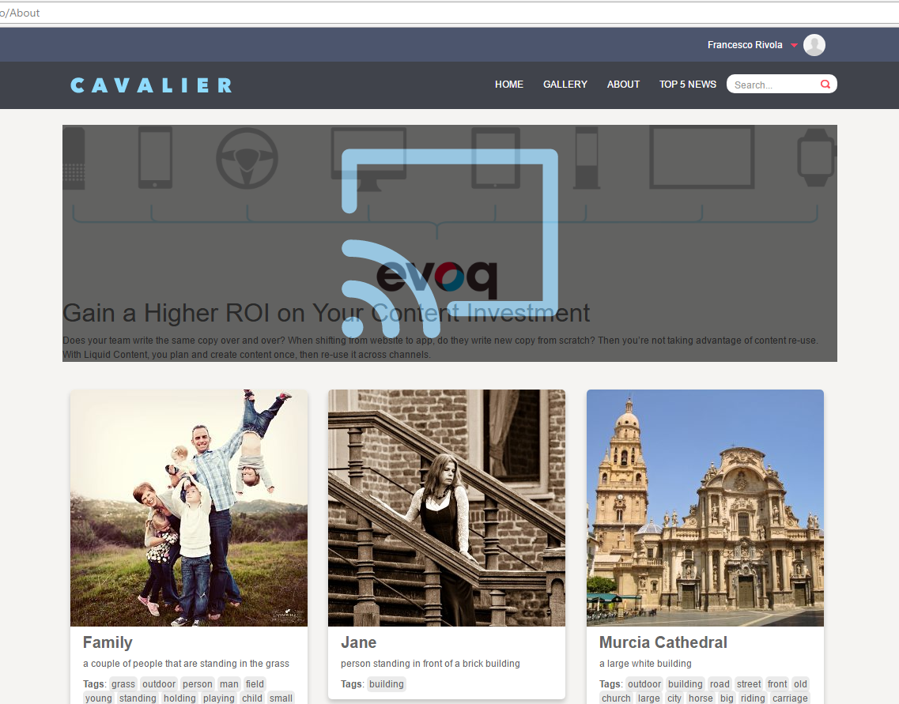

# Liquid Content - Chrome Cast Visualizer Dnn Module 

# Introduction

This project brings Chrome Cast on your Evoq CMS installation allowing you to cast visualizers in your web site directly to your TV using Google Chrome Cast.

This is a DNN Module that when dropped on a page will register the needed javascript files to initialize the Google Chrome Cast sender. Then it will inspect the page looking for visualizers modules on it and once you enable ChromeCast casting, will allow you to select visualizer and cast to your device.

# Prerequisites and Technologies
To be able to implement and run this project you will need

- Google ChromeCast device
- Google Chrome Cast dev account
- Basic Knowledge of HTML CSS and Javascript
- Basic Knowledge of DNN Module Creation
- Evoq Engage 9.1 and above
- Run and setup the Chrome Cast Visualizer Receiver [Chrome Cast Visualizer Receiver](../ChromeCastVisualizer.Receiver/README.md)

# Step 1 - Create the DNN Module
I won't enter in the detail of how to create a DNN module. However, I will point out that this module won't require any server side logic other than display a View.ascx and register in its code behind the followings Javascripts

```
/// <summary>
/// Module view user control
/// </summary>
public partial class View : PortalModuleBase
{
    protected override void OnLoad(EventArgs e)
    {
        base.OnLoad(e);

        if (Globals.IsEditMode())
        {
            Skin.AddModuleMessage(this, LocalizeString("EditModeInfo"),
                ModuleMessage.ModuleMessageType.BlueInfo);
        }

        // Register chrome cast sender script
        ClientResourceManager.RegisterScript(Page, "https://www.gstatic.com/cv/js/sender/v1/cast_sender.js");

        // Register custom cast sender script
        ClientResourceManager.RegisterScript(Page, "~/DesktopModules/DNNCorp/StructuredContentChromeCastVisualizer/ClientScripts/castSender.js");

        // Register custom cast sender script
        ClientResourceManager.RegisterStyleSheet(Page, "~/DesktopModules/DNNCorp/StructuredContentChromeCastVisualizer/module.css");
    }
}
```

The first one is the Chrome Cast Sender sdk, while the second one is our custom cast sender.

# Step 2 - Create the Cast Sender

Visualizer are html based, so we want create a Sender able to detect Visualizers on a page and sent its HTML to the Cast Receiver.

**NOTE**: for this project we are sending the entire HTML, however another alternative approach could be taken. Instead to send the final render html result to the receiver, you could just send the identifiers needed for the rendering (content item id, visualizer id, etc...) and let the receiver works with Liquid Content API to get the rendering. However for simplicity we have implemented the above strategy.

So, How to start? Luckly the google chrome cast docs expose a lot of samples and one of this is a text based cast hello world. You can find the code here: https://github.com/googlecast/CastHelloText-chrome

This example is divided in two part

1. **receiver.html**: This is the code of the receiver. It is just a simple html file that loads the Google Cast receiver js sdk and implement a javascript to be able to receive message from chrome cast devices. 

2. **chromehellotext.html**: The sender

## 2.1 - Create castSender.js

Assuming you already have created your receiver (see  [Chrome Cast Visualizer Receiver](../ChromeCastVisualizer.Receiver/README.md)), now extract from the chromehellotext.html the js code and bring it a file called castSender.js inside the standard ClientScripts module folder.

## 2.2 - Set your ApplicationID

Now change your castSender.js and set your ApplicationID (this is the identifier of the receiver application).

## 2.3 - Add click handler on Visualizer

Finally we want detect all the visualizers on your page and add a click event listener to it. This latter will send the inner HTML and send to the Cast Receiver on click event.

```
function initVisualizers() {
    var attributeName = "data-dnn-content-items";

    // get all visualizers elements
    var elements = document.querySelectorAll("[" + attributeName + "]");
    
    for (var i = 0; i < elements.length; i++) {
        // get visualizer element
        var element = elements[i];
        // get module container
        var parent = element.parentElement;
        // create a wrapper div
        var div = document.createElement('div');
        div.className = 'chromeCastVisualizer';
        // append it to the parent
        parent.appendChild(div);
        // create a click event listener on the div
        div.addEventListener("click", function onClick(e) {
            // on click take the visualizer element and send its inner HTML to the cast receiver
            var parent = e.target.parentElement;
            sendMessage(parent.firstElementChild.innerHTML);
        });
    }
}
```

Now let's call the above function and ensure is called once. We will call it in the Session listener callback. This function is called once the sender obtain a session to communicate with the Cast Receiver.

```
function sessionListener(e) {
    console.log('New session ID:' + e.sessionId);
    session = e;
    session.addUpdateListener(sessionUpdateListener);
    session.addMessageListener(namespace, receiverMessage);

    if (!initializedVisualizer) {
        initVisualizers();
        initializedVisualizer = true;
    }
}
```

Great, so now you should be ready to use your app.

# Step 3 - Use the Chrome Cast Visualizer Module

## 3.1 Install the Module

## 3.2 Drop on a Page the Visualizer Modules

## 3.3 Enable Cast Page

Go to the Chrome Settings > Cast



## 3.4 Cast to your Device

Select from the list your device



## 3.5 Select a Visualizer

Now that you are casting you will be able to select a Visualizer on the page and on click the content will be sent to the Receiver.



NOTE:
- feel free to change the hover style effect. In this project we have set some nice animation with the chrome cast icon
