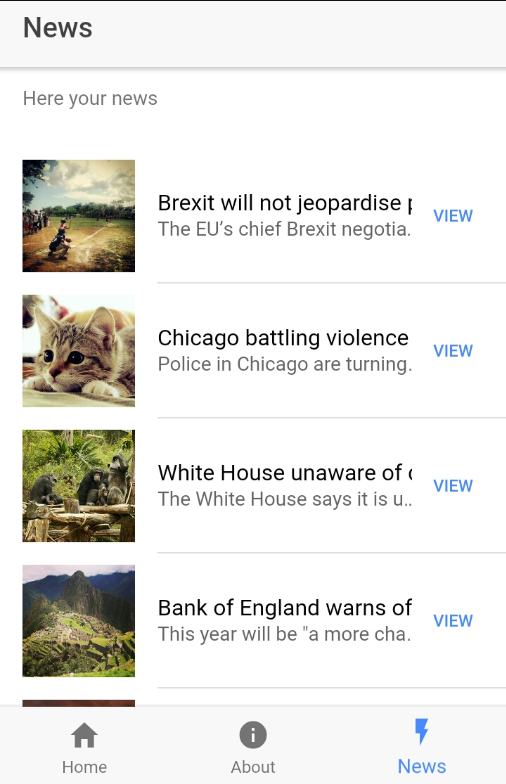
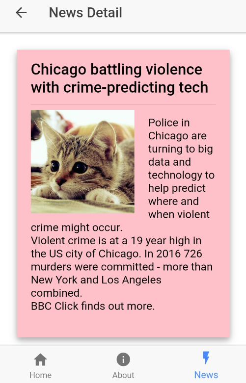
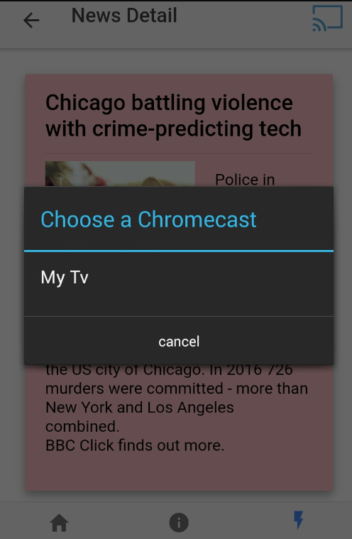

# Liquid Content - Chrome Cast Visualizer Mobile Application 

# Introduction

This project brings Visualizers beyond your Web Site. The goal is a proof of concept that will show you how to display a visualizer in a mobile application and then cast it to your TV using Google Chrome Cast.

# Business use case

As Content Consumer User of the Company XYZ I want a mobile application to see the Company News on my smartphone. Also want to see the news details and be able to cast it to my TV for meeting and presentations.

In order to achive that we will create a custom News Content Type (with a title, summary and image fields) and a specific Visualizer. The Visualizer will look like a card layout and it will be used to display the News detail in our mobile app as in a page of the Company Web Site to show the list of News.

# Prerequisites and Technologies
To be able to implement and run this project you will need the following prerequisites and technologies

- Google ChromeCast device
- Google Chrome Cast dev account
- Ionic 2 (http://ionicframework.com/docs/v2/getting-started/)
- Angular 4
- Typescript (https://www.typescriptlang.org/)
- Android Studio (https://developer.android.com/studio/index.html)
- Basic Knowledge of Android mobile development and Cordova (https://cordova.apache.org/)
- Run and setup the Chrome Cast Visualizer Receiver [Chrome Cast Visualizer Receiver](../ChromeCastVisualizer.Receiver/README.md)

# Step 1 - Install Ionic 2

First thing you need to do is to setup and install ionic 2, cordova and configure for Android platform.

Follow instruction here https://ionicframework.com/docs/intro/installation/

# Step 2 - Create an empty v2 project

Type the following command on your empty project folder

```
$ ionic start MyApp --v2
```
# Step 3 - Add Android Platform

Add Android platform in cordova. Run this command in the root of your project.

```
$ cordova platform add android
```

See more info here: https://cordova.apache.org/docs/en/latest/guide/platforms/android/

# Step 4 - Follow the tutorial to create a basic list/detail app

Ionic 2 provides a very good tutorial that explain you how to build a very basic list / detail application starting from the base template. This is perfect for our goal. For now follow the project and fake the list of items, then we will integrate it with Liquid Content content items.

Follow Ionic tutorial instruction here: https://ionicframework.com/docs//intro/tutorial/project-structure/

Note: as our application is about list NEWS you will see that we have called the list news page "news" and the detail page "news-detail".

# Step 5 - Add News Provider

At this stage you should be able to have a Android and Web Application with list and detail. Now is time to integrate it with Liquid Content. For our project we will limit to load in the list only the top 5 Content Items of the Content Type News ordered by Created Date descending.

## 5.1 - Create the News Provider
To do that in Angular 4 the recommended way is to create a provider that will be responsible to communicate with the Liquid Content API.

Let's do that, create under src folder a new folder called **providers** and inside that creates the file **news-provider.ts**.

This provider will have two methods:
- GetTop5News: retrieves top 5 Content Items of the Content Type News ordered by Created Date descending
- PreviewNew: requests a preview of a given News Content Item using a fixed Visualizer (created ad hoc for our example)

```
import { Injectable } from '@angular/core';
import { Http, Headers, RequestOptions } from '@angular/http';
import 'rxjs/add/operator/map';

@Injectable()
export class NewsProvider {
 
  // Content Item api url
  private apiUrl: string = 'https://dnnapi.com/content/api/contentItems/';

  // Hardcoded News Content Type Identifier
  private newsContentTypeId: string = 'ffda3e66-12f9-43de-a886-a8be21102915';

  // Query string to get top 5 content items, ordered by created At desc filtering by Content Type News
  private queryString: string = '?startIndex=0&maxItems=5&fieldOrder=createdAt&orderAsc=false&searchText=&contentTypeId=' + this.newsContentTypeId;

  // Standard Liquid Content API KEY (used to get news)
  private apiKey: string = '3b20949657bda770b916475d6563ddad';
  
  // Api Preview Url Endpoint (this api is used today to show a preview of a visualizer in the embed code wizard 
  // (it is not available as part of the API KEY)
  private apiPreviewUrl: string = 'https://dnnapi.com/content/api/visualizerEngine/preview/';

  // Hardcoded Card New Visualizer Identifier
  private visualizerId: string = '45cd16ac-53f9-4390-ac94-b1a53588e2b6';

   // 1 hour live token (this token is not the API KEY)
  private specialApiKey: string = '858751c42905e3715ff9e74447120daf';

  constructor(public http: Http) {
    
  }

  // Get top 5 News
  getTop5News(){
    const headers = new Headers({
        'Content-Type': 'application/json',
        'Authorization': 'Bearer ' + this.apiKey
    });
    const options = new RequestOptions({
        headers: headers
    });
    return this.http.get(this.apiUrl + this.queryString, options)
      .map(response => response.json());
  }

  // Given a news id, preview it using a pre-existing and hardcoded visualizer
  previewNew(newsId){    
    const headers = new Headers({
        'Content-Type': 'application/json',
        'Authorization': 'Bearer ' + this.specialApiKey
    });
    const options = new RequestOptions({
        headers: headers
    });
    return this.http.get(this.apiPreviewUrl + '?visualizerId=' + this.visualizerId + '&contentItemIds=' + newsId, options)
      .map(response => response.json());
  }
}
```

**IMPORTANT NOTES**:
- The preview API is not part of the API KEY scope, so in order to use that you need to get the token inspecting the Persona Bar > Content Library ajax calls made to the microservice when logged as Content Manager / Admin or Super User. Note that, the preview API is the same used to preview the result of the Embed Visualizer. This token is **1 hour live token** so this means that after 1 hour your application will start to give you 401 Unauthorized response as the token has expired.
- The visualizer identifier used for the preview is currently hardcoded for simplicity

## 5.2 - Register the Provider
Ok, now that we have created the provider let's register it in the app/app.modules.ts as providers

```
import { NewsProvider } from '../providers/news-provider';
```

```
@NgModule({
    
  providers: [
    NewsProvider,
    StatusBar,
    SplashScreen,
    {provide: ErrorHandler, useClass: IonicErrorHandler}
  ]
})
export class AppModule {}
```

Great!!! Now the provider is available and can be used by any page. We will see how to use it in the next step.

# 6 - Implement Top 5 News List
Once the provider is registered you can use it in your news list page to fetch the top 5 news (see code below **src/pages/news/news.ts**).

Page Class
```
import { Component } from '@angular/core';
import { NavController } from 'ionic-angular';
import { LoadingController } from 'ionic-angular';
import { ToastController } from 'ionic-angular';
import { NewsProvider } from '../../providers/news-provider' // ADDED PROVIDER
import { NewsDetailPage } from '../news-detail/news-detail';

@Component({
  selector: 'page-news',
  templateUrl: 'news.html'
})
export class NewsPage {
  news: Array<any> = [];

  constructor(
    public toastCtrl: ToastController,
    public loadingCtrl: LoadingController, 
    public navCtrl: NavController, 
    public newsProvider: NewsProvider) {    // INJECT IN THE CONSTRUCTOR
  }
  
  ionViewDidLoad() {
    this.loadNews();
  }

  refresh() {
    this.loadNews();
  }
  
  loadNews() {
    const loader = this.loadingCtrl.create({
      content: "Fetching your news..."
    });
    loader.present();

    // Get from Liquid Content API the top 5 news
    this.newsProvider.getTop5News().subscribe(news => {
      loader.dismiss();
      this.news = news.documents;
    },
    error => {
      loader.dismiss();
      const toast = this.toastCtrl.create({
        message: 'Error: ' + error,
        duration: 3000
      });
      toast.present();
    });
  }

  viewNewDetail(newDetail) {
    this.navCtrl.push(NewsDetailPage, {
      newDetail
    });
  }
}
```

Page Html
```
<ion-header>
  <ion-navbar>
    <ion-title>
      <ion-icon style="float:right;" name="refresh" (click)="refresh()"></ion-icon>
      News
    </ion-title>
  </ion-navbar>
</ion-header>

<ion-content>
  <ion-list>
    <ion-list-header>Here your news</ion-list-header>
    <ion-item ion-item *ngFor="let new of news">
      <ion-thumbnail item-left>
        
      </ion-thumbnail>
      <h2>{{new.details.title}}</h2>
      <p>{{new.details.summary}}</p>
      <button ion-button clear item-right (click)="viewNewDetail(new)">View</button>
    </ion-item>
  </ion-list>
</ion-content>
```

**NOTES:**
- In the Html you can see that we are accesing the fields value of the Content Item doing **news.details.NAMEOFTHEFIELD**. The name of the field will depend of the definition of your Content Type, so it may be different if you create the fields with a different label.

# 7 - Test you App
Now you should be able to test the get top 5 news in your app. Great Job!!



# 8 - Implement News Details Page
Next step is show the News detail. Once the user clicks on View News the app will navigate to the details page, then we will load the news detail using the Visualizer Preview method in the NewsProvider.

## 8.1 - Integrate Liquid Content in the Details Page

Go to your news details page **src/pages/news-details.ts** and add the following code to work with the **NewsProvider** and call the **previewNew** method.

Page Class
```
import { Component, } from '@angular/core';
import { LoadingController } from 'ionic-angular';
import { ToastController } from 'ionic-angular';
import { NavController, NavParams } from 'ionic-angular';
import { NewsProvider } from '../../providers/news-provider' // Import the NewsProvider

@Component({
    selector: 'pages-news-detail',
    templateUrl: 'news-detail.html',
})
export class NewsDetailPage {

    newDetail: any = null;
    previewHtml: string = "<div/>";

    constructor(
        public toastCtrl: ToastController,
        public loadingCtrl: LoadingController,
        public navCtrl: NavController,
        public navParams: NavParams,
        public newsProvider: NewsProvider) {

        // Get navigation parameter that indicate which news you want to see in the details page
        // Note: this value is set in the list page when you click on view a specific news
        this.newDetail = this.navParams.get("newDetail"); 
    }

    ionViewWillEnter() {
        this.loadNewDetail();
    }

    loadNewDetail() {
        const loader = this.loadingCtrl.create({
            content: "Loading News..."
        });
        loader.present();

        // Call Liquid Content to preview the selected News
        this.newsProvider.previewNew(this.newDetail.id)
            .subscribe(preview => {
                loader.dismiss();
                console.log(preview);
                this.previewHtml = preview.html;
            },
            error => {
                loader.dismiss();
                this.toast('Error: ' + error);
            });
    }

    // Utility function to show a toast message
    toast(message) {
        const toast = this.toastCtrl.create({
            message: message,
            duration: 3000
        });
        toast.present();
    }
}
```

Page Html
```
<ion-header>

  <ion-navbar>
    <ion-title>
      News Detail
    </ion-title>
    
  </ion-navbar>

</ion-header>


<ion-content padding>
  <div [innerHTML]="previewHtml" ></div>
</ion-content>
```

On viewWillEnter we will call the **previewNew** method obtaining the preview object that contains the rendered html of the Visualizer.

In the view we will use the **innerHtml** angular attribute to tell Angular to do not html encode the content of the previewHtml variable.


## 8.2 - Add safeHtml Pipe
In the previous step we have seen how we use innerHtml to bind the result of the previewHtml to our View. However Angular performs a sanity preprocessing on the html for security pourposes (i.e.: it removes style tags, scripts tags, etc...). To avoid that we need to use Pipes (see https://angular.io/docs/ts/latest/guide/pipes.html).

In this step we will create a safeHtml Pipe to bypass the by default sanitize preprocessing of our visualizer html.

Go to src and create a new folder called **pipes** and create a file called **safe-html-pipe.ts**. Type in this file the following content:

```
import { Pipe, PipeTransform } from '@angular/core';
import { DomSanitizer } from '@angular/platform-browser'

@Pipe({ name: 'safeHtml'})
export class SafeHtmlPipe implements PipeTransform  {
  constructor(private sanitized: DomSanitizer) {}
  transform(value) {
    return this.sanitized.bypassSecurityTrustHtml(value);
  }
}
```

then let's register our Pipe in **src/app/app.module.ts** in the declaratios array (see below):

```
import { SafeHtmlPipe } from '../pipes/safe-html-pipe';

@NgModule({
  declarations: [
    MyApp,
    AboutPage,
    NewsPage,
    HomePage,
    TabsPage,
    NewsDetailPage,
    SafeHtmlPipe // Add the Pipe into declarations
  ],
  ...
  ...
```

## 8.3 - Test the News Details Page
Finally, we can use our pipe in our view :)

Page Html
```
<ion-content padding>
  <div [innerHTML]="previewHtml | safeHtml" ></div>
</ion-content>
```

Great!!! Now run again your app, go to the News List and pickup one and click View. The result of the detail page will look like the image below:



**Important Note**
- Please take into account that the look & feel above is totally driven by your visualizer html and style defined inside the visualizer template. If we change the card color to white the application will show that on refresh without need to re-compile and re-distribute your application (in Android your APK)
- In this application we are ignoring the visualizer css and js file for simplicity. An alternative approach to load both js and css in a safer way could be load the visualizer html preview, css and js inside an iframe. However, this is out of scope for this project.

# 9 - Integrate with Google Chrome Cast
Last step is to add Google Chrome Cast support and allow the application to send the visualizer to your TV.

## 9.1 - Add Cordova Chrom Cast plugin for Android

In order to use Chrome Cast in Android device we will need to install a Cordova plugin. 

Follow instruction here https://github.com/videostream/cordova-chromecast

## 9.2 - Add Chrome Cast javascript code in News Details Page

Similar of what done in the Visualizer Chrome Cast DNN Module we will bring the same sender javascript to our Ionic App. 

**Note**: 
- This JS is inspired by the example https://github.com/googlecast/CastHelloText-chrome see **chromehellotext.html**
- This won't work in the browser in developer mode until you add cordova browser platform and produce the PWA browser application

On the top of our NewsDetail Class we will add the following variables

```
// Chrome Cast Receiver Application identifier
applicationId: string = '192680C9';
// Chrome Cast Namespace
namespace: string = 'urn:x-cast:com.google.cast.liquidcontent';

// Chrome Object loaded by Cordova Plugin
chrome: any = window["chrome"];
// Chrome Cast session (null by default)
session: any = null;

// Set to true when a chrome cast device is found
deviceFound: boolean = false;
```

Then we will add all the js logic: 
1. initialize the Chrome Cast API
2. obtain a valid session
3. send message to the Receiver app (see [Chrome Cast Visualizer Receiver](../ChromeCastVisualizer.Receiver/README.md))

```
// Initialization of Chrome Cast API
initializeCastApi() {
    console.log('initializeCastApi');
    var sessionRequest = new this.chrome.cast.SessionRequest(this.applicationId);
    var apiConfig = new this.chrome.cast.ApiConfig(sessionRequest,
        this.sessionListener.bind(this),
        this.receiverListener.bind(this));

    this.chrome.cast.initialize(apiConfig, this.onInitSuccess.bind(this), this.onError.bind(this));
}

onInitSuccess() {
    console.log('onInitSuccess');
}

onError(message) {
    this.toast('Error: ' + message);
    console.log('onError: ' + JSON.stringify(message));
}

onSuccess(message) {
    console.log('onSuccess: ' + message);
}

// session listener during initialization
sessionListener(e) {
    console.log('New session ID:' + e.sessionId);
    this.session = e;
    this.session.addUpdateListener(this.sessionUpdateListener.bind(this));
    this.session.addMessageListener(this.namespace, this.receiverMessage.bind(this));
}

// listener for session updates
sessionUpdateListener(isAlive) {
    var message = isAlive ? 'Session Updated' : 'Session Removed';
    message += ': ' + this.session.sessionId;
    console.log(message);
    if (!isAlive) {
        this.session = null;
    }
}

/**
    * utility function to log messages from the receiver
    * @param {string} namespace The namespace of the message
    * @param {string} message A message string
    */
receiverMessage(namespace, message) {
    console.log('receiverMessage: ' + namespace + ', ' + message);
}

// receiver listener during initialization
receiverListener(e) {
    console.log(e);
    if (e === 'available') {
        console.log('receiver found');
        this.deviceFound = true;
    }
    else {
        console.log('receiver list empty');
    }
}

/**
    * send a message to the receiver using the custom namespace
    * receiver CastMessageBus message handler will be invoked
    * @param {string} message A message string
    */
sendMessage(message) {
    if (this.session != null) {
        this.session.sendMessage(this.namespace, message, 
        this.onMessageSentSuccess.bind(this, 'Message sent: ' + message),
            this.onError.bind(this));
    }
    else {
        this.chrome.cast.requestSession((e) => {
            console.log(e);
            this.session = e;
            this.session.sendMessage(this.namespace, message, 
            this.onMessageSentSuccess.bind(this, 'Message sent: ' +
                message), this.onError.bind(this));
        }, this.onError.bind(this));
    }
}

onMessageSentSuccess(message) {
    this.toast('Casting...');
    console.log('onSuccess: ' + message);
}
```

Last thing we need to do now is to call the initializeCastApi in the ionViewWillEnter event.

```
ionViewWillEnter() {
    this.loadNewDetail();

    if (!this.chrome) {
        console.log('we are not in chrome');
        return;
    }

    // Call initialization for Chrome Cast
    setTimeout(() => this.initializeCastApi(), 2000);
}
```

Then expose a method to cast the preview of the Visualizer (aka our News Details)

```
// cast to chrome cast the preview Html
cast() {
    this.sendMessage(this.previewHtml);
}
```

Now bind the method to the template HTML creating a button in the navigation bar to call the cast method

```
<ion-header>
  <ion-navbar>
    <ion-title>
      <span class="cast" [hidden]="!deviceFound" (click)="cast()">
        
      </span>
      News Detail
    </ion-title>
  </ion-navbar>
</ion-header>
<ion-content padding>
  <div [innerHTML]="previewHtml | safeHtml" ></div>
</ion-content>
```

Great Job!!! Now run the app in your android device and once you get the News Details after few seconds you will see the chrome cast button. Once clicked, Android will prompt the user with the dialog to select your chromecast device:



Congratulation you have built an awesome Evoq Liquid Content Application that leverage your Content and Visualizer beyond your Web Site !!! :)

