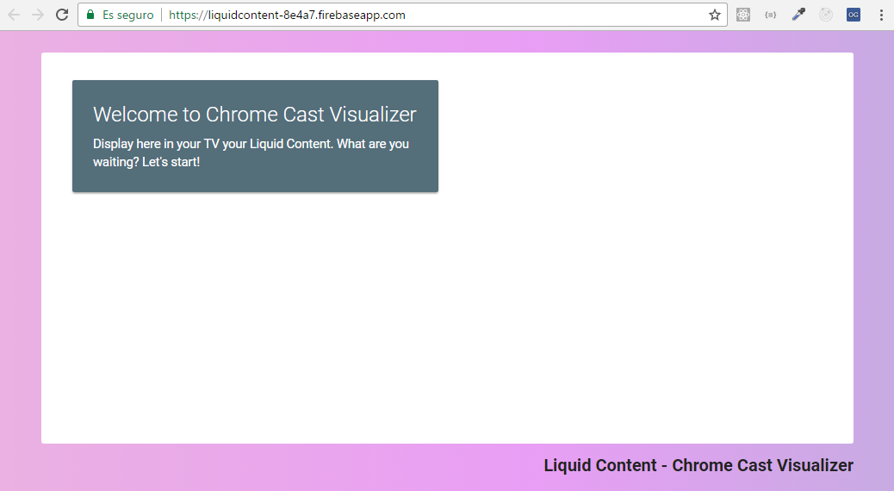
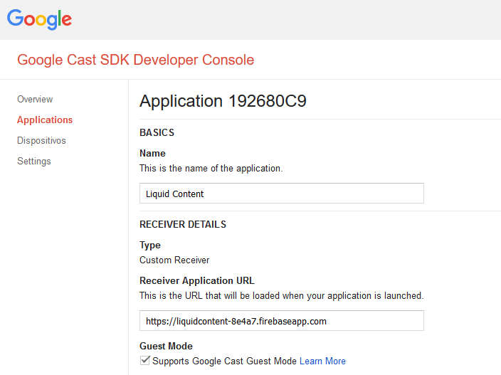

# Liquid Content - Chrome Cast Visualizer Receiver 

# Introduction

Google Chrome Cast allows you to create and publish custom receiver. A Receiver is just a simple web application that will receive the chrome cast messages and it will be able to show specific content.

See more in https://developers.google.com/cast/docs/custom_receiver

The receiver of this project is currently published at this url: https://liquidcontent-8e4a7.firebaseapp.com/



# Prerequisites and Technologies
To be able to reproduce and run this project you will need

- Google ChromeCast device
- Google Chrome Cast dev account
- Knowledge of HTML CSS and Javascript

# Step 1 - Create a Custom Receiver

Visualizer are html based, so we want create a Receiver that is able to receive html and display it in your tv. So, basically create a white canvas and when an html is received add it as InnerHTML in it.

**NOTE**: for this project we are sending the entire HTML, however another alternative approach could be taken. Instead of send the final render html result to the receiver, you could just send the identifiers needed for the rendering (content item id, visualizer id, etc...) and let the receiver works with Liquid Content API to get the rendering. However for simplicity we have implemented the above strategy.

So, How to start? Luckly the google chrome cast docs expose a lot of samples and one of this is a text based cast hello world. You can find the code here: https://github.com/googlecast/CastHelloText-chrome

This example is divided in two part

1. **receiver.html**: This is the code of the receiver. It is just a simple html file that loads the Google Cast receiver js sdk and implement a javascript to be able to receive message from chrome cast devices. 

2. **chromehellotext.html**: The sender

The Example Receiver gets a message and display on a black canvas as text (see code below):

```
// utility function to display the text message in the input field
function displayText(text) {
    console.log(text);
    document.getElementById('message').innerText = text;
    window.castReceiverManager.setApplicationState(text);
}; 
```

For our receiver we want send an entire html that will represent the visualizer. So all you need to do is change the displayText method for a displayHtml method (see below):

```
// utility function to display the html
function displayHtml(html) {
    console.log(html);
    document.getElementById('lc-message').innerHTML = html;
    window.castReceiverManager.setApplicationState(html);
};
```

Then, just change the html to display a white canvas that take almost all the screen, add some footer and some cool css animations :).

HTML
```
<div id="lc-message">
<div class="row">
        <div class="col s12 m6">
        <div class="card blue-grey darken-1">
            <div class="card-content white-text">
            <span class="card-title">Welcome to Chrome Cast Visualizer</span>
            <p>Display here in your TV your Liquid Content. What are you waiting? Let's start!</p>
            </div>
        </div>
        </div>
    </div>
</div>
<div id="lc-footer">Liquid Content - Chrome Cast Visualizer</div>
```

CSS
```
html, body { 
    height: 100%
}

#lc-title { 
    margin: 0px 50px;
    padding: 32px 0px;
    font-size: 40px;
    font-weight: bold;
    color: midnightblue 
}

#lc-footer { 
    margin: 0px 50px; 
    padding: 0px;
    font-size: 20px;
    text-align: right;
    font-weight: bold;
    color: #222 
}

#lc-message { 
    height: calc(100% - 80px);
    overflow: hidden;
    background: white;
    margin: 25px 50px 10px 50px;
    padding: 25px;
    border-radius: 3px; 
}

#lc-message * { 
    max-width: 100% 
}

body {
    margin: 0;
    padding: 0;
    overflow: hidden;
    background: -webkit-linear-gradient(right, #00c5ff, #0ff27c, #e99ef5, #eff59e);
    background: -o-linear-gradient(right, #00c5ff, #0ff27c, #e99ef5, #eff59e);
    background: linear-gradient(to left, #00c5ff, #0ff27c, #e99ef5, #eff59e);
    background-size: 800% 800%;

    -webkit-animation: AnimationName 42s ease infinite;
    -moz-animation: AnimationName 42s ease infinite;
    animation: AnimationName 42s ease infinite;
}
@-webkit-keyframes AnimationName {
    0%{background-position:0% 91%}
    50%{background-position:100% 10%}
    100%{background-position:0% 91%}
}
@-moz-keyframes AnimationName {
    0%{background-position:0% 91%}
    50%{background-position:100% 10%}
    100%{background-position:0% 91%}
}
@keyframes AnimationName { 
    0%{background-position:0% 91%}
    50%{background-position:100% 10%}
    100%{background-position:0% 91%}
}
```

Ok, now that you have your receiver ready is time to publish it!

# Step 2 - Publish your Custom Receiver

For this you will need to register yourself as google cast developer (https://cast.google.com/publish). Once done that you will get access to the cast app console. This allows you to create and setup your app, getting the **application id** and register test devices.

All this is well documented here: https://developers.google.com/cast/docs/developers



Once the receiver is published and your test devices is registered you should be able to connect with the **chromehellotext.html** from Chrome and send messages to your receiver.

**IMPORTANT STEPS**
- After you have created the Applicaton in the Cast Console change ApplicationID in the chromehellotext.html 
