# CONNECTOR BETWEEN ODOO AND LIQUID CONTENT

## Introduction

[Liquid Content from DNN Evoq](http://www.dnnsoftware.com/cms-features/about-liquid-content) provides a great API to integrate with other applications and systems. This document will teach you how to export the data about your products from an Odoo ERP installation to Liquid Content, keep your changes in Odoo in sync with Liquid Content and then show your products anywhere you want. As a sample, we will see how to show a list of products on an Evoq site using a [visualizer](http://www.dnnsoftware.com/DOCS/content-managers/structured-content/index.html).

### Installation prerequisites

- Install Odoo 10 on your local machine. You can download from the following link: [https://www.odoo.com/page/download](https://www.odoo.com/page/download)
- Download and install the following modules:
  - Job Queue: [https://apps.openerp.com/apps/modules/10.0/queue\_job/](https://apps.openerp.com/apps/modules/10.0/queue_job/)
  - Connector: [https://apps.openerp.com/apps/modules/10.0/connector/](https://apps.openerp.com/apps/modules/10.0/connector/)
  - Odoo Liquid Content Connector: [https://github.com/dnnsoftware/Dnn.Evoq.LiquidContent.Samples/tree/master/Pedro/src/odoo\_liquid\_content\_connector](https://github.com/dnnsoftware/Dnn.Evoq.LiquidContent.Samples/tree/master/Pedro/src/odoo_liquid_content_connector)
- To install a module on Odoo 10 follow these steps:
  - Copy the unzipped content of the module to a new folder in the addons folder. On a regular windows installation, the folder is located in **C:\Program Files (x86)\Odoo 10.0\server\odoo\addons**
  - Activate the developer mode: go to Settings menu and click on  &quot;Activate the developer mode&quot;
	
	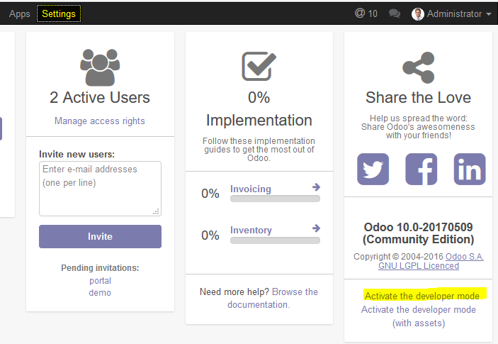

  - Go to Apps menu and click on &quot;Update Apps List&quot;

	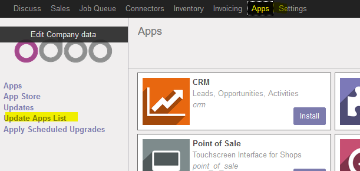

  - Remove the Apps filter from the textbox and search for the module. Once found click on the Install button

	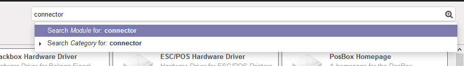
 
	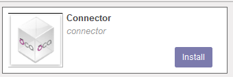 

- Enable jobs queue and connector.
  - You have to change some parameters in the odoo configuration file. It is located into &lt;installation\_folder&gt;\server\odoo.conf
  - Add queue\_job and connector to the server\_wide\_modules parameter:

	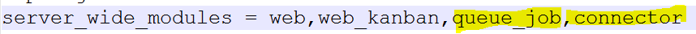 	

  - Set workers parameters to 1:

	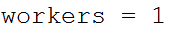 	

  - At the [queue\_job] section and the parameter channels = root:1 at the end of the configuration file:

	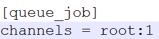 	

  - Restart the odoo server service. On windows systems:
    - Open file explorer
    - Right click on &quot;This Machine&quot; icon
    - Click on Admin
    - Click on Services and Applications
    - Click on Services
    - Search for the service with name odoo-server-10.0
    - Click on Restart Service button

## Testing the connector

This section will show you how to configure the connector between Odoo and Liquid Content and test it.

### Configuration on Liquid Content

First of all, we need to create a new content type with name &quot;Product&quot; and the following fields:

- **Name** : Single Line Text (Required)
- **Image Url:** Single Line Text
- **Description** : Multi Line
- **Sale Price** : Number (Required)
- **Quantity** : Number (Required)
- **Code** : Single Line Text
- **Category** : Single Line Text

 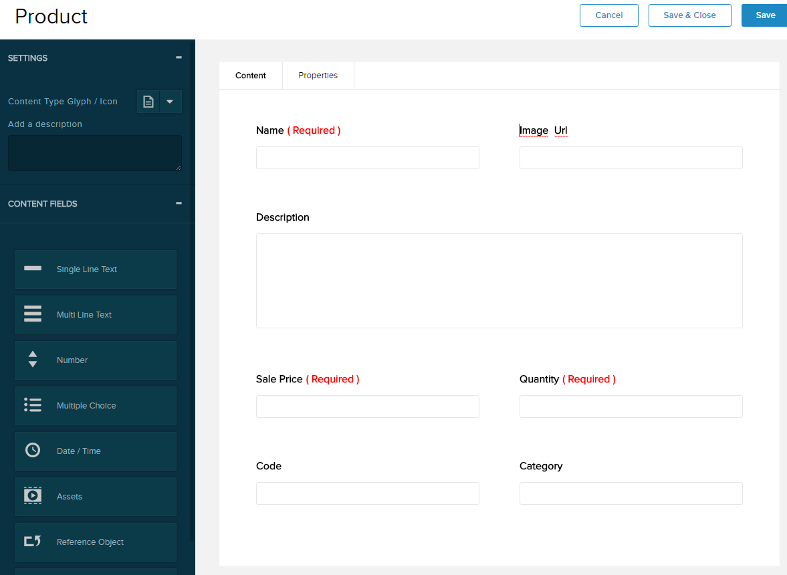 	

We will need to know the id of the created content type later. To know it, please open the console of your browser, select the network tab and inspect the response from the web server: you will have to take note of the id field in the json response:

 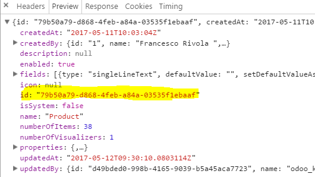 	

We will have to create a new API key on Structured Content with the following permissions:

- Read/Write content items
- Read Content Types

Please take note of the generated API key.

### Configuration on Odoo

Please be sure that the Connector with Liquid Content is installed on your machine. It should be, if you followed the steps on this section of this document correctly. Go to App -&gt; Apps on your Odoo installation and check that the module has a disabled &quot;Installed&quot; button.

 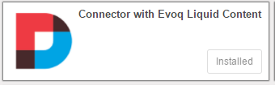 	

Next, we are going to configure the connection to create/update the products on Liquid Content. Go to Connectors -&gt; Liquid Content -&gt; Configuration. Then click on &quot;Create&quot; button on the top:

 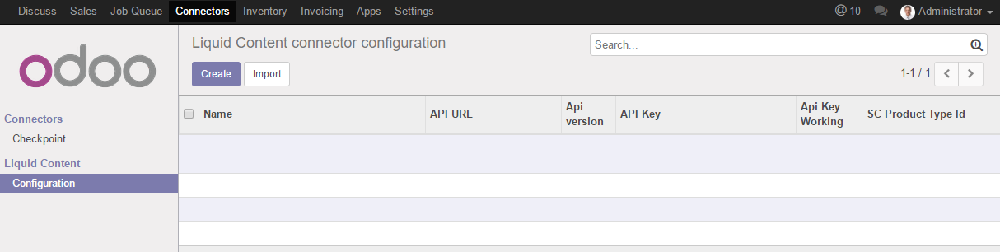 	

You will have to fill the following parameters:

- Name: A descriptive name to identify the Liquid Content site. F.i: the url of the site

- Version: select the only available option at this moment: &quot;Version 1.14&quot;
- SC Product Type Id: enter the content type id that you got on step 2.1.
- API Url: It is [https://dnnapi.com/content](https://dnnapi.com/content)
- API Key: enter the API Key you created on step 2.1.

To test the configuration, you can click on &quot;Test Url Connection&quot; button (will test the API without security restrictions) and &quot;Test API Key&quot; (will test the API with security restrictions). If everything is right, you should see 2 labels with the version on the API and the OK text:

 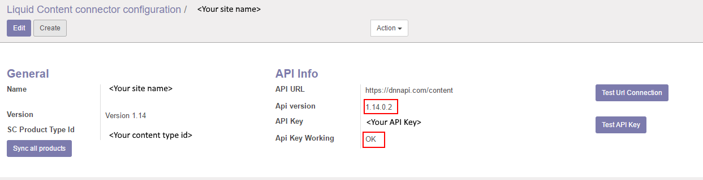 	

## Use cases

In this section we will show you how to export all your products to Liquid Content, configure a new visualizer to see them on your Evoq site and test that changes in Odoo are sync in Liquid Content near to real time.

### Export all your products at once

Go to the connector configuration by navigating to Connectors -&gt; Liquid Content -&gt; Configuration and select your configured connector. Then click on &quot;Sync all products&quot; button:

  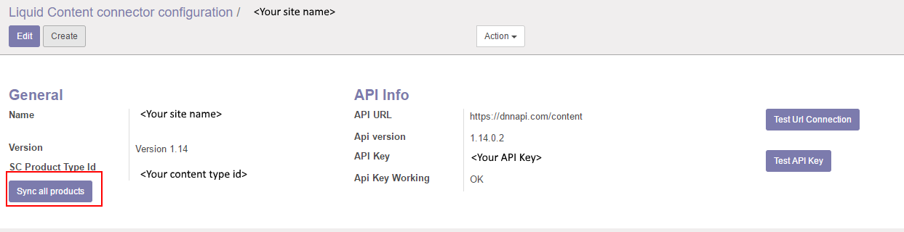 	

This action will enqueue a list of jobs (one for each product) that will export some data of your products to Liquid Content. If you go to Job Queue -&gt; Jobs you will see a list of many jobs:

  	

The jobs will be executed and will be finishing correctly if everything is ok during the process.

After that, you can go to the list of content items on your Evoq site and you will see all your exported products:

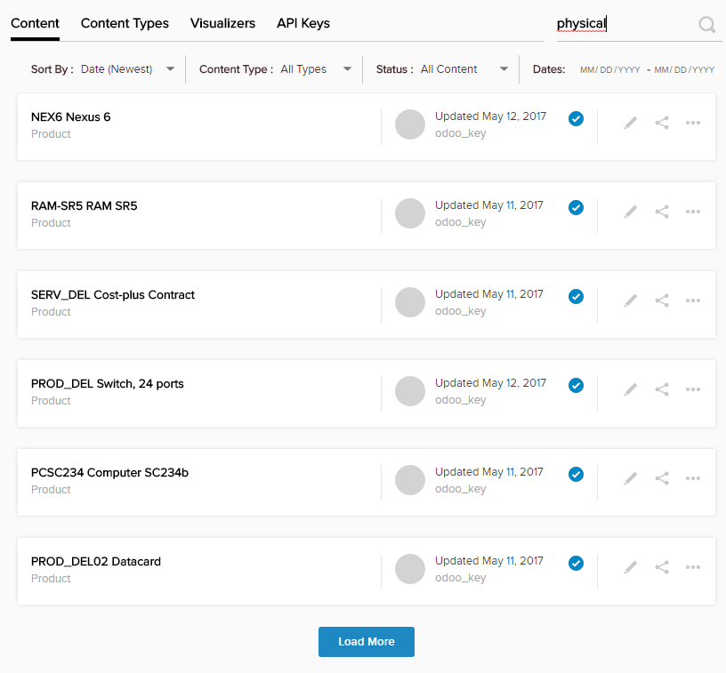 	
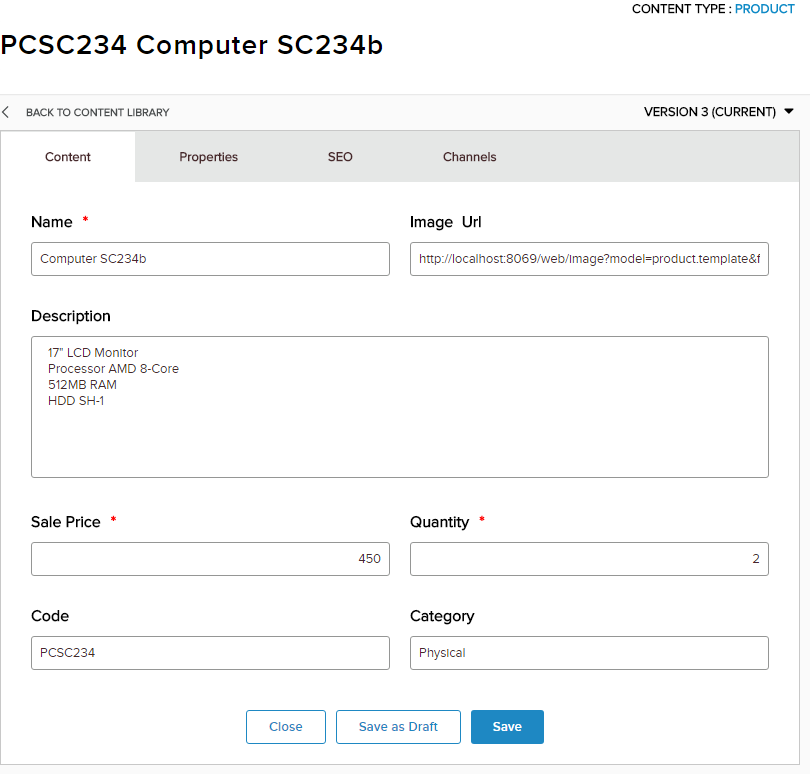 	

### Create a visualizer and add it to a page

We are going to create a new visualizer to show the products in a nice way on your Evoq site. On Evoq Liquid Content, go to Visualizers -&gt; Create Visualizer -&gt; New Visualizer.  Give it a name, select &quot;Product&quot; as Content Type and use the following files as Template Header, Template Body, Template Footer and CSS:

- [https://github.com/dnnsoftware/Dnn.Evoq.LiquidContent.Samples/blob/master/Pedro/src/visualizer\_template/template\_header.html](https://github.com/dnnsoftware/Dnn.Evoq.LiquidContent.Samples/blob/master/Pedro/src/visualizer_template/template_header.html)
- [https://github.com/dnnsoftware/Dnn.Evoq.LiquidContent.Samples/blob/master/Pedro/src/visualizer\_template/template\_body.html](https://github.com/dnnsoftware/Dnn.Evoq.LiquidContent.Samples/blob/master/Pedro/src/visualizer_template/template_body.html)
- [https://github.com/dnnsoftware/Dnn.Evoq.LiquidContent.Samples/blob/master/Pedro/src/visualizer\_template/template\_footer.html](https://github.com/dnnsoftware/Dnn.Evoq.LiquidContent.Samples/blob/master/Pedro/src/visualizer_template/template_footer.html)
- [https://github.com/dnnsoftware/Dnn.Evoq.LiquidContent.Samples/blob/master/Pedro/src/visualizer\_template/style.css](https://github.com/dnnsoftware/Dnn.Evoq.LiquidContent.Samples/blob/master/Pedro/src/visualizer_template/style.css)

Then add a new Visualizer to a page with the following settings:

- Type: List
- Content Type: Product
- Select Visualizer: The visualizer you just created.
- Visualizer Settings:
  - Filter by Physical tag
  - Unselect pagination

Once finished, you will be able to see a list of your products exported from Odoo similar to this:

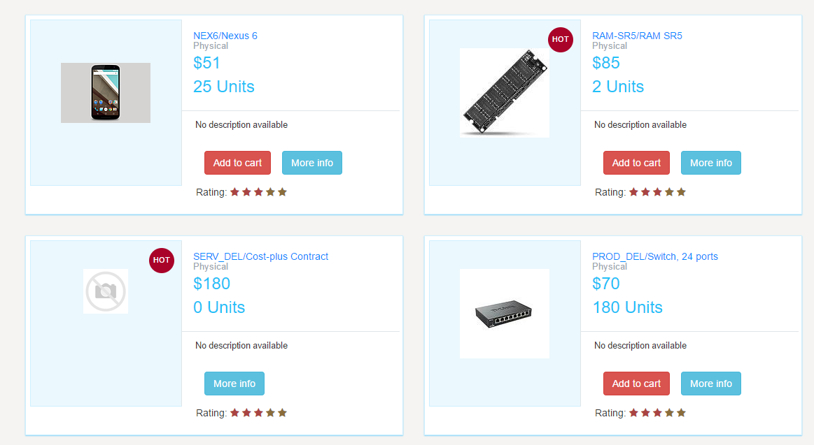 	

The visualizer is customized to show &quot;Add to cart&quot; button only for products with Quantity &gt; 0 and the HOT symbol to products with Quantity &lt;= 10.

### Test changes in Odoo

Any time you create a new product or update an existing one, a new Job will be created on Odoo -&gt; Job Queue -&gt; Jobs that will update the date in Liquid Content. You can test it by making changes in Odoo products, wait for some seconds and reload the page on Evoq to see that the rendering changes and it show the updated data.

## Technical details

### Technologies

The connector is build using [Python](https://www.python.org/) language and uses the Odoo development framework and utilities to build [new modules](https://www.odoo.com/documentation/8.0/howtos/backend.html). It is also based on a generic connector framework for Odoo that is open source: [http://odoo-connector.com/](http://odoo-connector.com/) .

To edit the code, the [Pycharm](https://www.jetbrains.com/pycharm/) IDE was used (Community Edition).

Due to the underlying database use by Odoo is [PostgreSQL](https://www.postgresql.org/); the [pgAdmin](https://www.pgadmin.org/) tool was used to inspect the tables, make queries, etc.

For creating the Visualizer we have used standard HTML and CSS code.

### Architecture

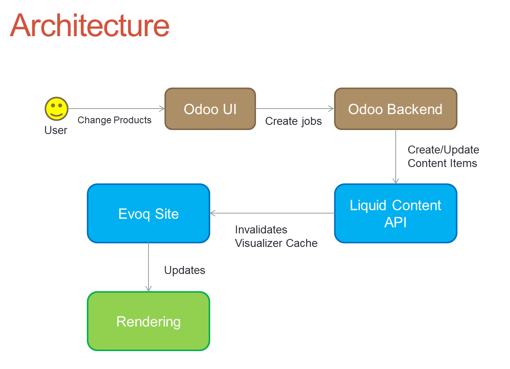 	
