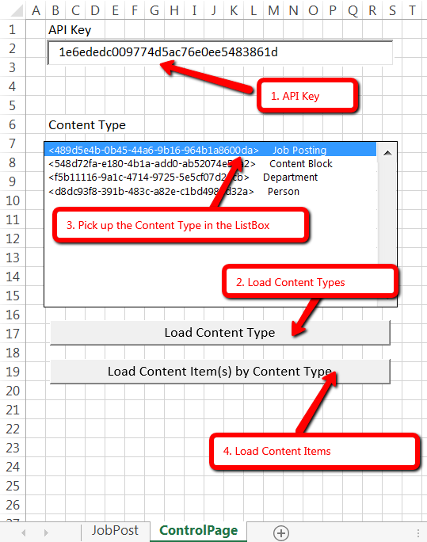
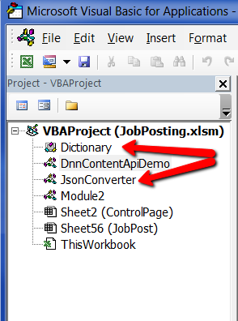

# Liquid Content - Data Publishing and Synchronization in MS Excel
<br />  


## Introduction

In this example, we will use Evoq Liquid Content, REST APIs and VBA Script to build up a solution how easily we can use MS Excel to update certain contents on the website pages in just seconds.
<br />  

## Purpose of this example

- Demo the possibility to remove the dependency of Evoq Product and Persona Bar when dealing with web contents
- Avoid end-user to learn and understand JSon format, or complicated forms (Phase II will provide more features)
- Demo the possibility that Liquid Content is capable to provide an easy and visualized way for end-user to maintain the data
- A tool to import/export data quickly

## Use Case of this example

- HR department asked IT to create a page for job posting
- But HR didn't decide how many jobs and titles/descriptions at that moment.
- Some of the HR team members, they don't have access to Persona Bar
- HR needs a way to update important fields (job information) without a waiting for IT department
<br />  

## Technologies Used

- Liquid Content APIs from Evoq Content or Evoq Engage
- Excel VBA scripting
- [JsonConverter] - JSON conversion and parsing for VBA 
- [Dictionary.cls] - VBA-Dictionary is a drop-in replacement for the useful and powerful Scripting.Dictionary
<br />  

## Prerequisites

- A target website and obtain API Key of Liquid Content
  - This API Key shall have permission to read and write Content Types and Content Items
- Enable Excel micro with file extension ".xlsm"
- Load JsonConverter.bas and Dictionary.cls in Excel micro
<br />  


## How to get Evoq Liquid Content APIKey

1. Install Evoq Content or Evoq Engage ver.9.1.0+
2. Log in as Host User
3. Go to Persona Bar &gt; Content &gt; Content Library &gt; API Keys
4. Create a new one or copy from existing ones.
5. Make sure the APIKey has proper permission assigned.
see [more details](http://www.dnnsoftware.com/docs/content-managers/structured-content/create-api-key.html)

<br />  

## Liquid Content API Call Preview
### A simple GET Request
```Java 
GET https://dnnapi.com/content/api/ContentTypes?searchText= HTTP/1.1
Set MyRequest = CreateObject("MSXML2.XMLHTTP.6.0")
FullApiURL = "https://dnnapi.com/content/api/ContentTypes?searchText=&maxItems=5000"
With MyRequest
    .Open "GET", FullApiURL
    .setRequestHeader "authorization", "Bearer " & const_ApiKey
    .send ""
    MyResponse = MyRequest.responseText
End With
```

### A simple POST Request
```java
POST https://dnnapi.com/content/api/ContentItems/?publish=true HTTP/1.1
Set MyRequest = CreateObject("MSXML2.XMLHTTP.6.0")
    FullApiURL = "https://dnnapi.com/content/api/ContentItems/?publish=true"
    With MyRequest
        .Open "POST", FullApiURL
        .setRequestHeader "content-type", "application/json"
        .setRequestHeader "authorization", "Bearer " & const_ApiKey
        .send jsonString
        MyResponse = MyRequest.responseText
        If MyRequest.Status <> 201 Then
            MsgBox ("Request Failed with Error Code: " & MyRequest.statusText & vbCrLf & "Dismiss this dialog to continue.")
            MyResponse = ""
        End If
    End With

```  
<br />  

## MS Excel Spreadsheet Preview


<br />  <br />  

## Check out the code


Please make sure JsonConverter.bas and Dictionary.cls are imported already to Excel VBA module
<br />  <br />  

## Conclusion
This is a simple example to show the capability of Liquid Content. This example demonstrated that all data posted from MS Excel could be reflected 
on the web page almost immediately, and viewable by all users. There is no dependencies or any necessary to wait for a web developer or IT department to 
modify the page for you, and all changes could be published in just couple seconds. Even more, considering by using the Evoq Liquid Content and its APIs, 
those changes could be also published to multiple channels automatically at the same time. 


<br />  <br />  
Copyright
----

Copyright (c) 2017 DNN Corp. (DotNetNuke). All rights reserved.

If you have more questions, please visit our website @ [www.dnnsoftware.com](http://www.dnnsoftware.com) or call 1.650.288.3150


   [JsonConverter]: <https://github.com/VBA-tools/VBA-JSON.git>
   [Dictionary.cls]: <https://github.com/VBA-tools/VBA-Dictionary.git>