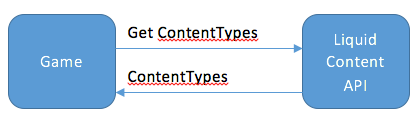
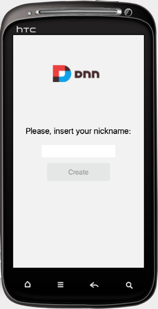
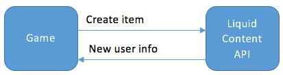
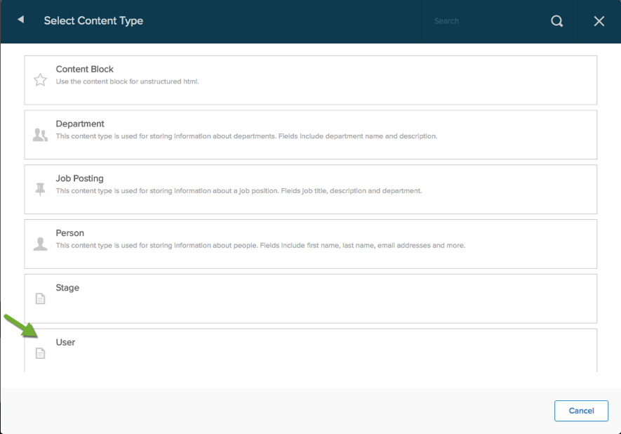
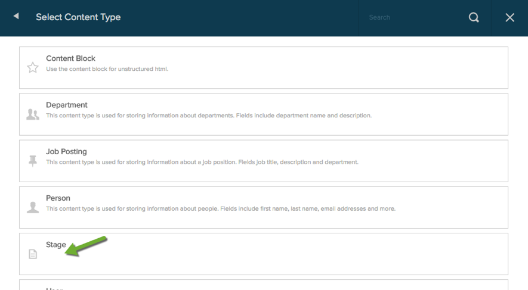
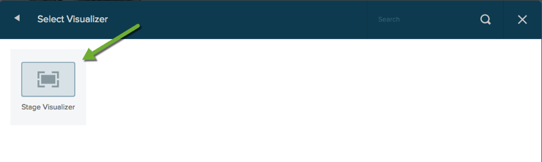

# Use Case / Requisites

The purpose of this project is to create a simple mobile/tablet game that makes use of Liquid Content as data provider.

As example the project implements a simplified version of the classic game: 4 Images 1 Word. Here you can find some examples of this kind of game in both Play and App Stores:

[https://play.google.com/store/apps/details?id=de.lotum.whatsinthefoto.us](https://play.google.com/store/apps/details?id=de.lotum.whatsinthefoto.us)

[https://itunes.apple.com/es/app/4-pics-1-word/id595558452](https://itunes.apple.com/es/app/4-pics-1-word/id595558452)

The idea in the game is to provide 4 images and a hidden word that a user has to figure out. Each one of these game levels will have some coins that the user will earn if the level is solved.

Finally, thanks to the support of Liquid Content, we will also define a page for the game where we can check the leaderboard with the users with more coins.

Some images of the game:


# Prerequisites

## Corona Labs

The game will be implemented using the framework Corona Labs:

[https://coronalabs.com/](https://coronalabs.com/)

Some of the features of this framework are:

1. Free
2. Publish to the major mobile platforms
3. Windows and Mac support.
4. Android TV and Apple TV support.

### Installation

1. Go to the Corona Labs web page:
 [https://coronalabs.com/](https://coronalabs.com/)
2. Create an account in order to be able to download and execute the app.

## API Key

To be able to use the Liquid Content API, we need to provide to the game configuration a valid API key with permissions for:

1. Read content types.
2. Read/Write content items.

## Configuring Content Types for Games

Liquid Content&#39;s Types are the perfect tool to support the data manage by an application, a game in this case.

For our game we will need two new content types:

1. Stage, which contains information about a level including:
  * 4 pictures
  * a hidden word
  * earned coins
2. User, each user that makes use of the game will have its own instance in Liquid Content. In our case, a user has these attributes:
  * Nickname
  * earned coins

In the following section, we will learn how to set the types needed for our game.

## Importing Content Types

In the folder of the project we can find two zips:

1. types/stage.zip
2. types/user.zip

Importing these ZIP files, the associated types and visualizers for our game will be automatically added to our site.

## Reviewing the Game Types
### Stages


This type has three attributes (all required):

1. Hidden word, the word to be figure out by the user.
2. As set of 4 images that will be uploaded to our system.
3. Number of coins that the user will earn if the level is solved.


### User


User type has only two attributes:

1. Nickname of the user, which is required.
2. Number of coins earned by the user.

## Creating Levels for our Game

Thanks to the great features of Liquid Content, once we have defined the types of our game, we will be able to define new levels that will be automatically available!

To create a new level, we only have to follow these steps:

1. Decide a hidden word, for example: DOGS
2. Search for images related to the word, here there is a link for searching with the proper images resolution:
 [Search link](https://www.google.es/search?q=dogs&tbm=isch&tbs=isz:ex,iszw:200,iszh:200)
3. Save 4 of them
4. Create a new item:


# Communication with Liquid Content

Our game will use Liquid Content in some steps during its execution.

## First Execution

In this scenario the game:

* does not have any information about the content types identifiers.
* no user associated with the mobile.

So the game will do these requests to the Liquid Content API:



These content types are cached, so this information is only retrieved once.

After this the game shows a view to insert your user&#39;s nickname:



Once the nickname is inserted and tap on &quot;Create&quot; the following communication is done:



This information is also cached by the game, so we will only have to introduce our user once.

## Communication in All Executions

Assuming that the game is already configured (previous section), the game makes this communication with the API:


# Configuring Game

To configure our game, we have to edit the file:

src/config/liquidContent.lua

```
local config = {

        apiServiceUrl = "https://dnnapi.com/content/";,

        apiKey = "$API_KEY$",

        userContentTypeName = "User",

        stageContentTypeName = "Stage"

}

Globals.liquidContent = config
```

In this file we have to replace $API\_KEY$ with the key that we created in section 2.2.

# Executing Our Game

Corona Labs allows us to execute our game in a big number of platforms, in this section will see two of them.

## Desktop

Once we have the framework installed, we have:

1. to run the program &quot;Corona Simulator&quot;


2. open out project (folder &quot;src&quot;).


## Mobile/Tablet App

Once we have our game running following the previous section steps, we can export it to one of the supported platforms by clicking in:

File -> Build -> one of the platforms

The easiest platform to be generated is the Android one, the iOS ones need to have xCode previously configured. After that an APK file is generated that can be installed in any Android device (smartphone or tablet).

# Game Web Site

Finally, we will user the visualizer created during the importation of the types to create a web page of our game.

For do that we have to:

* add a new page in EVOQ
* add a new visualizer list with the best gamers:




* add a new visualizer list with latest levels:





Adding these two visualizers list, we get this result:


