# Movie Android App with Infinite Scroll Using Liquid Content, AngularJS and Ionic

 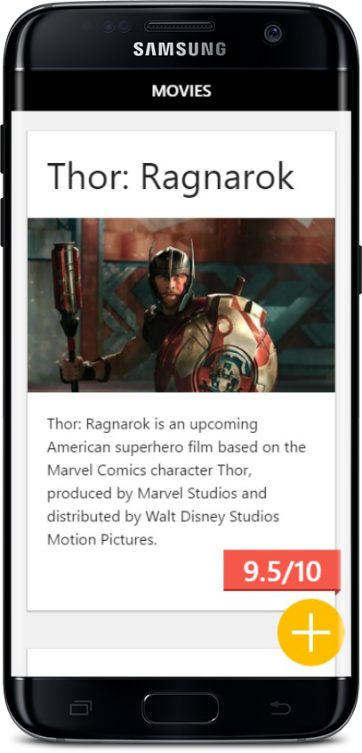

# Introduction

The purpose of this Mobile App is to make a personal movie list with ratings. This way a user can create a personal top list of movies and share it.

This app uses [Liquid Content](http://www.dnnsoftware.com/cms-features/about-liquid-content) as the backend. It&#39;s built using Ionic and Angular JS. It has also have support for infinite scrolling.


# Technologies Used

- Knowledge of Liquid Content APIs from Evoq
- Ionic Development Environment
- AngularJS programing language


# Prerequisites

- Obtain API Key for Liquid Content
- Create a simple Content Type and couple of Content Items
- Node JS, npm, Ionic
- Android SDK, JDK

# Step 1 Set Your Content

- Create a simple Content Type

  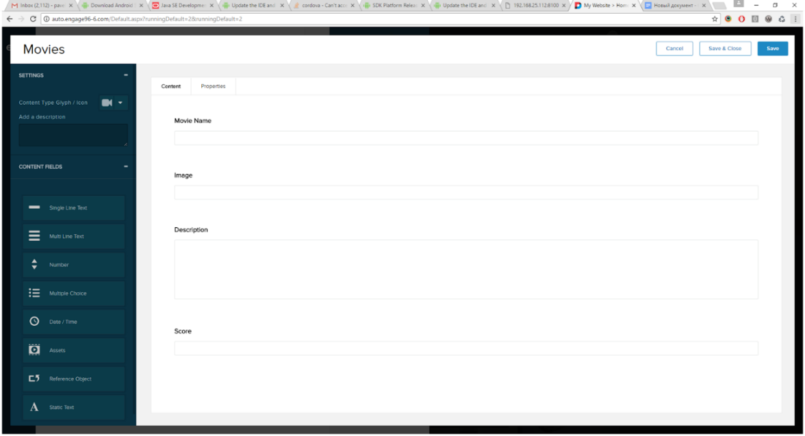

- Create couple Content Items

 

- Create API key with ability to Read and Write Content Items

# Step 2 Setup Ionic Environment

Learn more about ionic: [http://ionicframework.com](http://ionicframework.com)

- Instal Node.js and npm
- Instal Ionic and Cordova

```
npm install -g cordova ionic
```

- Create an Ionic app. ionic start myApp blank . Use name of your app instead of myApp. This operation may take a few minutes.
- Go to myApp folder
```
cd myApp
```
- Start serving your app

```
ionic serve localhost
```

This will open a new browser tab that will watch the code changes.

 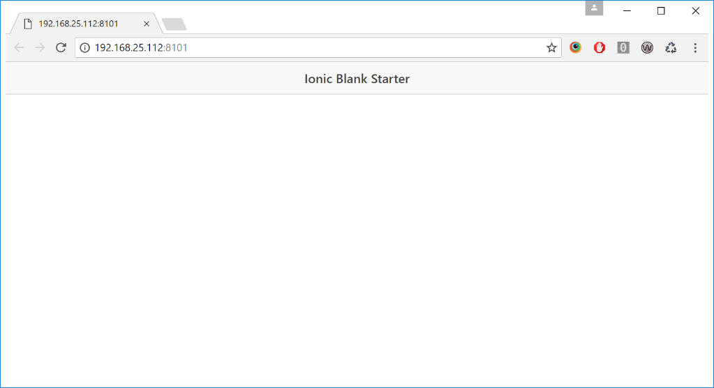
        

# Step 3 Build the App, Setup Integration with the Liquid Content

Open you app in a text editor of your choice. Sorce code of your app is located in www folder. You can create new, files or update existing. But for our application we will work only with 3 files:
  - html
  - js
  - css

 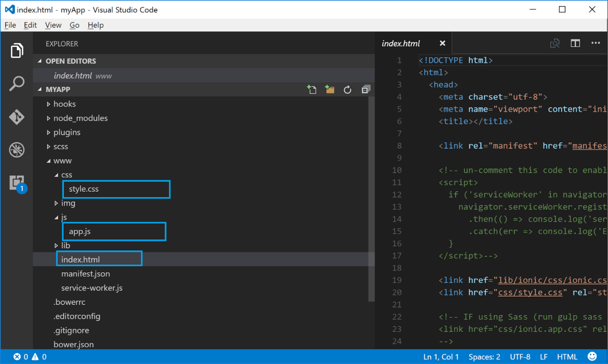


As a first step we will add a header to our html file
```
<ion-header-bar class="bar-dark">
     <h1 class="title">Movies </h1>
     <ion-icon name="heart"></ion-icon>
</ion-header-bar>

```
It will immediately change header in the app:

 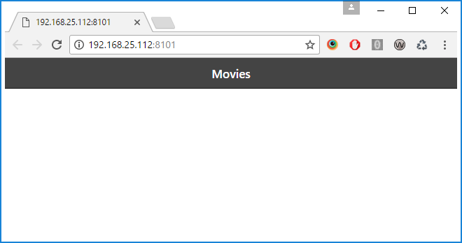
 

**Add content item cards**

In your app.js add app variable  update code to look like this:


 
add url constant - value is url of content item API

add APIkey constant - value is &quot;Bearer {APIkey created in the 3rd step }&quot;
```
const url = "https://qa.dnnapi.com/content/api/ContentItems&quot";

constAPIkey="Bearer 1e4f8360d5761bee3df67eab656b32a3&quot";
```
**Add a controller to app.js file with liquid content integration:**

```
app.controller("moviesController", function ($scope, $http) {
 $scope.movies = [];
 $http.get(`${url}`, { headers: { authorization: APIkey } }).then(function (data) {
   $scope.movies = [...data.data.documents];
 });
});
```

This Includes angular **$http** service framework, which allows to do API calls. Use **url** and **APIkeys** variables for API call. Store response data  into **$scope.movies**.

**Add a controller name to body in html file:**
```
<body ng-app="Movies" ng-controller="moviesController">
```
Now your application should do API calls. You can check it in the Network tab of the browser.

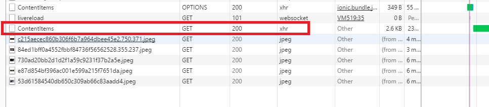

**To html file add a cards with content items:**
```
<ion-content class="cards-bg">
     <ion-list>
       <ion-card ng-repeat="movie in movies">
         <ion-card-title>
           {{movie.details.movieName}}
         </ion-card-title>
         
         <ion-card-content class="card-content card-content-wp">
           <p>
             {{movie.details.description}}
           </p>
           <div class="scores">{{movie.details.score}}/10</div>
         </ion-card-content>
       </ion-card>
     </ion-list>
   </ion-content>

```
Now you should be able to see your content items in the app. 

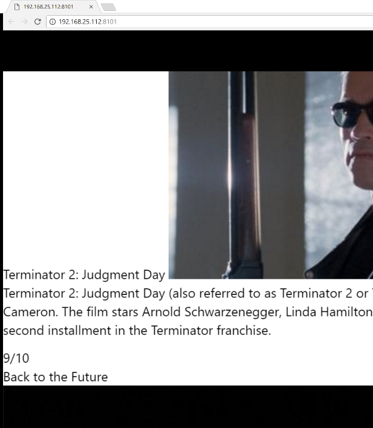

Add some styles to styles.css file to make it look nicer.

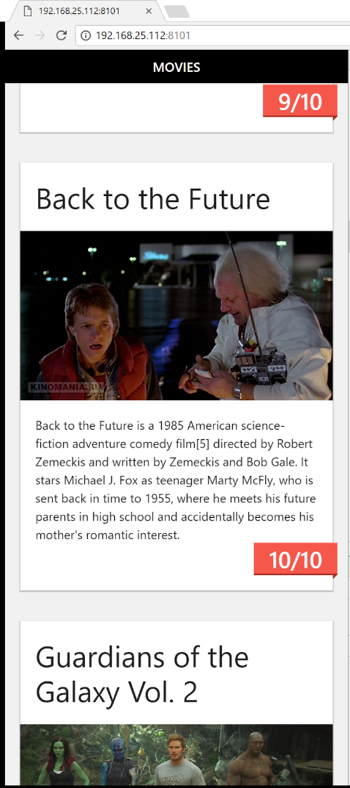

**Add infinite scroll**

Add inifinte scoll in index.html right after ion-list tag
```
<ion-list>
	….
</ion-list>
<ion-infinite-scroll ng-hide="true" ng-if="!noMoreItemsAvailable" on-infinite="loadMore()" distance="10%" />
```

In app.js inside the controller add loadMore function:

```
const maxItems = 1;
$scope.startIndex = 0;

$scope.loadMore = function () {
$http.get(`${url}?startIndex=${$scope.startIndex}&maxItems=${maxItems}&fieldOrder=createdAt&orderAsc=false`, { headers: { authorization: APIkey } }).then(function (data) {
     $scope.movies = [...$scope.movies, ...data.data.documents];
     $scope.startIndex = $scope.startIndex + maxItems;
     $scope.noMoreItemsAvailable = $scope.movies.length === data.data.totalResultCount;
     $scope.$broadcast('scroll.infiniteScrollComplete');
   });
 }

```

**maxItems** indicates how many content items it will load in one API call.

**$scope.startIndex** - indicates start index for API call.

Now application makes API calls as you scroll.

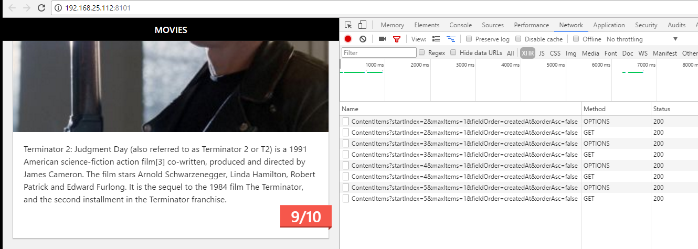

**Add functionality to Add New Content Item**

In index.html file add form.
```
<div class="form-pane">
     <ion-header-bar class="bar-dark">
       <h1 class="title">Add Movie</h1>
     </ion-header-bar>
     <form ng-submit="onSubmit()">
       <div class="list">
         <label class="item item-input item-floating-label">
         <span class="input-label">Movie Name</span>
         <input type="text" placeholder="Movie Name"  ng-model="formData.movieName">
     </label>
         <label class="item item-input item-floating-label">
       <span class="input-label">Movie Image</span>
       <input type="text" placeholder="Movie Image"  ng-model="formData.image">
     </label>
         <label class="item item-input item-floating-label">
         <span class="input-label">Description</span>
         <textarea  placeholder="Description"  ng-model="formData.description"></textarea>
     </label>
         <label class="item item-input item-floating-label">
         <span class="input-label">Your Score</span>
         <input type="text" placeholder="Your Score"  ng-model="formData.score">
     </label>
       </div>
       <button class="button button-positive" type="submit">
        Add
     </button>
     </form>
   </div>
```

**Add button that can toggle the form and style it:**

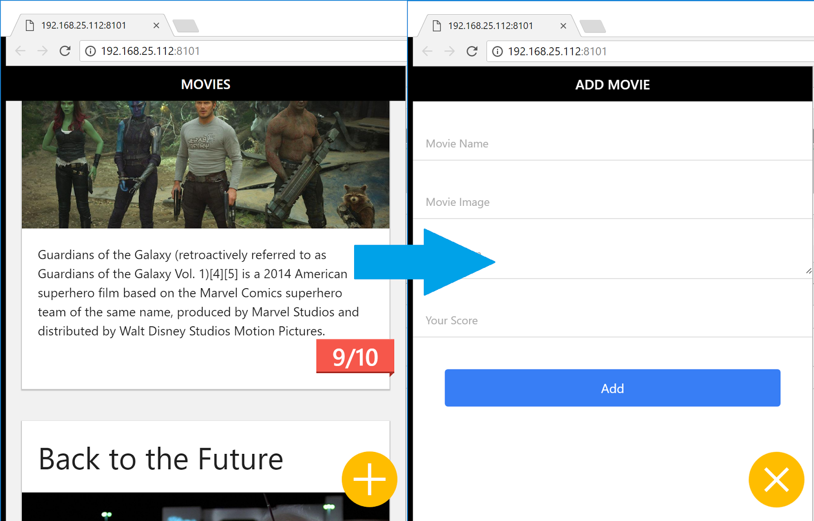


**Add onSubmit fnction to the controller**

```
$scope.onSubmit = function() {
   const params = {
     contentTypeId:  "36751f3b-7d3c-4cb5-bbab-40809013c989",
     description: "",
     name: movieName,
     tags: [],
     details: $scope.formData;
   };
   $http.post(`${url}?publish=true`, params, {headers: { authorization: APIkey }}).then(function(data) {
     $scope.movies = [data.data, ...$scope.movies ];
   });
 };

```

Now the application should be able to do POST API calls, when you submit the form

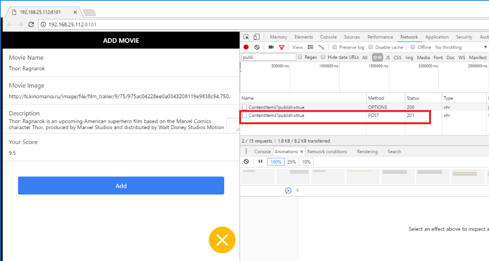
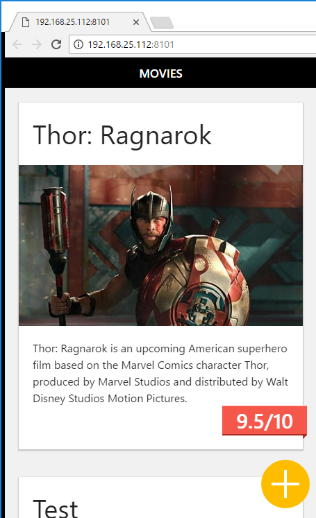

After that you should be able to see the content item in the DNN Engage Persona Bar:


# Step4 Release the App Using Android SDK

1) Download and install Android Studio ( [https://developer.android.com/studio/index.html](https://developer.android.com/studio/index.html))

2) Install Latest JDK.

3) Add android platform to you app
```
ionic platform add android
```
4) Build an \*.apk file

```
Ionic build android –release
```

Now you should be able to see your \*.apk file in platforms folder

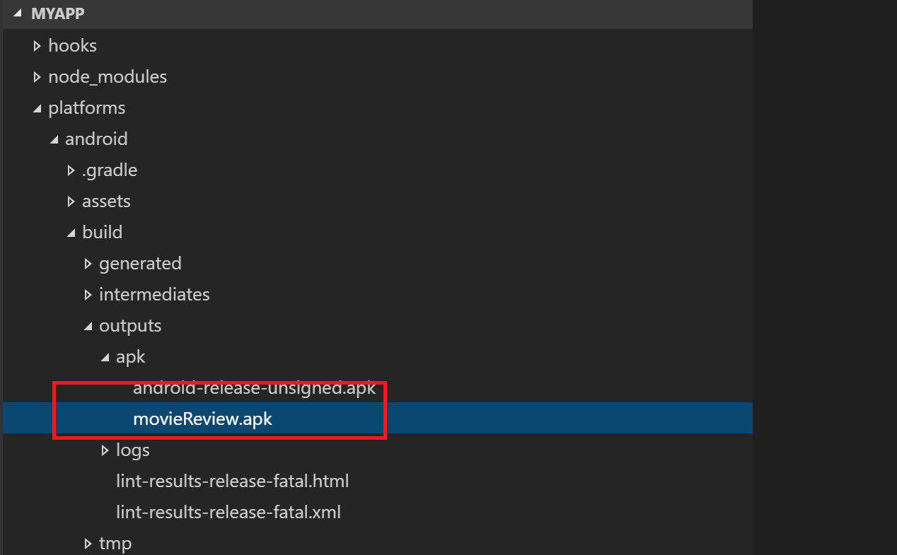

5) Generate keystore:
```
keytool -genkey -v -keystore ionicTest.keystore -alias movieRevie -keyalg RSA -keysize 2048 -validity 10000
```
6) Signe your apk file.
```
jarsigner -verbose -sigalg SHA1withRSA -digestalg SHA1 -keystore ionicTest.keystore movieReview.apk movieRevie
```
7) After the \*.apk file is signed you should be able to upload it to an android device and install it.

# Conclusion

As can be seen from above, it&#39;s very easy to build an App using Evoq Liquid Content. All that&#39;s needed is to setup Ionic Development Environment, setup Integration with the Liquid Content and release the App using Android SDK.

Also as seen, the Liquid Content API is flexible, which makes it&#39;s very easy to build infinite scroll application.
