# Android App – Points of Interest

# Introduction

The purpose of “Points of Interest” is to let users retrieve their points of interest data stored on [Evoq Liquid Content](http://www.dnnsoftware.com/cms-features/about-liquid-content) through API and view them on Android device. Editing/creating points is not supported at this moment. 

## Technologies Used
The following technologies are going to be used in this tutorial:

- Liquid Content APIs from Evoq
- Android SDK
- Android Virtual Device
- React Native framework by Facebook
- React Native Map component by Airbnb

## Architecture
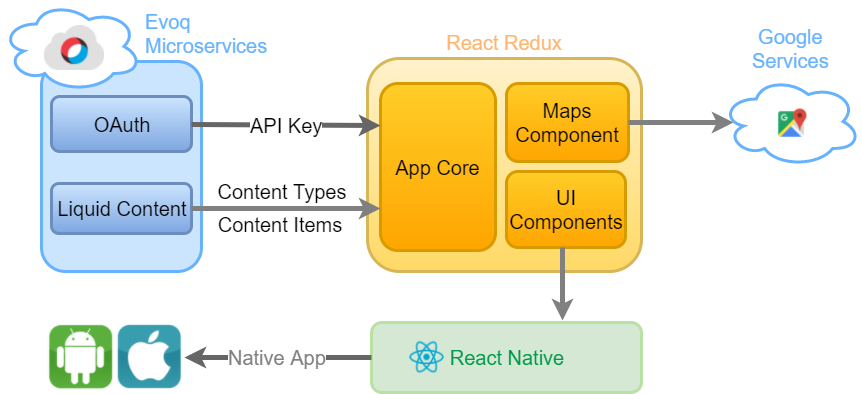

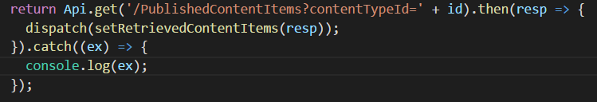

# Prerequisites

- Obtain API Key for Liquid Content
- Install [React Native](https://facebook.github.io/react-native/docs/getting-started.html)
- Obtain Google API Key from [Google API Console](https://console.developers.google.com/)

# Step 1

Open Android Studio

# Step 2

Create a new Android Studio project or open an existing project

# Step 3

Open AVD Manager under Tools > Android and add new virtual device if you don’t have any (clicking the green action button to start device)
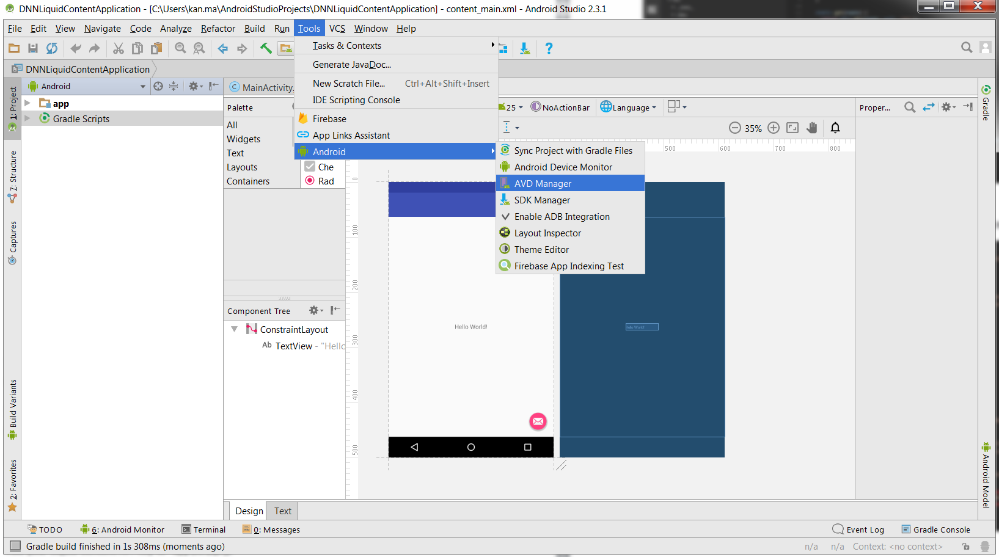
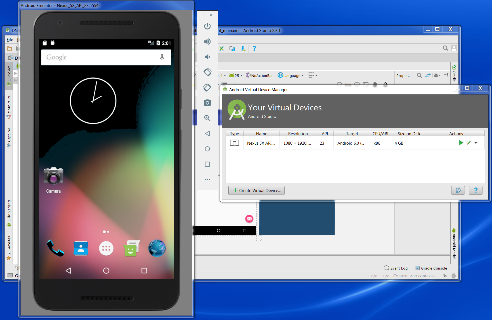

# Step 4

Open the project folder in Windows Explorer

# Step 5

Update your Liquid Content API Key and API endpoint to “app\lib\api.js”
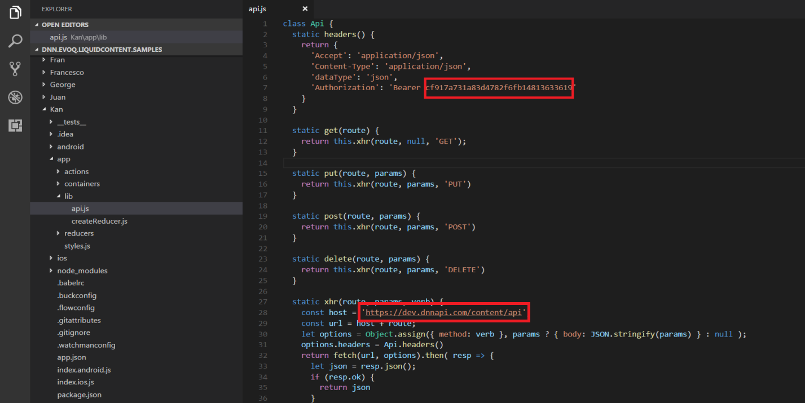

# Step 6

Update your Google API Key to your manifest file “android\app\src\main\AndroidManifest.xml”
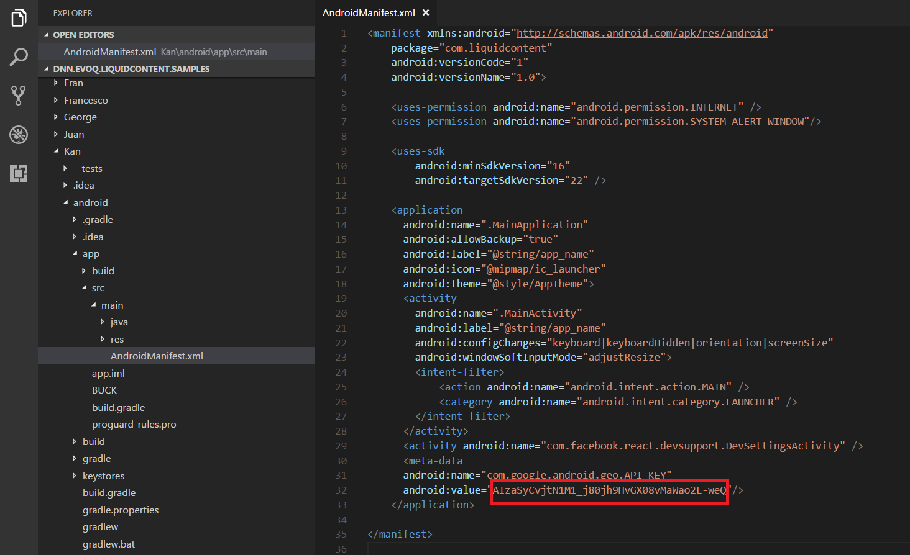

# Step 7

Open Command window from project root folder (Ctrl + Shift + Right Click) and run “npm install” to download libraries 

# Step 8

Run “react-native run-android” to test app in virtual device
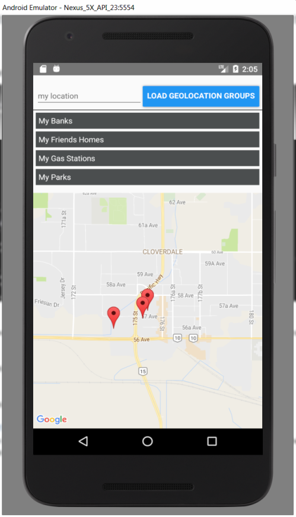

# Step 9

Prepair some test data in Evoq
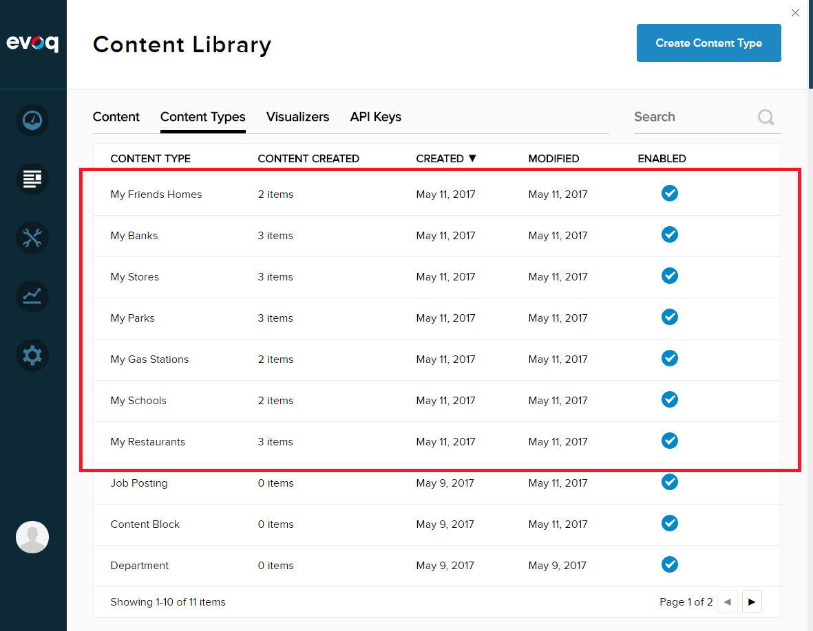

Create some Content Types each one should have the following fields,
- Name
- Description
- Latitude
- Longitude

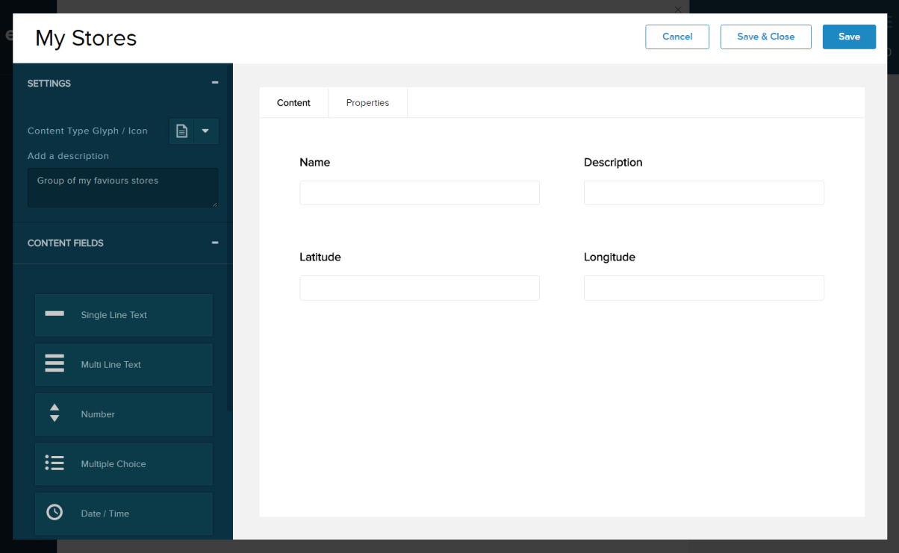
Create some Content Items for each new Content Type (title MUST starts with “My” because of hardcoded in source code),
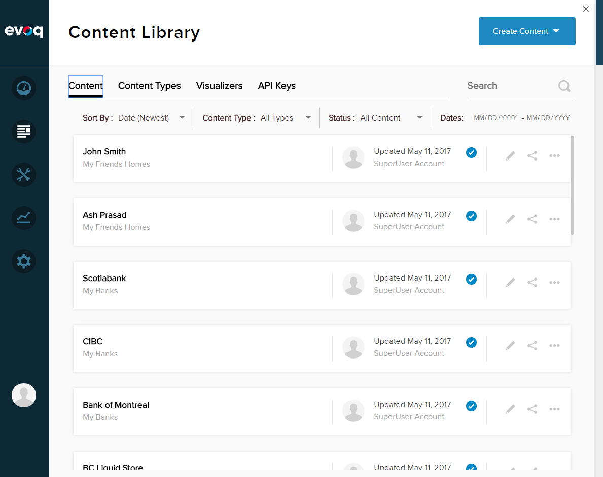
Sample data looks like this, 
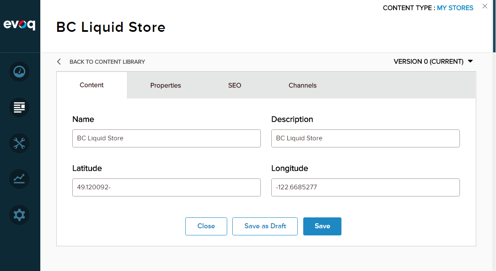

# Sample Data

My Restaurants
Latitude/Longitude:	
49.170521/-123.139655
49.170374/-123.1355193
49.172233/-123.1368873

My Parks
Latitude/Longitude:	
37.549718/-122.3187867
37.542538/-122.323486
37.524598/-122.3222497

My Gas Stations
Latitude/Longitude:	
49.159704/-122.6685667
49.162793/-122.6417877

My Schools
Latitude/Longitude:	
49.1254401/-122.7211709
49.129119/-122.7068587
			
My Stores
Latitude/Longitude:	
49.120044/-122.6579707
49.119559/-122.6673907
49.120092/-122.6685277

My Banks
Latitude/Longitude:	
49.106491/-122.7368497
49.104967/-122.7410877
49.105831/-122.7374507

# Conclusion

As can be seen from above, it’s very easy to build and React Native Android app using Evoq Liquid Content. All that’s needed is step 1 through step 9.
