# The LiquidApp (Hello world)
## Introduction
The purpose of this Mobile App is to make one API call to Liquid Content and display its version on the main screen.

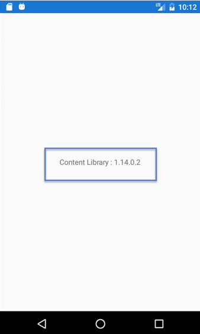

## Technologies Used

* Knowledge of Liquid Content APIs from Evoq
* Xamarin Development Environment
* C# programing language

### Prerequisites

* Install Visual Studio Xamarin Developer Environment
* Have PC or Mac [o	Tested on Windows 10 OS [Not a virtual machine]]


# Step 1 – Hello World Xamarin

1.	Open Visual Studio
2.  Click on File > New Project > Installed > Templates > Visual C# > Cross-Platform >
- 	Select Cross Platform App (Xamarin.Forms or Native)
-   Project Name “Hello world”
-   Click Ok

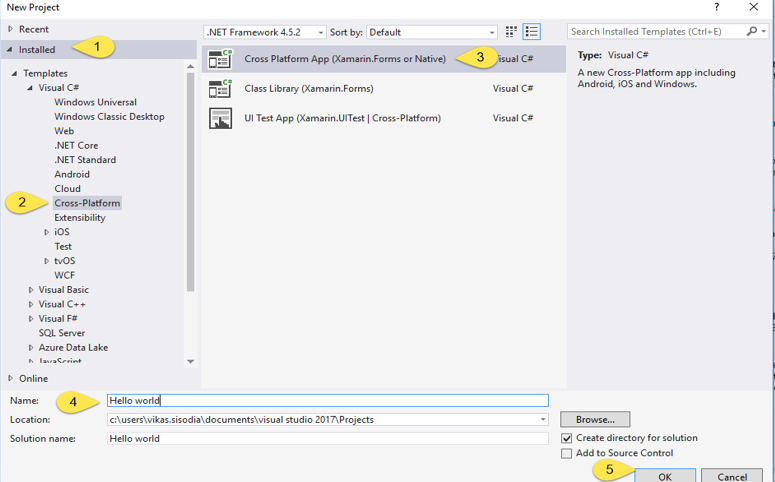

-  Next screen (New Cross Platform App – Hello_world)
-  Please follow the below screen shot.
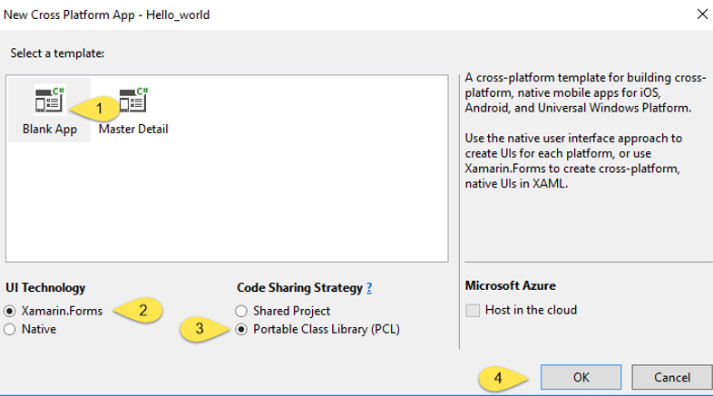

 3. Default Folder Structure


4. Add new NuGet Packages
- Right click on solution ‘Hello world’
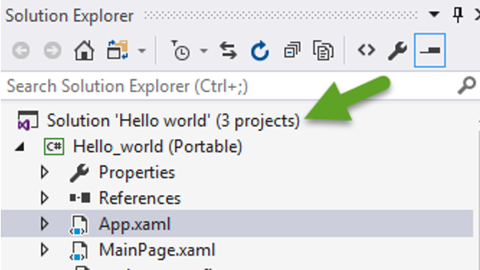

- Click Manage NuGet Package from Solution
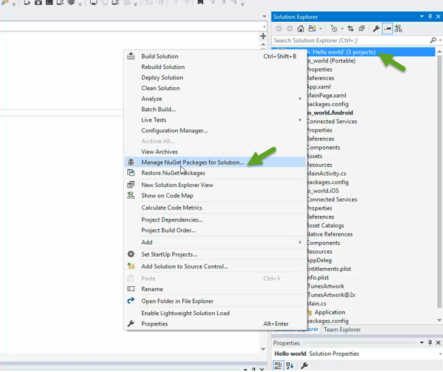

- Install
    -  Newtonsoft.Json
    -  Microsoft.netHTTP
    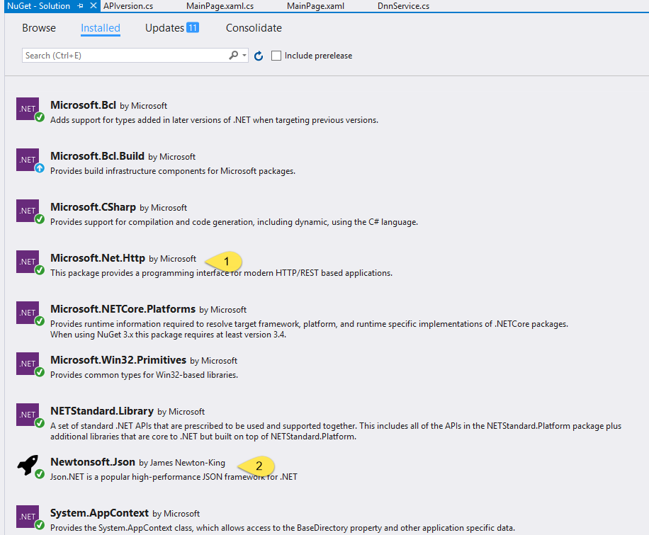
- References

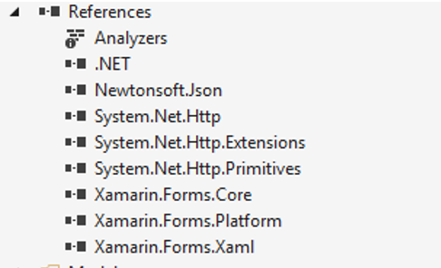

- Run the default app (Default app screenshot)
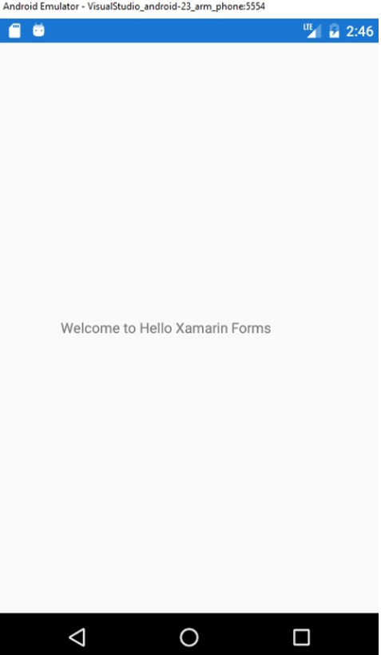


# Step 2 - Add Name to Label

1. From Solution Explorer Window, click on MainPage.xaml file to add the Label Name

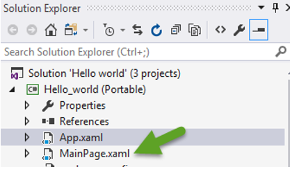

2. Default Code :

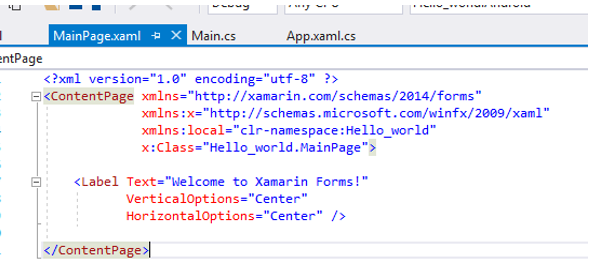

3. Updated Code

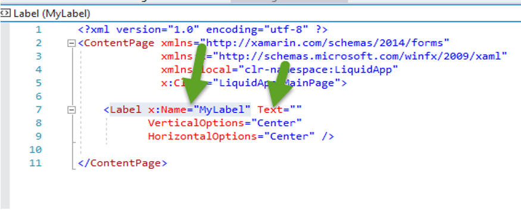

4. Add two lines of code in MainPage constructor in MainPage.xaml.cs file
    - Default File looks :
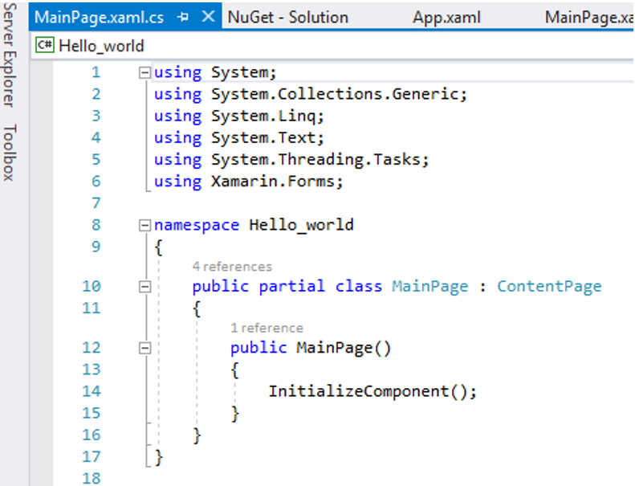

```
var dnnService = new DnnService();
MyLabel.Text = "Content Library : " + dnnService.GetVersion().Version;

```

We first call DnnService to obtain version of Liquid Content. Then, we update the Label with version information.

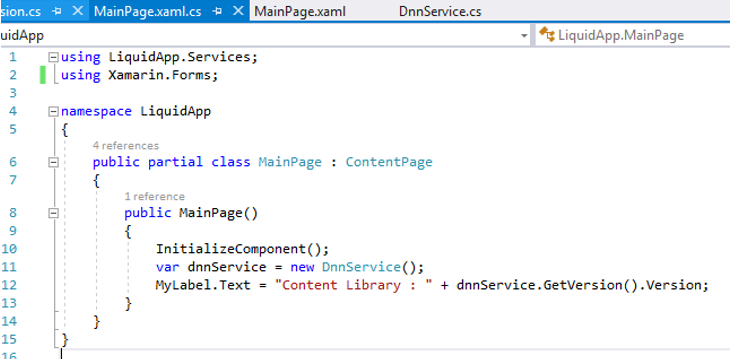

### Final Code

```
using LiquidApp.Services;
using Xamarin.Forms;

namespace LiquidApp
{
    public partial class MainPage : ContentPage
    {
        public MainPage()
        {
            InitializeComponent();
            var dnnService = new DnnService();
            MyLabel.Text = "Content Library : " + dnnService.GetVersion().Version;
        }
    }
}

```

# Step 3 - Create two classes

1. Create new folder at root level and two classes: 

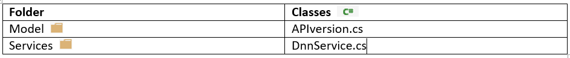

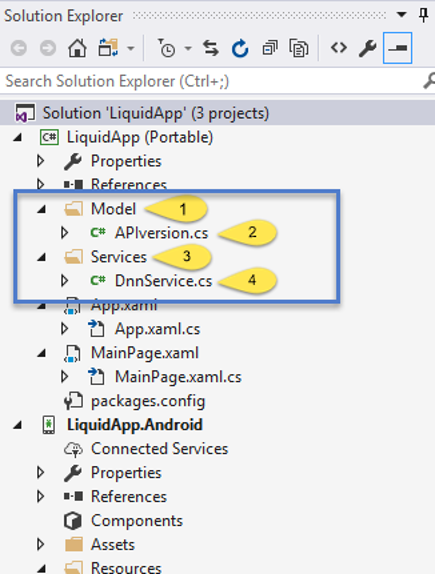

2. Code in APIversion.cs  
This holds the model for Version.

```
using Newtonsoft.Json;

namespace LiquidApp.Model
{
    [JsonObject]
    public class APIversion
    {

        [JsonProperty("version")]
        public string Version { get; set; } = string.Empty;
    }
}

```

3. Code in DnnService.cs (This calls the Liquid Content API.)


```
using System.Net.Http;
using System.Net.Http.Headers;
using Newtonsoft.Json;
	
namespace LiquidApp.Services
{
    public class DnnService
    {
        const string MsaVersion = "https://dnnapi.com/content/api/version";

        public APIversion GetVersion()
        {
            var version = new APIversion();

            using (var client = GetClient())
            {
                var response = client.GetAsync("https://dnnapi.com/content/api/version").Result;
                var content = response.Content.ReadAsStringAsync().Result;
                if (!response.IsSuccessStatusCode)
                {
                    // show error here
                    version.Version = "ERROR: " + response.ReasonPhrase;
                }
                else
                {
                    version = JsonConvert.DeserializeObject<APIversion>(content);
                }
            }

            return version;
        }

        private HttpClient GetClient()
        {
            var client = new HttpClient
            {
                Timeout = TimeSpan.FromSeconds(45),
            };
            var headers = client.DefaultRequestHeaders;
            headers.Accept.Add(new MediaTypeWithQualityHeaderValue("application/json"));
            headers.Authorization = new AuthenticationHeaderValue("Bearer", "cbf9b53593548cf077f9e03a067e75cc");
            return client;
        }

    }
}

```
4. Run on Visual Studio Android emulator (Final product screenshot:)

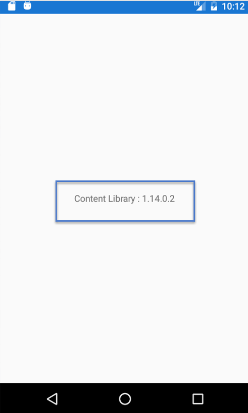

# Additional Information

The HttpClient Class allows apps to interact directly with Rest API using HTTP. The System.Json class can be used to parse JSON results from an HTTP request.

How to pass the API Key:


```
var response = client.GetAsync("https://dnnapi.com/content/api/version").Result;
```

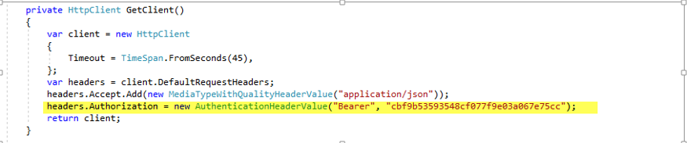

```
headers.Authorization = new AuthenticationHeaderValue("Bearer", "cbf9b53593548cf077f9e03a067e75cc");
Namespace:  System.Net.Http	
Assembly:  System.Net.Http (in System.Net.Http.dll)

```

You can also verify this by visiting [https://dnnapi.com/content/api/version/](https://dnnapi.com/content/api/version)

# Conclusion

As can be seen from above, it’s very easy build mobile app & make API call to Liquid Content and display context. 