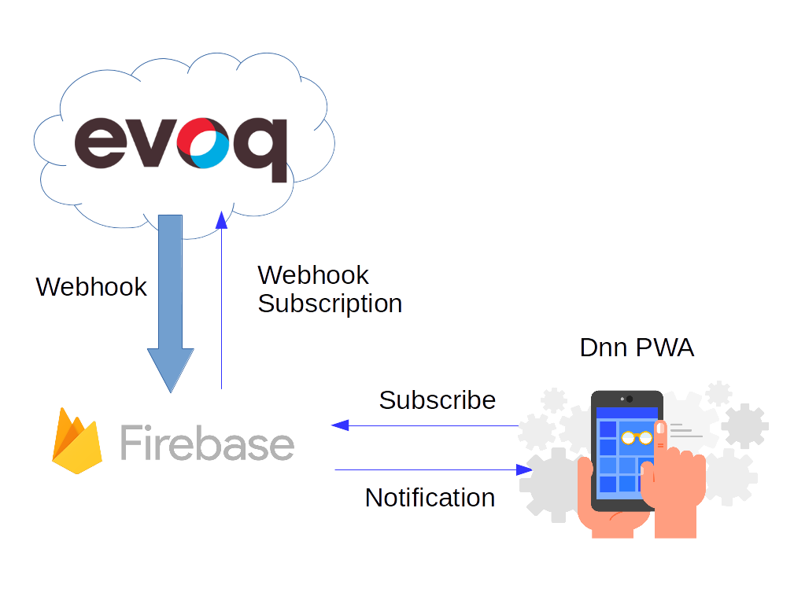

# Dnn Liquid Content Progressive Web App

This project is an example of how to develop a Progressive Web App and subscribe it to [Evoq Liquid Content from DNN](http://www.dnnsoftware.com/cms-features/about-liquid-content) Webhook events. The tutorial has been divided in two steps:

1. Backend: provided by [Dnn Liquid Content Firebase Sample Functions](dnn-firebase-app). Should be installed in a Firebase project first. 
2. PWA application: deployed also in a Firebase hosting. Keep reading about PWA application install and deploy in [Dnn Liquid Content Sample PWA](dnn-pwa-app).

To have the full picture, you will learn how to subscribe a Firebase backend to a DNN Liquid Content Webhook API. Then, the PWA application will be able to retrieve latest publication events and receive push notifications from the Firebase webhook subscriber.

