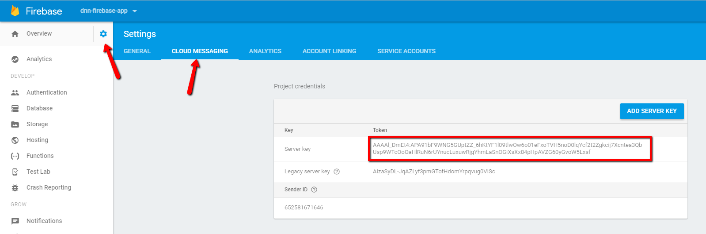
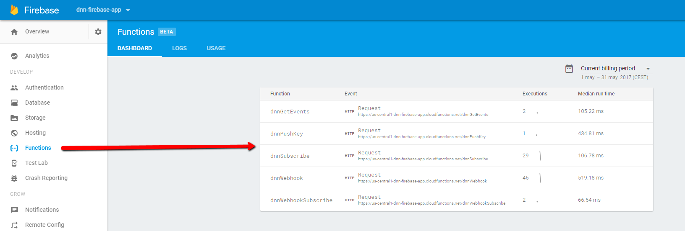

# Dnn Liquid Content Firebase Sample Functions

This project shows how to access to [Dnn Liquid Content](http://www.dnnsoftware.com/cms-features/liquid-content) APIs and Webhook subscription from a Firebase project. The webhook will store publishing events in the Firebase database and also will push notifications to subscribers using [Dnn Liquid Content Sample PWA](../dnn-pwa-app). To follow this tutorial you will need an Dnn Evoq installation and a Firebase account.

## List of technologies used in the project

1. [Firebase](https://firebase.google.com/)
2. [Node](https://nodejs.org/en/)
3. [Web-push](https://github.com/web-push-libs/web-push)

## 1. Deploy the function library

To deploy the project you need a Firebase account. Go [here](https://firebase.google.com/) to get one for free!. Also create a new empty project in the main window. You also should install Firebase tools, like described [here](https://firebase.google.com/docs/cli/).

Then, download the source from this repository and run this command in the new created folder:

```
firebase use --add
```

This will link the project to your Firebase project. 

We also should define some enviroment constants in Firebase:

```
firebase functions:config:set dnn.webhook_url="https://dnnapi.com/content/api/WebHooks"
firebase functions:config:set dnn.subscriber_url="https://your_firebase_project_host/dnnWebhook"
firebase functions:config:set dnn.token_key="your_evoq_1hour_valid_token"
firebase functions:config:set dnn.server_key="your_cloud_notifications_server_key"
firebase functions:config:set dnn.support_mail="your_email"
```

The server_key parametter is required to be able to send notifications. You can find your key in the project settings section:



Also take note of the client id, you will need it to config the [Dnn Liquid Content Sample PWA](../dnn-pwa-app).

To finish, deploy the functions with next command:

```
firebase deploy
```

Go to your Firebase Console Functions section, you should see something like this:



## 2. Subscribe to the webhook

Ok, once we have all these functions in place, we can start to listen the webhook. To do this we should call the *dnnWebhookSubscribe* function. Go to Firebase Functions and look for the related url. Open the url using the browser or using some tool like *curl*:

```
curl https://your_functions_base_domain/dnnWebhookSubscribe
```

The call should return a json message confirming you are subscribed:

```
{
    status: "success",
    message: "your_subscribed_url has been subscribed to Dnn Liquid Content Webhook"
}
```

Ok, we are ready to pull events and make subscriptions to our Firebase enviroment. Go ahead and continue reading in [Dnn Liquid Content Sample PWA](../dnn-pwa-app).

## Conclusions

Firebase is a very easy platform to run projects without worry about infraestructure. These sample functions are a good start point to create aplications consuming Dnn Liquid Content APIs. It is be very easy to change these functions to fire other events or to consume other API endpoints. Deployment is also very easy to perform thanks to Firebase tools.