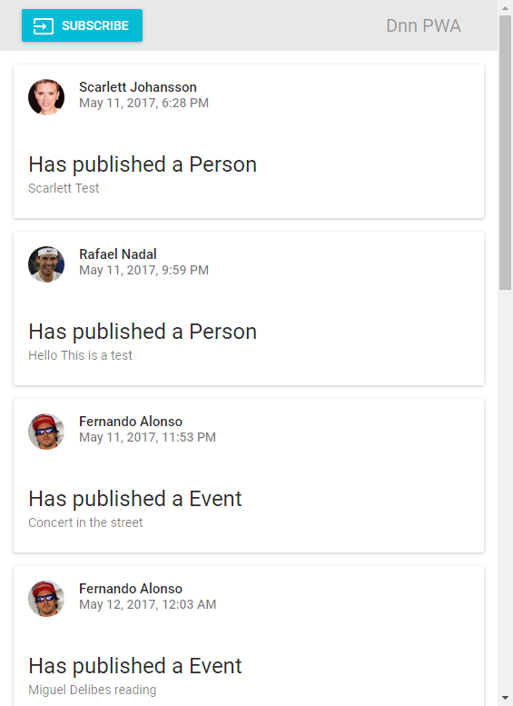
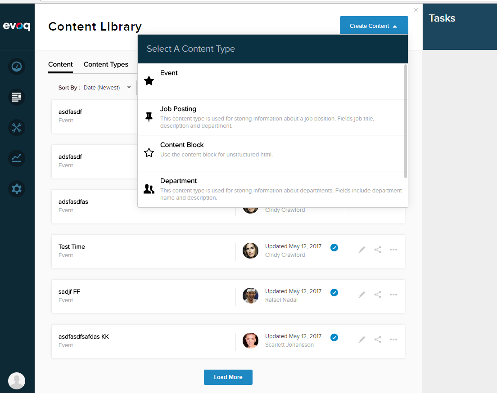

# Dnn Liquid Content PWA Sample Application

Progressive Web Apps let you to distribute applications to your users using only an url and having a similar experience than using a native app. This applications are supported for both Chrome and Firefox browsers.

In this example you will see how to subscribe a Firebase backend to a DNN Liquid Content Webhook API (see [Firebase Functions Project](../dnn-firebase-app)). Then, the PWA application will be able to retrieve latest publication events, receive push notifications from the Firebase webhook subscriber and notify the user using the native notification system.

## List of technologies used in the project

1. React: [React Create App](https://github.com/facebookincubator/create-react-app)
2. [Material UI](http://www.material-ui.com)
3. PWA: You can see some information about this standard [here](https://developers.google.com/web/progressive-web-apps/)

## 1. Config and run the application

First, clone this repository to your computer and install the dependencies. To install and deploy the app we will use *yarn*, but you can use *npm* instead.

```
git clone ...
yarn install
```

Before running the application you should configure your Firebase Functions host (common part of your functions urls). For this, open public/index.html and enter a value for window.backendEndPoint:

```
window.backendEndPoint = "YOUR_FIREBASE_ENDPOINT"
```

Also you need to set your messaging system clientId in manifest.json file (see [Dnn Liquid Content Firebase Sample Functions](../dnn-firebase-app), to know how to get it from Firebase):

```
{
  "short_name": "dnn-pwa-app",
  "name": "Dnn PWA app",
  "gcm_sender_id": "YOUR_CLIENT_ID_HERE",
  "permissions": [
      "gcm"
  ],
  ....
```

This is everything you need to configure for this app. Run the command below to test everithing is working:

```
yarn start
```

And you will see the awesome web app runing and retrieving the latest event from Firebase.



## 2. Deploy application to firebase

Notifications are only available when the application is deployed in a host with https support. To do that, we are going to also use Firebase. Copy the content of the build folder to the public folder inside [Dnn Liquid Content Firebase Sample Functions](../dnn-firebase-app) installation folder. Then simply run firebase deploy command in the Firebase Functions folder:

```
firebase deploy
```

This will upload the application to Firebase host.

Now to access your firebase console, go to Hosting section and click on your hosting link to access your site. Once in the app press into Subscribe. You should see a native dialog asking you to allow push notifications.

## 3. Testing the APP.

To test the Progressive Web app capabilities, go to your phone and access your firebase hosting URL. You should see a confirmation window promting you to install the app. Install the app and you will have a new icon in your desktop to access the APP. Open it and subscribe for notifications.

Now, go to the Evoq site and create Content to test the notifications:



You should see a new notification in your browser or mobile device and also you can see new notification sumary in the Event list.

## Conclusions

PWA apps are a great opportunity to reach a lot of people, and you can bring Liquid Content data directly in their devices. PWA apps provide a nice user experience since they run directly in your mobile device and have notification support. In the other side, Progresive Web App is still a not very mature technology, and could be hard to develop some functionalities, but we should not lose the opportunity to be ahead on this new technology.
