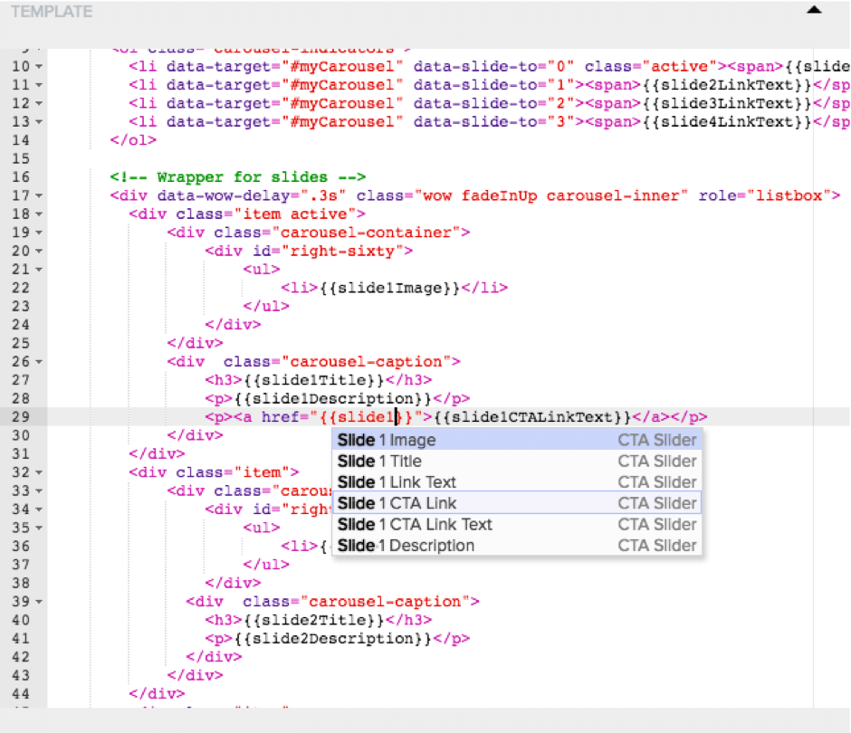

# Step 10 : Add in CTA Link Html to the Visualizer

Open the CTA Slider Visualizer, go to the Template Html Editor, and add in a new &lt;p&gt; element containing a link for the CTA Link, like this:

&lt;p&gt;&lt;a href=&quot;{{slide1Link}}&quot; data-evtcategory=&quot;CTA&quot; data-evtaction=&quot;Click&quot; data-evtlabel=&quot;{{slide1LinkText}}&quot;&gt;{{slide1CTALinkText}}&lt;/a&gt;&lt;/p&gt;

 
 
You can use Ctl+Space to get the list of available Content Item fields at any point, as shown above.

The secret sauce here is the data-ctacategory, data-ctaaction and data-ctalabel attributes in the otherwise plain &lt;a&gt; element.  Decorating the &lt;a&gt; element with these attributes is valid Html but instructs Evoq Analytics to track any clicks on that link using that Category, Action and Label attribute.   Note that the Category and Action are hardcoded into the Html, but the Label value is taken from the Slide 1 Link Text (in our example, &#39;Create&#39;).  You can make it whatever is most meaningful, but the important part is that this is the bit that changes in the Analytics reporting, so it needs to be associated with whatever it is clicked.

Yes, of course you can play on easy mode and copy the html from CTA Slider-template(all with CTA).html from the attached download.  If you want to keep your Html pencil unused.

Last step in the editing process – add in the needed CTA Link content to the content Item.

Prev : [Add in CTA Link Definitions to the Content Type](step9.md)
Next : [Add the CTA Link Details to the Content Item](step11.md)