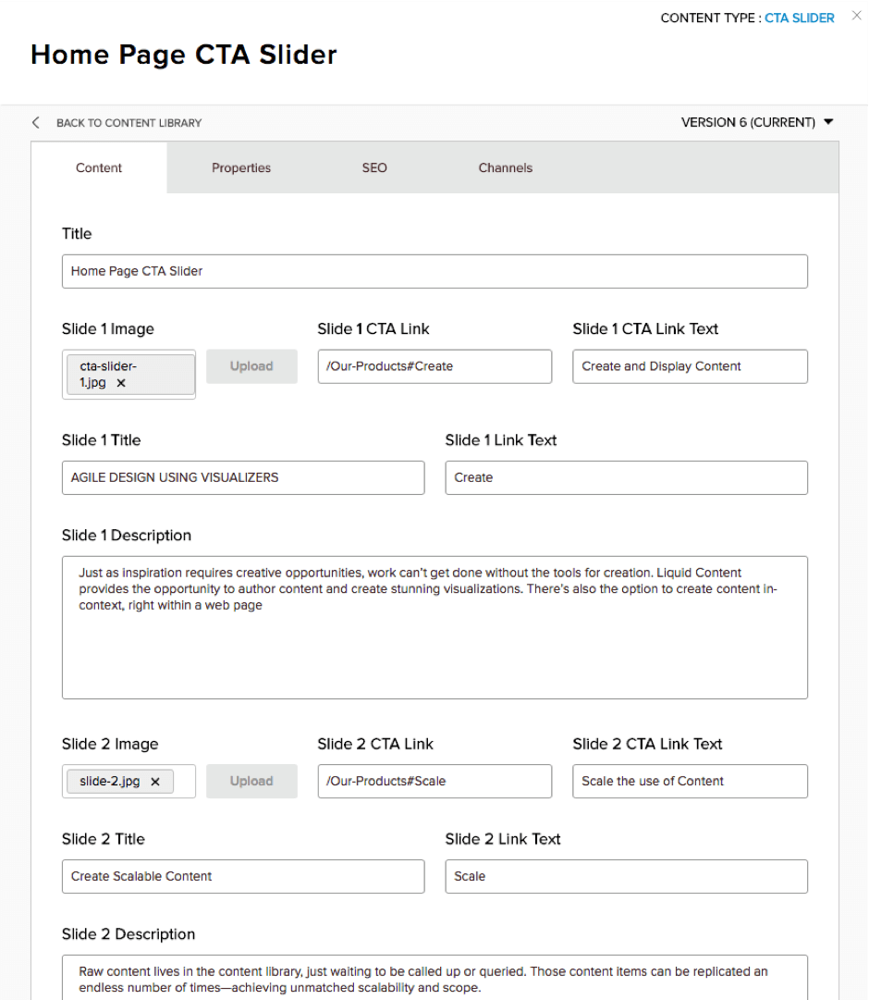

# Step 11 : Add the CTA Link Details to the Content Item

In the Content Library, edit the &#39;Home Page CTA Slider&#39; content item, and go through and add CTA Link and CTA Link Text values for each of the slides.

 
 
In this example, all of the Links go to the /Our-Products page, but each has an # anchor to show a different section of the page.  This is where traditional Analytics can break down, because you cannot discern from the source or the destination page which link attracted the most attention from Visitors.    Just adding these couple of fields to the Content Item corrects that shortcoming.

Save the Content Item and go to your Home page to view the results of your work.

Prev : [Add in CTA Html Attributes to the Visualizer](step10.md)
Next : [View the Results](step12.md)