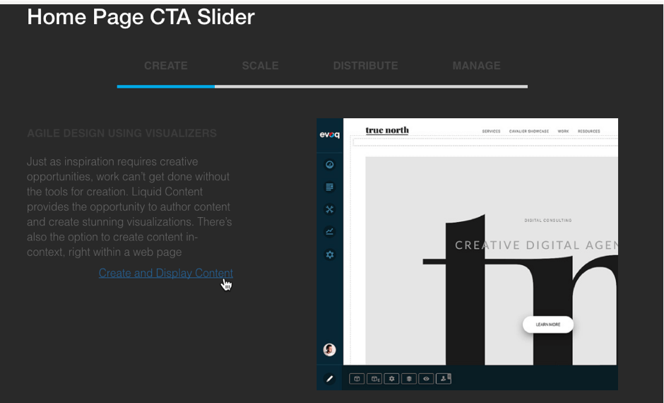

# Step 12 : View the Results

What you will see after all this is a Carousel slider showing the 4 images and text you have chosen.    You can click on a CTA link for each of the slides.   In fact, you should do that to check the links and create some traffic.

 

You&#39;ll need some traffic before the Analtyics will tell you anything – if the site is live leave it for a while.  If it&#39;s not, then send the link out to a few people and convince them to click on it.

Prev : [Add the CTA Link Details to the Content Item](step11.md)
Next : [Analyze the click behaviour with Analytics](step13.md)