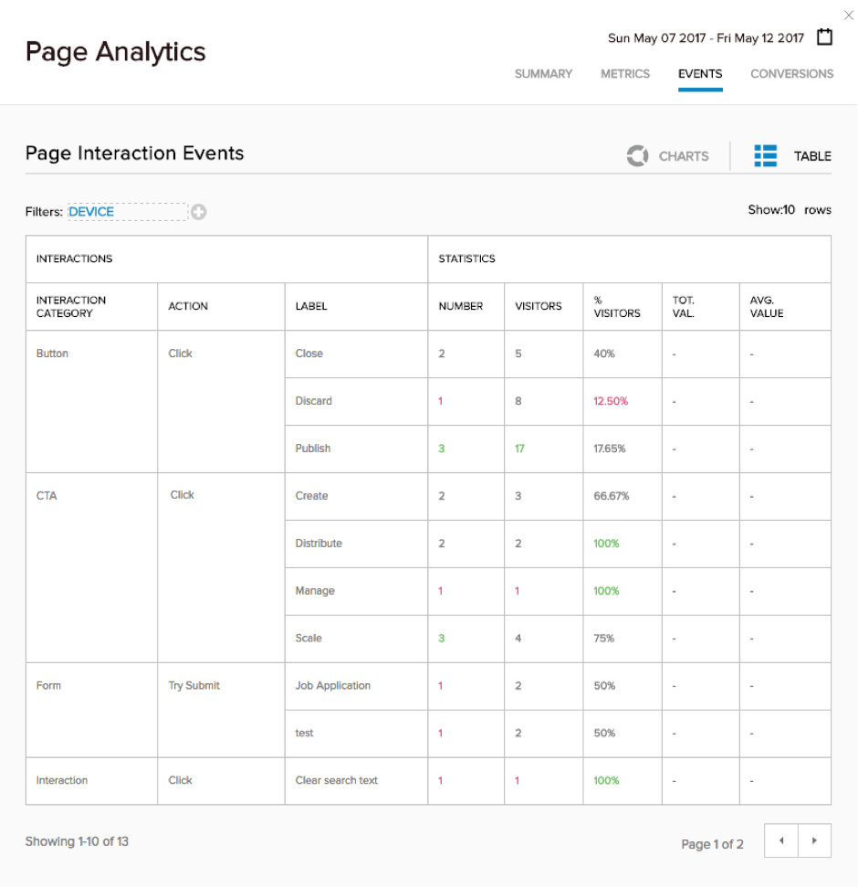
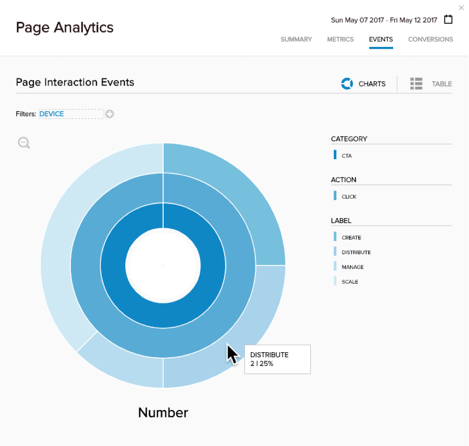

# Step 13 : Analyse the Behaviour with Analytics

Prev : [View the Results](step12.md)

Open your Page Analytics and go to the &#39;Events&#39; tab.   The clicks on your CTA links will start showing up in the &#39;Page Interaction Events Table&#39; (Click the Table icon if you can&#39;t see it)

 

You can see the CTA Click breakdown for &#39;Create&#39;, &#39;Distribute&#39;, &#39;Manage&#39; and &#39;Scale&#39; – which are the 4 Slides created for this example.   The % Visitors column gives a breakdown of the visitors that clicked each link, while the &#39;Number&#39; column tells you how many clicks the visitors gave you.   There is no &#39;Value&#39; associated with these clicks, which is why the column is blank.

You can associate a value with a specific click using &#39;data-evtvalue=xxx&#39; where xxx represents a value you want to track, but this wasn&#39;t shown in this example.

Switch to the &#39;Charts&#39; view, zoom the &#39;Number&#39; chart and you can drill into the &#39;CTA&#39; category to get a visual breakdown of the clicks for each of the CTA types.

 
 
This data over time will help understand which of the CTA items are most clicked.

Home : [Project Home](../readme.md)