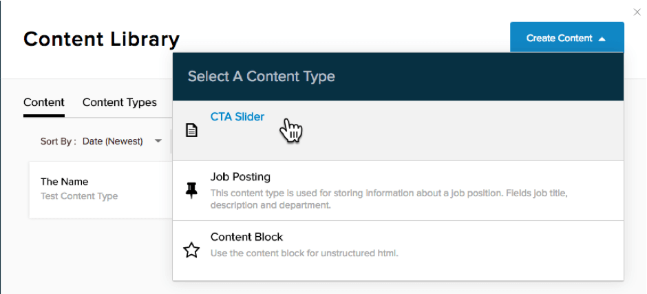
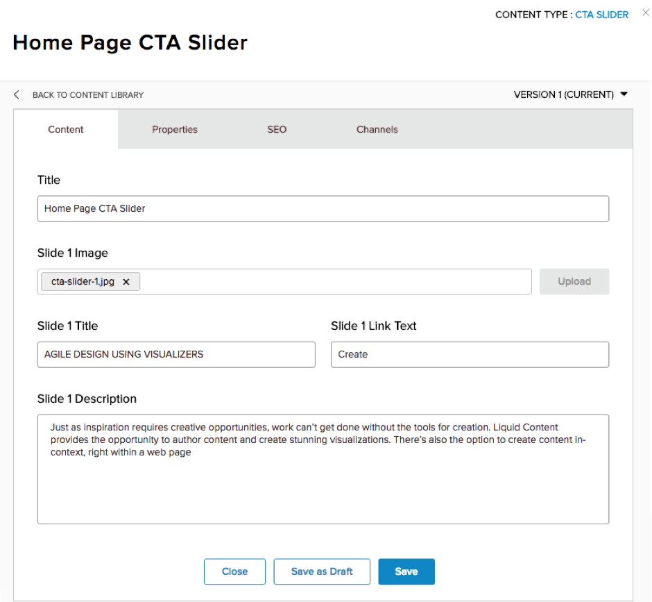

# Step 2 : Create some Content

Previous : [Create a New Content Type](step1.md)

Now that a Content Type has been created, we can create a Content Item.   Do this by going to the &#39;Content Item&#39; tab and clicking on &#39;Create Content&#39; and choosing &#39;CTA Slider&#39; as the Content Type.

This part is easy – just type in the data you want for the various fields, and upload the associated image.  This example is replicating one of the Liquid Content sliders to be a meta-representation of the very technology being used.  Or something.   You can either follow it exactly or enter anything you like.  You&#39;ll figure it out quickly.

When the content is complete, click &#39;Save&#39;.

Now you&#39;re ready to take a look at that content you just created.  Almost there.  You&#39;ll need a Visualizer for that.

Next : [Create the Slider Visualizer](step3.md)