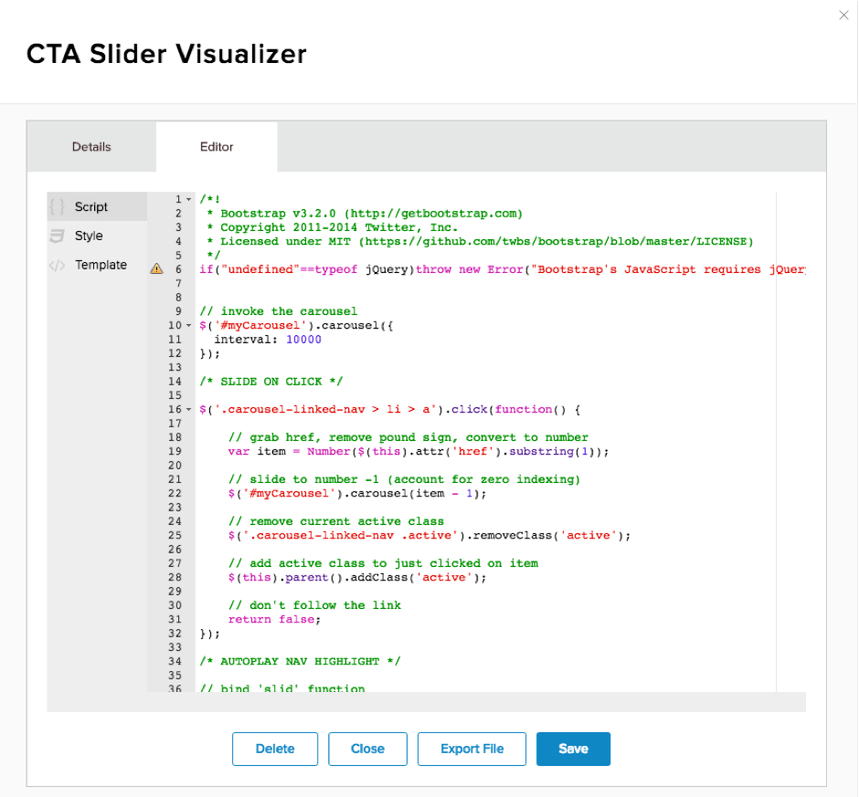
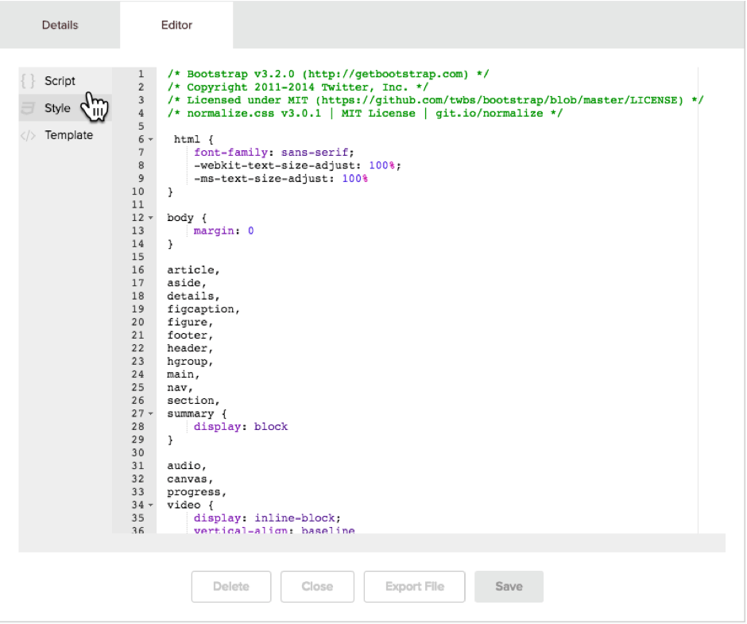
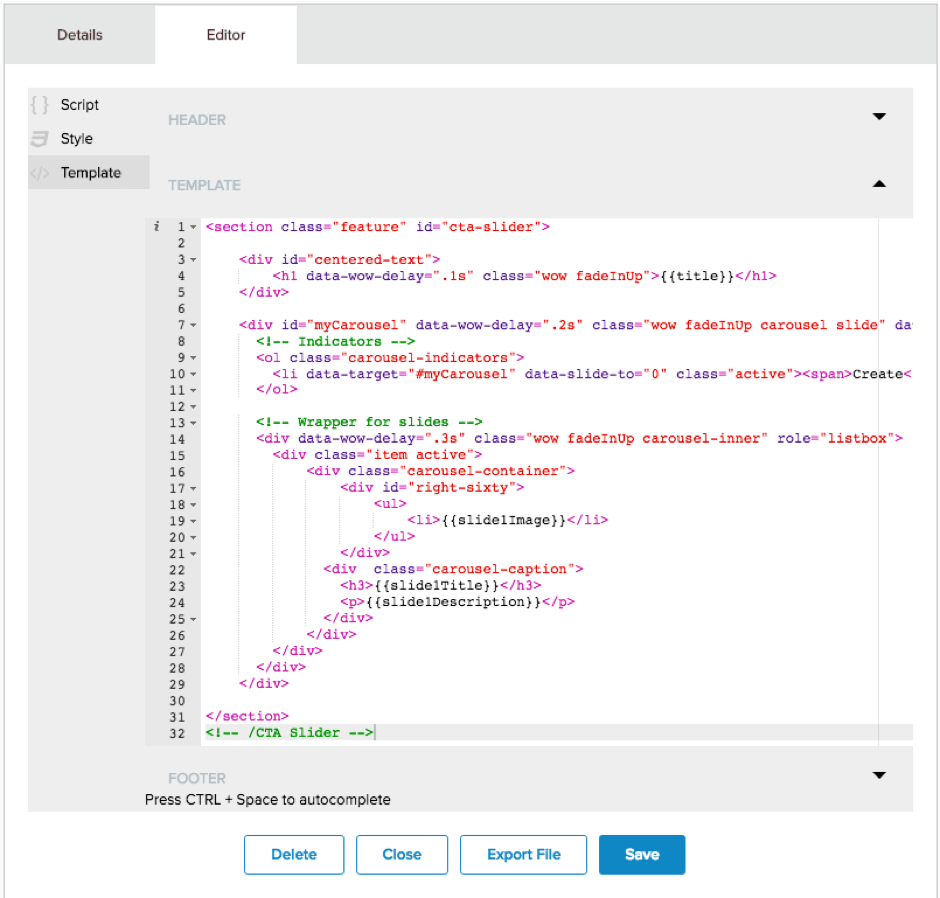
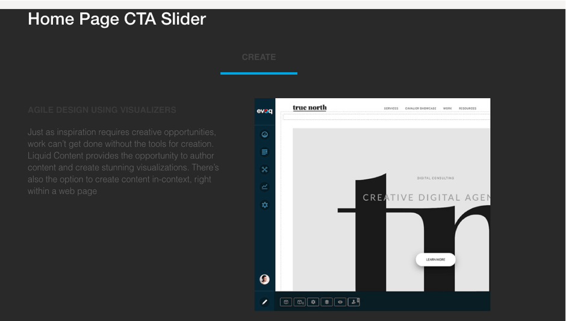

# Step 5 : Edit the Visualizer to add the Carousel style and code

Prev : [Add the Visualizer to a Page](step4.md)

You should be very motivated to get that mess cleaned up (there was no warning about doing this to a live site – surely you figured that out beforehand?)

Go back into the Content Library and edit your Visualizer.  You&#39;re now going to see how to add some style and interaction to your content.  This is done by selecting your Visualizer from the list and then click on the &#39;Editor&#39; tab.

There&#39;s three sections here – the Template which is where the display Html lives, and the Script, where you can add some javascript, and Style, where you can add some CSS.  Let&#39;s do all three.

First, click on the &#39;Script&#39; section and copy the contents of the &#39;[CTA-Slider_0.js](../CTA-Slider_0.js)&#39; file.   Just open the js file in a text editor and copy/paste the contents directly into the Script window.

  

Click &#39;Save&#39; when done.

Then, go to the &#39;Style&#39; section, and open and copy/paste the contents of the &#39;[CTA-Slider_0.css](../CTA-Slider_0.css)&#39; file.   Again, just use a text editor to open the file to copy the contents.

 
 
Click &#39;Save&#39; when that is done.

Finally, on the &#39;Template&#39; section, copy/paste the contents of the &#39;[CTA-Slider-template.html](../CTA-Slider-template.html)&#39; file in.  Use a text editor to open this file as well – if you double click, well, it&#39;s just going to load the file.

 

 
Note in the template the use of the double brace {{ }} – that&#39;s where the fields from the Content Item go, such as {{slide1Image}}.

You guessed it – click Save.   And then close the Content Library and refresh your page.

 

Success! Your home page should now show a nicely laid out Carousel, showing your content and your image.

OK.  It&#39;s not much of a Carousel with only one image, but it is nice and tidy!

Next : [Modify your Content Type for multiple images](step6.md)