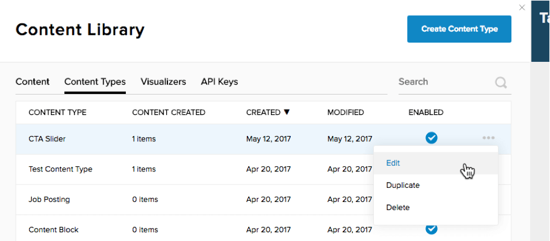
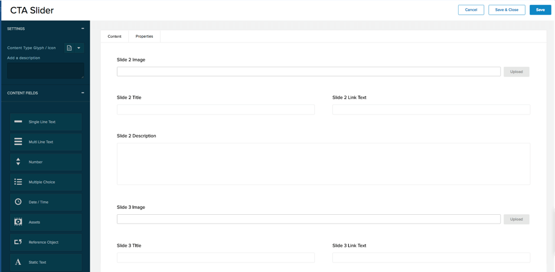

# Step 6 : Modify your Content Type to use 4 images

Prev : [Edit the Visualizer to add Style](step5.md)

A Carousel Slider is not much use if it doesn&#39;t slide to at least one more image.   This next step will add other images in to make that happen.  More images means more fields in the Content Type.   Note that this example isn&#39;t using a list of Content Items to create the slider, because that would imply you can merrily add as many as you like.   The final design will be limited to 4 images (and associated text).

Edit your Content Type by opening the Content Library, click on &#39;Content Types&#39; and select your Content Type.  Click on the … to find the Edit option.

 

Once you have your Content Type open, repeat the existing fields 3 times more, to create 4 Image positions.  At the end you should have:

Title : single line text

Slide 1 Image : Asset -&gt; Image

Slide 1 Title : single line text

Slide 1 Link Text : single line text

Slide 1 Description : multi line text

Slide 2 Image : Asset -&gt; Image

Slide 2 Title : single line text

Slide 2 Link Text : single line text

Slide 2 Description : multi line text

.. repeat this for Slide 3 and Slide 4:

 

Save and Close your Content Item when this is done.

Next : [Modify your Visualizer for multiple images](step7.md)