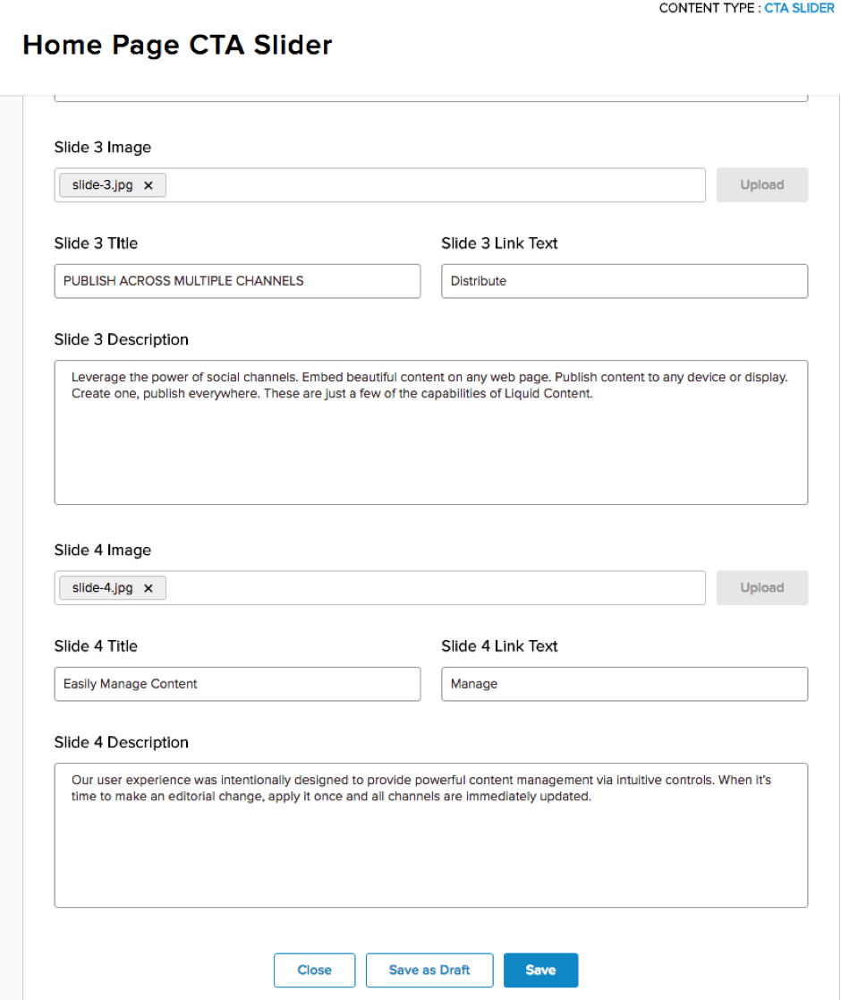

# Step 8 : Edit your Content Item to add the extra Slider image

Click on &#39;Content&#39; in your Content Library and open up the Content item.  You&#39;ll now see there are new fields for Slide 2 image, title, link and description, Slide 3 and Slide 4.  Pick the images and add the text fields for each of the values.

 

Once that is done, click &#39;Save&#39; and then close the Content Library.  Refresh your page and enjoy the slider.

 

But wait?  Where is the CTA tracking?  Wasn&#39;t that what this was all about?

Prev : [Modify your Visualizer for multiple images](step7.md)
Next : [Add in CTA Link Definitions to the Content Type](step9.md)
